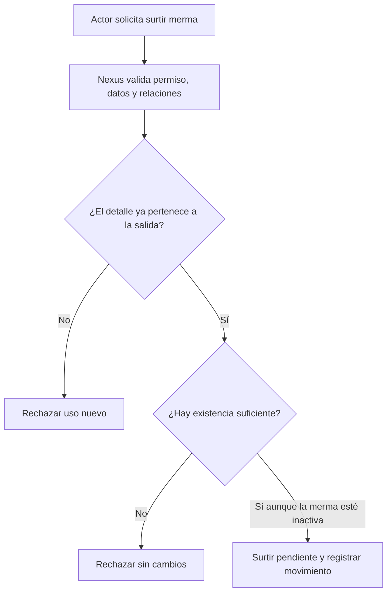

# `CU-SAL-12` — Surtir merma

```mermaid
flowchart TD
    request["Actor solicita surtir merma"] --> validate["Nexus valida permiso, datos y relaciones"]
    validate --> committed{"¿El detalle ya pertenece a la salida?"}
    committed -->|No| reject["Rechazar uso nuevo"]
    committed -->|Sí| stock{"¿Hay existencia suficiente?"}
    stock -->|No| conflict["Rechazar sin cambios"]
    stock -->|Sí aunque la merma esté inactiva| result["Surtir pendiente y registrar movimiento"]
```
