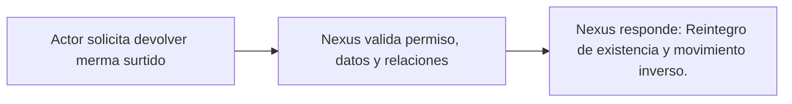

# `CU-SAL-13` — Devolver merma surtida

```mermaid
flowchart LR
    accTitle: CU-SAL-13 — Devolver merma surtida
    request["Actor solicita devolver merma surtido"] --> validate["Nexus valida permiso, datos y relaciones"]
    validate --> result["Nexus responde: Reintegro de existencia y movimiento inverso."]
```
