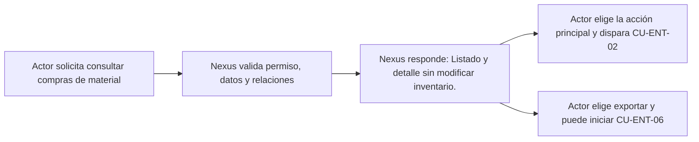

# `CU-ENT-01` — Consultar compras de material

```mermaid
flowchart LR
    accTitle: CU-ENT-01 — Consultar compras de material
    request["Actor solicita consultar compras de material"] --> validate["Nexus valida permiso, datos y relaciones"]
    validate --> result["Nexus responde: Listado y detalle sin modificar inventario."]
    result --> primary["Actor elige la acción principal y dispara CU-ENT-02"]
    result --> report["Actor elige exportar y puede iniciar CU-ENT-06"]
```
