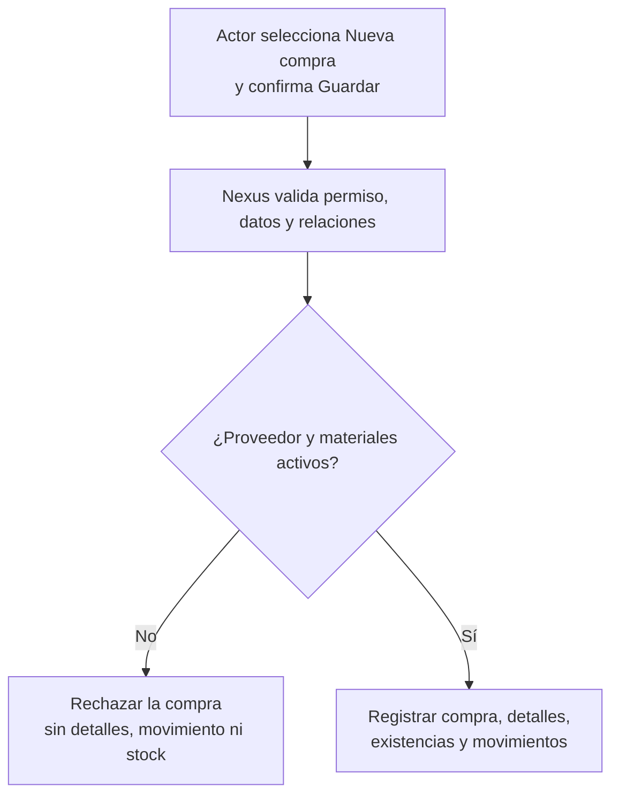

# `CU-ENT-02` — Crear compra de material

```mermaid
flowchart TD
    request["Actor selecciona Nueva compra<br/>y confirma Guardar"] --> validate["Nexus valida permiso, datos y relaciones"]
    validate --> active{"¿Proveedor y materiales activos?"}
    active -->|No| reject["Rechazar la compra<br/>sin detalles, movimiento ni stock"]
    active -->|Sí| result["Registrar compra, detalles,<br/>existencias y movimientos"]
```
