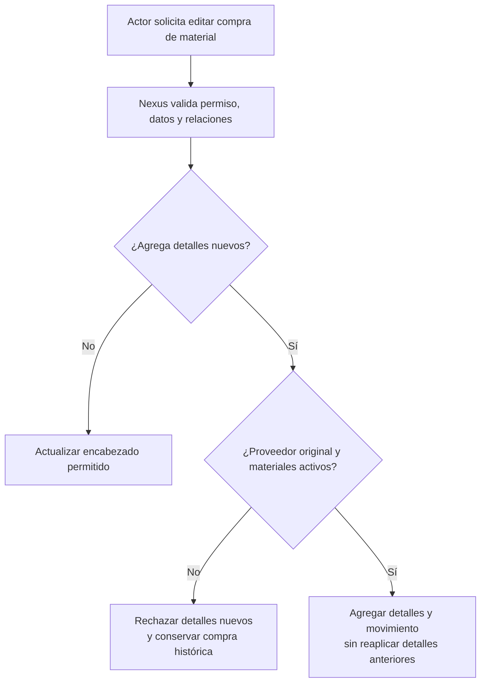

# `CU-ENT-03` — Editar compra de material

```mermaid
flowchart TD
    accTitle: CU-ENT-03 — Editar compra de material
    request["Actor solicita editar compra de material"] --> validate["Nexus valida permiso, datos y relaciones"]
    validate --> newDetails{"¿Agrega detalles nuevos?"}
    newDetails -->|No| header["Actualizar encabezado permitido"]
    newDetails -->|Sí| active{"¿Proveedor original y materiales activos?"}
    active -->|No| reject["Rechazar detalles nuevos<br/>y conservar compra histórica"]
    active -->|Sí| result["Agregar detalles y movimiento<br/>sin reaplicar detalles anteriores"]
```
