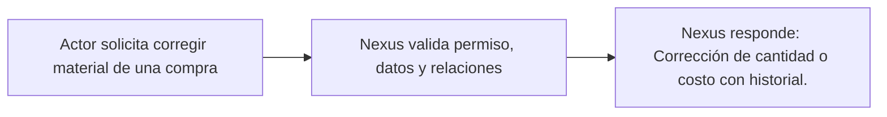

# `CU-ENT-04` — Corregir material de una compra

```mermaid
flowchart LR
    request["Actor solicita corregir material de una compra"] --> validate["Nexus valida permiso, datos y relaciones"]
    validate --> result["Nexus responde: Corrección de cantidad o costo con historial."]
```
