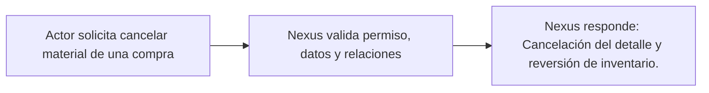

# `CU-ENT-05` — Cancelar material de una compra

```mermaid
flowchart LR
    request["Actor solicita cancelar material de una compra"] --> validate["Nexus valida permiso, datos y relaciones"]
    validate --> result["Nexus responde: Cancelación del detalle y reversión de inventario."]
```
