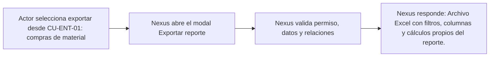

# `CU-ENT-06` — Generar reporte de compras de material

```mermaid
flowchart LR
    accTitle: CU-ENT-06 — Generar reporte de compras de material
    request["Actor selecciona exportar desde CU-ENT-01: compras de material"] --> modal["Nexus abre el modal Exportar reporte"]
    modal --> validate["Nexus valida permiso, datos y relaciones"]
    validate --> result["Nexus responde: Archivo Excel con filtros, columnas y cálculos propios del reporte."]
```
