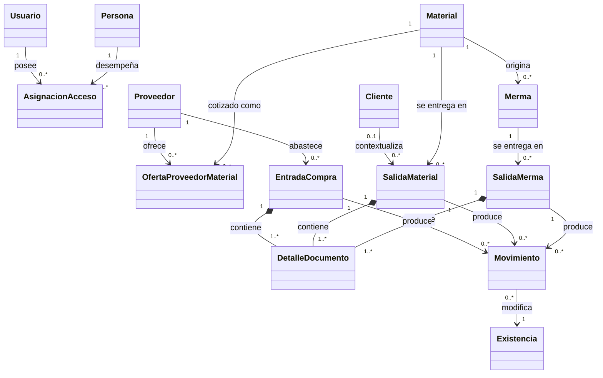
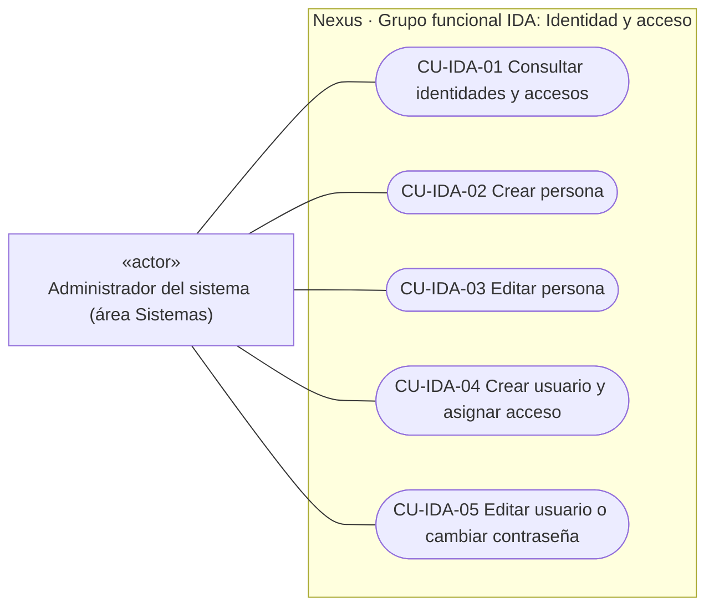
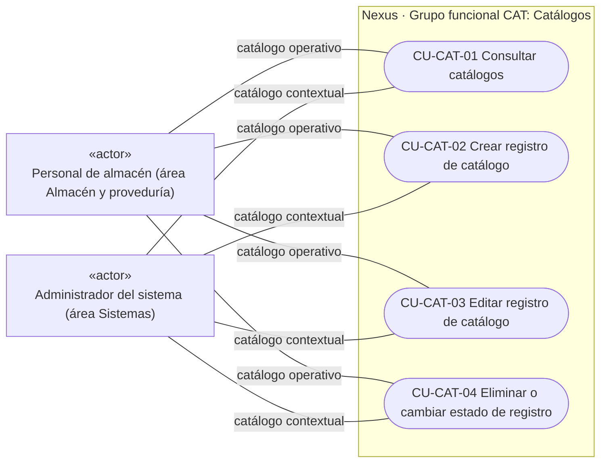
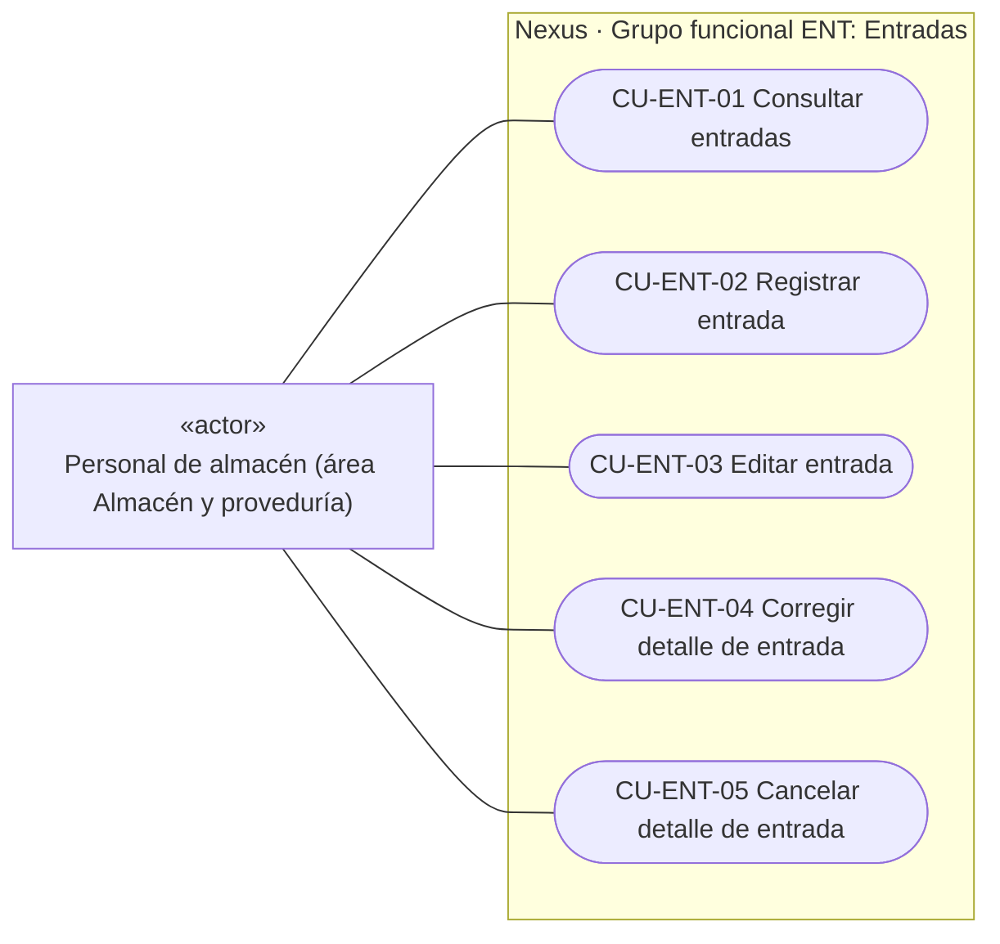
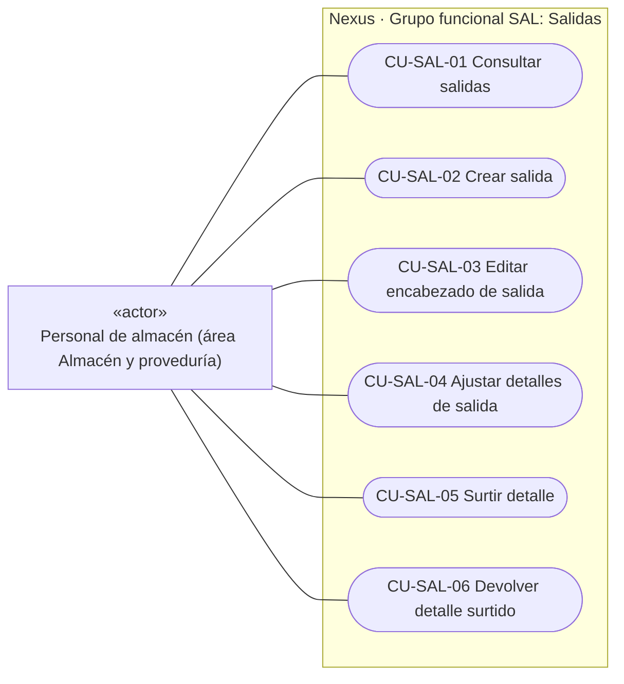
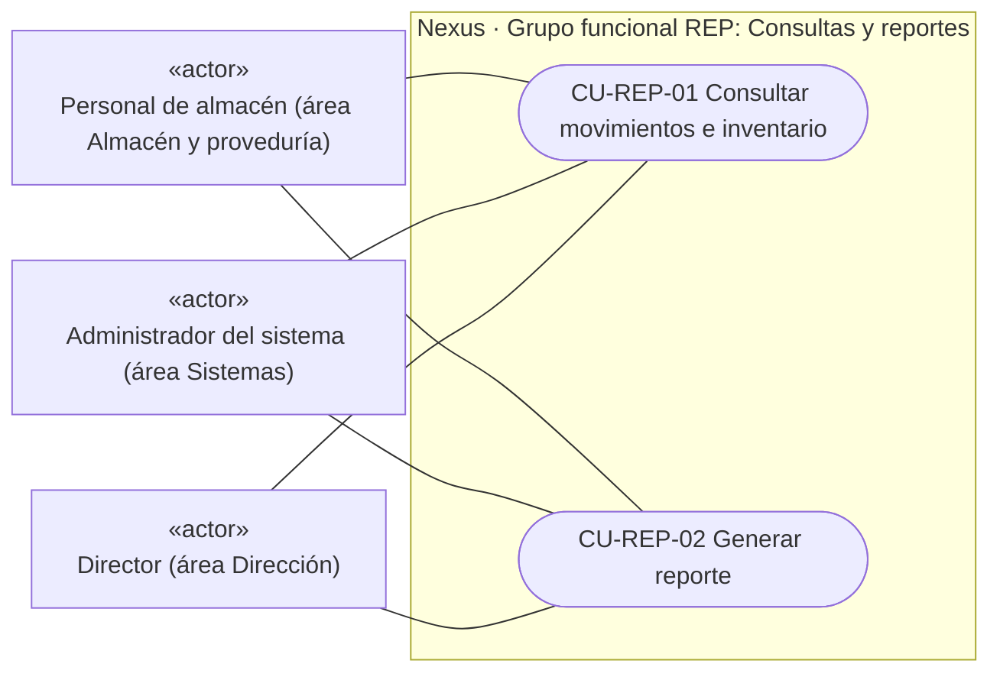
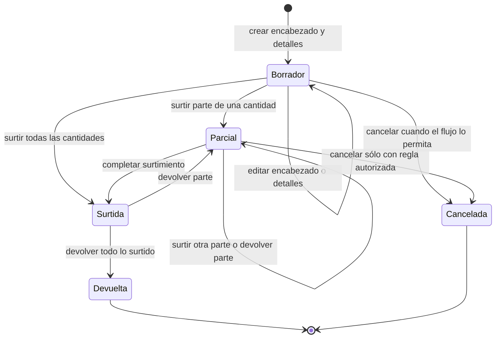

# Modelo de dominio, casos de uso y relación entre vistas

## Alcance de las vistas

Este documento contiene dos vistas curadas diferentes: el modelo conceptual explica
el vocabulario del negocio y el diagrama de casos de uso muestra objetivos de actores.
Los campos SQL y cardinalidades físicas están en el
[ER generado](../generated/database-schema.md), y los criterios verificables en la
[especificación de requisitos](requirements-specification.md). No se repiten aquí.

## Modelo de dominio conceptual

Se usa `classDiagram`, notación UML soportada por Mermaid. Las clases no representan
clases JavaScript ni copian tablas: son conceptos del negocio. La multiplicidad indica
la relación conceptual vigente; una relación pendiente se omite para no presentar una
intención como parte del dominio operativo.

`Persona` puede ser solicitante, receptor o referencia comercial sin que eso convierta
a esa persona en usuario. En particular, **asesor** es un dato del contexto comercial,
no un actor con acceso. Los proyectos siguen modelados técnicamente, pero se excluyen de
esta vista vigente hasta definir su flujo.

## Casos de uso vigentes

El diagrama se mantiene en Mermaid para que GitHub lo represente correctamente. Es una
**aproximación visual a un diagrama UML de casos de uso**, no UML estricto: Mermaid no
ofrece ese tipo de diagrama y se emplean nodos de `flowchart` con la semántica que se
explica a continuación. Los límites rectangulares representan el sistema. Cada actor se
muestra fuera de esos límites como un clasificador con el estereotipo UML `«actor»`; se
usa esta notación alternativa a la figura humana porque Mermaid no incorpora actores en
`flowchart`. Las asociaciones muestran quién inicia un objetivo y no equivalen a
permisos individuales. Ventas no es
actor: el área no tiene acceso. Tampoco se asignan salidas a otras áreas solicitantes;
su participación futura queda pendiente de definición.

Los participantes, precondiciones, garantías, pasos, alternativas y excepciones de cada
objetivo se detallan por tema en el
[catálogo de descripciones de casos de uso](use-case-descriptions.md).
La vista se divide en bloques por grupo funcional para mantenerla legible. Estos bloques
no son paquetes UML ni paquetes documentales: el único límite de sistema es Nexus. Cada
bloque conserva los actores fuera del sistema y muestra una sola vez los casos que le
pertenecen; juntos forman el diagrama de casos de uso.

### Grupo funcional IDA — Identidad y acceso

### Grupo funcional CAT — Catálogos

### Grupo funcional ENT — Entradas

### Grupo funcional SAL — Salidas

### Grupo funcional REP — Consultas y reportes

`CU-SAL-05` actualiza la existencia y registra el movimiento como parte de su propio
flujo; `CU-SAL-06` registra la reversión y el movimiento inverso. No existe una relación
`«include»` con `CU-REP-01`: consultar movimientos es otro objetivo iniciado por un
actor, mientras registrar un movimiento es una responsabilidad interna de Nexus. Por la
misma razón, compartir servicios entre grupos no se representa como salto, inclusión o
extensión entre casos de uso.

Los actores vigentes son **Personal de almacén** del área Almacén y proveduría,
**Administrador del sistema** del área Sistemas, y **Director** del área Dirección. En
`CAT`, almacén inicia operaciones sobre catálogos operativos y administración sobre los
contextuales; en `REP`, cada actor consulta sólo el alcance autorizado. Solicitantes,
aprobadores, asesores y proveedores participan como roles o entidades del negocio, pero
no se dibujan como actores porque no inician estos casos mediante acceso a Nexus.

Cada caso pertenece a un único grupo funcional; no quedan casos sueltos dentro del
límite de Nexus. Cada grupo conserva el código definido en el catálogo y cada caso usa
el formato `CU-<GRUPO>-<SECUENCIA>`. Los identificadores son los mismos del catálogo
operativo y permiten pasar de cada objetivo visual a su descripción y a su diagrama de
flujo específico en
[Diagramas de requisitos](requirements-diagrams.md#flujos-de-cada-caso-de-uso).
No se usa «administrar» o «mantener» como objetivo: cada óvalo expresa una operación
observable.

Los grupos son ayudas de lectura, no límites del sistema ni permisos. El Administrador
del sistema del área Sistemas conserva el alcance que conceden las políticas
vigentes; el Personal de almacén sólo opera entradas, inventario y salidas autorizadas.
Las demás áreas aparecen
únicamente cuando una política de lectura o el encabezado de una salida lo permite.
Consultar un catálogo desde un `combobox` es una capacidad auxiliar de lectura y no un
caso de uso independiente: debe autorizarse en el servidor, pero no se asocia como si el
actor mantuviera el catálogo. Dirección no se dibuja con acceso total porque esa regla
aún no existe de manera uniforme en las políticas.

Los casos de uso son objetivos del actor, no módulos de código. Por ello **no se requiere
crear una carpeta `useCases` ni renombrar los dominios existentes**. La trazabilidad se
mantiene desde el identificador hacia rutas, controllers, DTO, servicios y pruebas; una
operación puede coordinar varios de esos artefactos y un servicio puede apoyar más de un
caso sin que ambos deban compartir nombre.

No se dibujan operaciones pendientes como asociaciones. Las áreas que eventualmente
soliciten o registren salidas, y el mantenimiento de proyectos, deben definirse primero
como alcance, permisos y criterios de aceptación.

## Estados y datos modificados por acción

Los modos de formulario (`crear`, `editar`, `surtir`, `devolver`) no son estados del
documento. El siguiente UML de estados muestra las precondiciones de negocio comunes a
salidas de material y merma; las diferencias específicas se consultan en la
[matriz de operaciones](requirements-operations-matrix.md#modos-precondiciones-y-datos-modificados).

## Vistas de diseño del sistema

El diseño no se duplica en este archivo. Consulta la
[arquitectura del sistema](../architecture/architecture-and-web-views.md#1-arquitectura-del-sistema)
para contexto, contenedores, despliegue, componentes y secuencia; el
[mapa generado](../generated/code-map.md) para imports y rutas; y el
[ER](../generated/database-schema.md) para diseño físico de datos. La vista de despliegue
distingue el entorno vigente en Render y Supabase del objetivo de trasladar la
aplicación a un VPS; los detalles todavía no decididos se presentan como propuesta y
no como infraestructura implementada.
