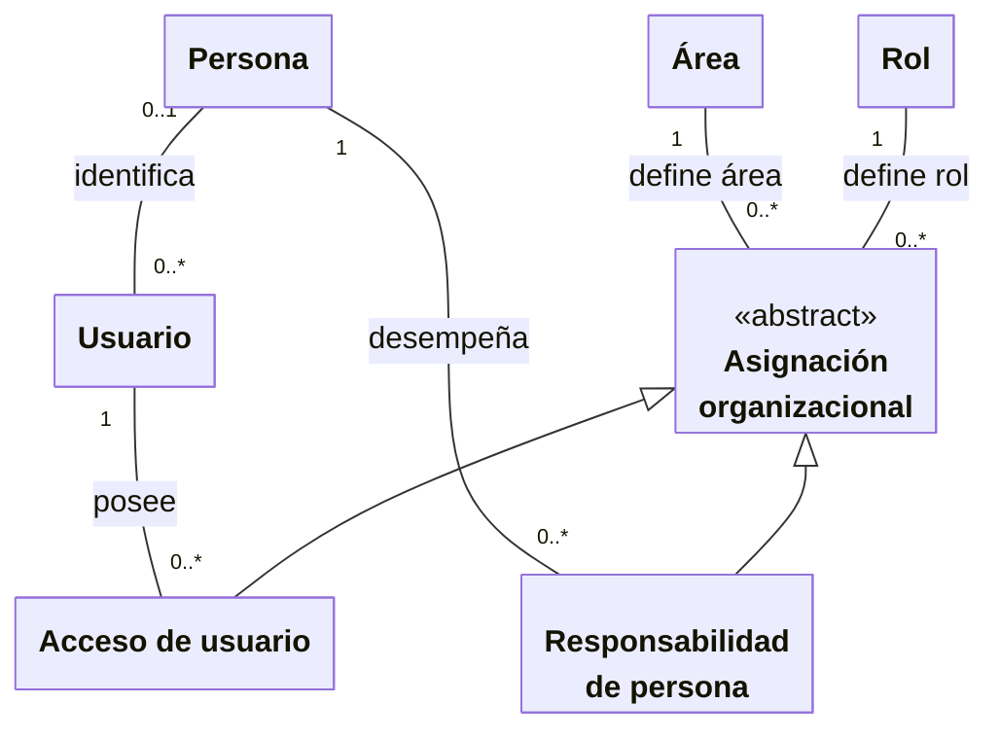
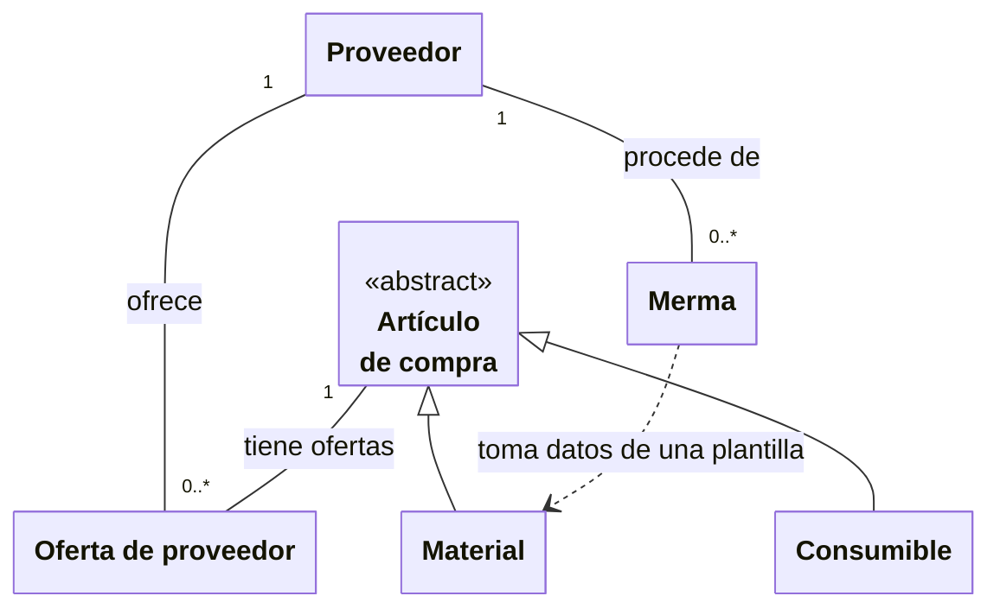
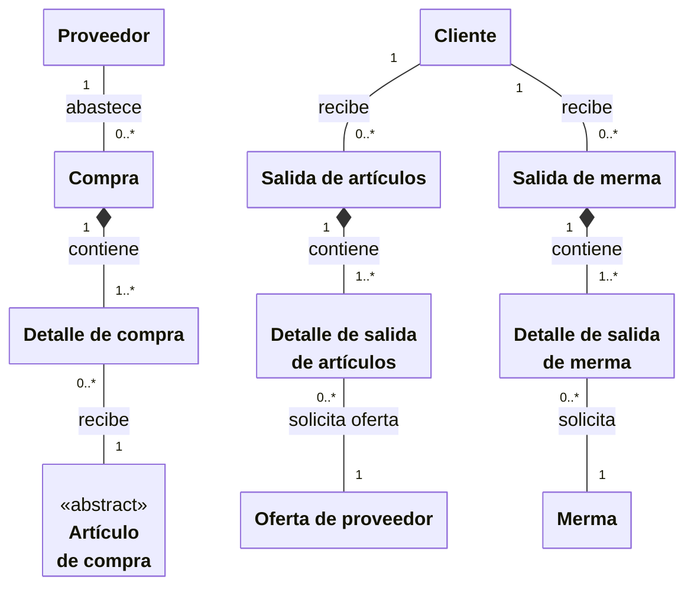
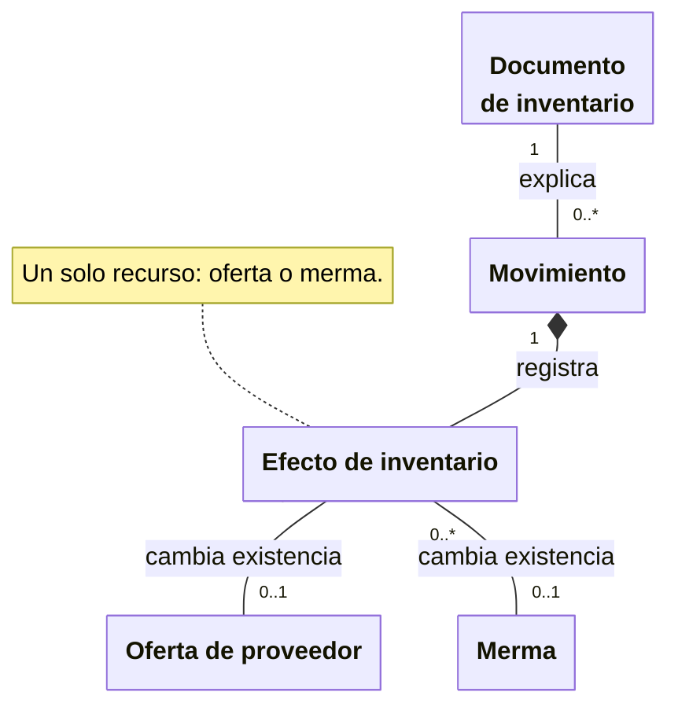

# 1. Modelo de dominio conceptual

El modelo representa conceptos y relaciones del negocio vigente. Se divide en cuatro
vistas del mismo dominio para facilitar la lectura; un concepto repetido conserva el
mismo significado. Los nombres y las multiplicidades describen reglas funcionales,
sin reproducir tablas, campos internos ni componentes de software. Esta vista muestra
únicamente conceptos y relaciones: omitir atributos no significa que una entidad carezca
de datos. Sus características se definen en el glosario y en los requisitos correspondientes.

Las figuras usan clases UML en Mermaid. Las asociaciones indican vínculos entre
conceptos; la generalización agrupa variantes de un concepto y apunta al general.
La composición señala que un detalle pertenece a un único documento o movimiento.
Las clases abstractas sirven para expresar reglas comunes y no se registran por sí solas.

## Personas y responsabilidades

Una persona puede participar en el negocio sin disponer de una cuenta. Una cuenta
puede vincularse con una persona; la persona puede tener varias cuentas. Las
responsabilidades de una persona y los accesos de una cuenta se describen mediante
un rol y un área, pero asignar una responsabilidad a la persona no le concede acceso.

El solicitante, el asesor y la persona que recibe una compra son participaciones de
`Persona`, no tipos de usuario. El usuario identifica la cuenta que ejecuta una acción.
Los actores funcionales Personal de almacén y Administrador del sistema se representan
en los casos de uso, sin convertirlos en entidades adicionales del dominio.

## Artículos, ofertas y existencias

Materiales y consumibles son dos clasificaciones distintas de artículos de compra.
Cada oferta vincula un artículo con un proveedor y conserva su existencia, costo y
estado activo. La merma tiene proveedor y existencia propios; toma datos de un material
como plantilla al registrarse, pero conserva sus propios datos después del alta.

Cada artículo y cada merma tienen una presentación y una unidad de medida,
procedentes de los catálogos auxiliares correspondientes.

La existencia es una cantidad de la oferta o de la merma, no un saldo único del
artículo. Un artículo puede ofrecerse por varios proveedores; no puede repetirse la
misma combinación artículo–proveedor. Los consumibles se clasifican expresamente,
carecen de dimensiones y se gestionan en consultas y reportes separados de materiales.
La dependencia de Merma hacia Material expresa el uso de una plantilla, no un vínculo
que obligue a actualizar la merma cuando cambia el material.

## Compras y salidas

Una compra recibe artículos de un proveedor. Una salida solicita artículos o mermas
para un cliente. Cada documento contiene al menos un detalle y cada detalle pertenece
a un solo documento. Los detalles se conservan cuando se corrigen, se cancelan o se
devuelve lo entregado, para mantener la historia de la operación.

Los detalles de una compra pertenecen todos a su clasificación: materiales o
consumibles. El proveedor de la compra determina la oferta que recibe las cantidades.
Salida de artículos representa el proceso común a **salidas de materiales y salidas
de consumibles**, que se gestionan en contextos separados y no se mezclan en un mismo
documento. Sus detalles identifican el artículo y el proveedor de cuya existencia se
surtirá; los detalles de una salida de merma identifican la merma correspondiente.
El solicitante, asesor, área y número de proyecto completan el contexto de una salida;
la persona receptora completa el de una compra. El mantenimiento de proyectos queda
fuera del alcance vigente y no se introduce como otro proceso en esta vista.

## Documentos y trazabilidad de inventario

Las compras, salidas, ajustes y entradas adicionales de merma explican los cambios
de existencia. Cada movimiento corresponde a un único documento de origen y puede
contener efectos sobre varios recursos. Una devolución o corrección conserva la
referencia al documento original; no crea una nueva compra o salida.

Cada efecto corresponde **exclusivamente a una oferta o a una merma**; las dos
asociaciones opcionales expresan esa alternativa, no permiten un efecto sin recurso ni
con ambos recursos. El movimiento puede afectar varias existencias mediante sus efectos;
no se vincula a un único saldo global. Su documento de origen es una compra, salida
de material, salida de consumible, salida de merma, ajuste o entrada adicional de merma.
Crear una salida pendiente no produce movimientos: éstos aparecen al surtir o devolver. Un ajuste y una entrada
adicional de merma son documentos distintos de una compra.

El [glosario del negocio](../business-glossary.md) define los conceptos y el
[catálogo de casos de uso](../use-cases/index.md) describe los objetivos que actúan sobre
ellos. Los estados de documentos y detalles se explican en el
[capítulo siguiente de estados](03-states-and-data-changed-by-action.md).
