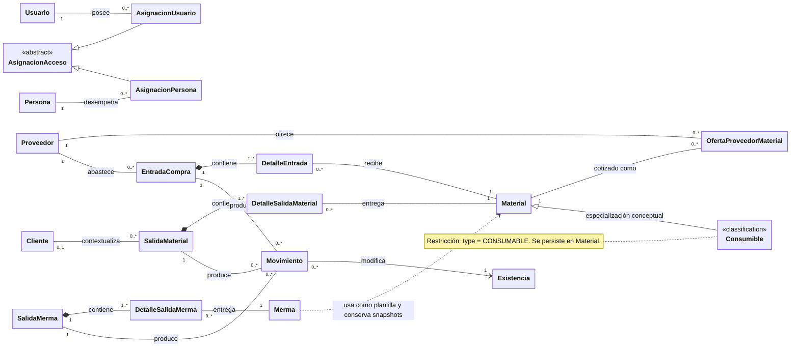

# 1. Modelo de dominio conceptual

Se usa `classDiagram`, notación UML soportada por Mermaid. Las clases no representan
clases JavaScript ni copian tablas: son conceptos del negocio. La multiplicidad indica
la relación conceptual vigente; una relación pendiente se omite para no presentar una
intención como parte del dominio operativo.

`Consumible` representa la clasificación explícita `CONSUMABLE` de una identidad
persistida en `Material`; no es otra tabla ni se infiere por unidad o ausencia de
dimensiones. Reutiliza la oferta, existencia, ajuste y movimiento de material, mientras
sus consultas y reportes se mantienen separados.

`AsignacionUsuario` y `AsignacionPersona` especializan el concepto abstracto de
asignación sin exigir que una misma asignación pertenezca a cuenta y persona a la vez.

`Persona` puede ser solicitante, receptor o referencia comercial sin que eso convierta
a esa persona en usuario. En particular, **asesor** es un dato del contexto comercial,
no un actor con acceso. Los proyectos siguen modelados técnicamente, pero se excluyen de
esta vista vigente hasta definir su flujo.

La composición (`*--`) expresa propiedad de los detalles por su documento; las
asociaciones (`--`) incluyen multiplicidades y no implican llamadas. La dependencia
de Merma hacia Material describe la selección de una plantilla: no afirma una
relación persistente. `«classification»` es un estereotipo local que distingue la
especialización conceptual de una jerarquía de clases o tablas.
