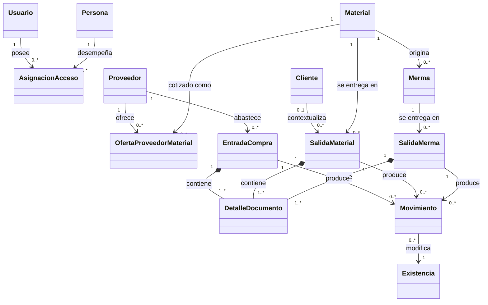

# 2. Modelo de dominio conceptual

Se usa `classDiagram`, notación UML soportada por Mermaid. Las clases no representan
clases JavaScript ni copian tablas: son conceptos del negocio. La multiplicidad indica
la relación conceptual vigente; una relación pendiente se omite para no presentar una
intención como parte del dominio operativo.

`Persona` puede ser solicitante, receptor o referencia comercial sin que eso convierta
a esa persona en usuario. En particular, **asesor** es un dato del contexto comercial,
no un actor con acceso. Los proyectos siguen modelados técnicamente, pero se excluyen de
esta vista vigente hasta definir su flujo.
