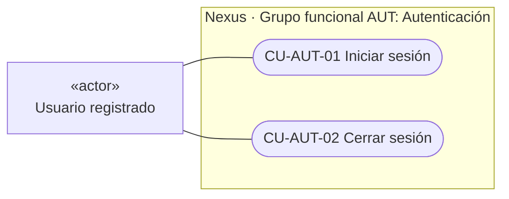
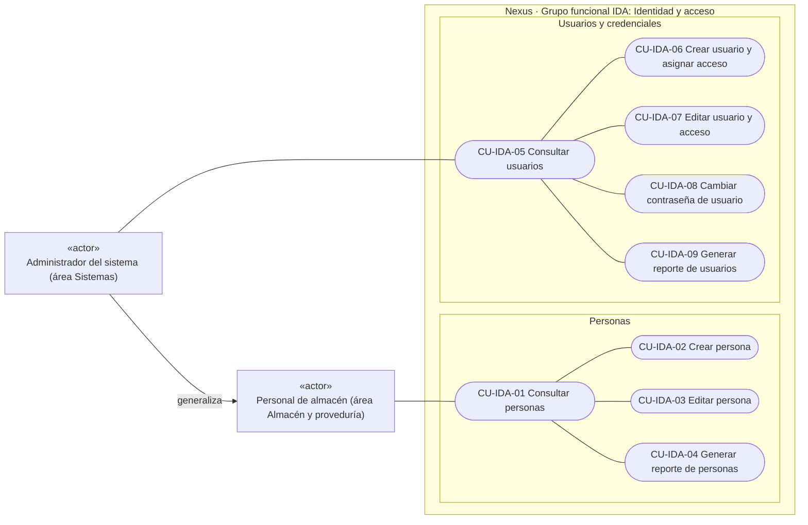
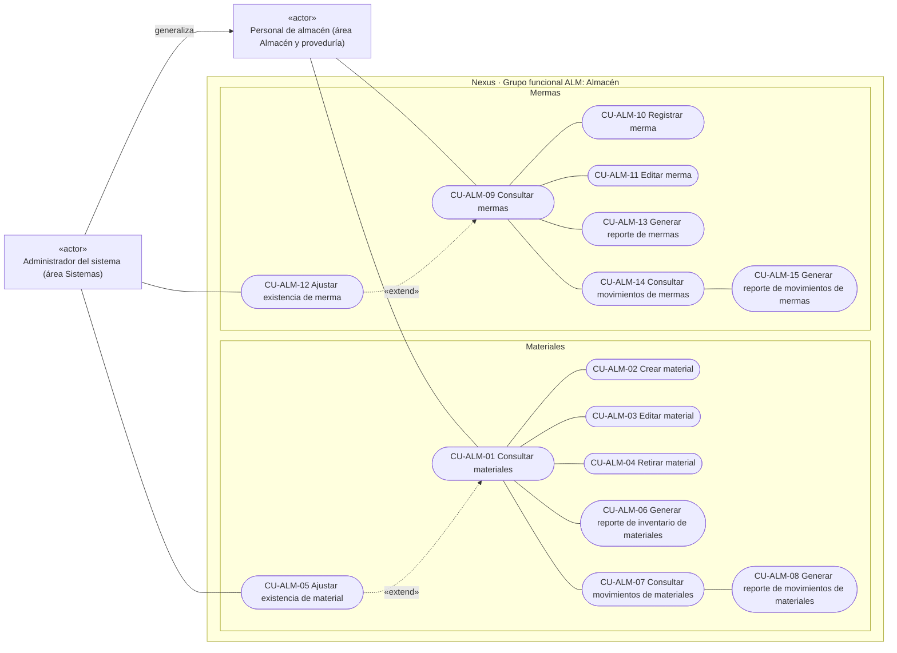
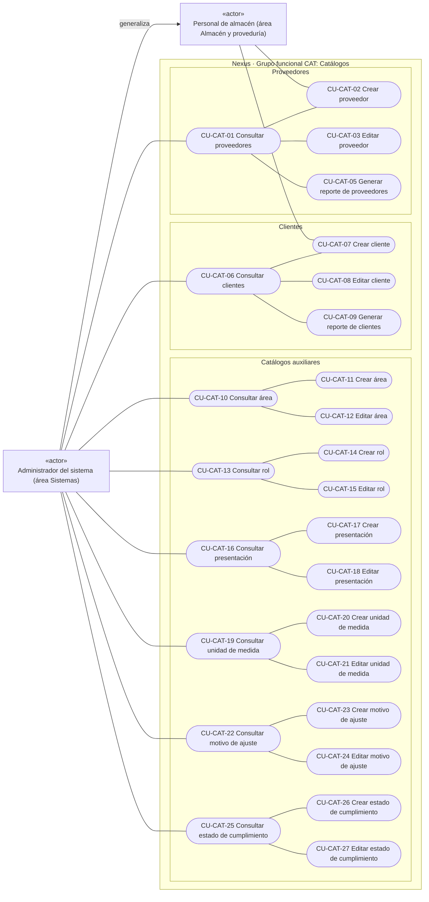
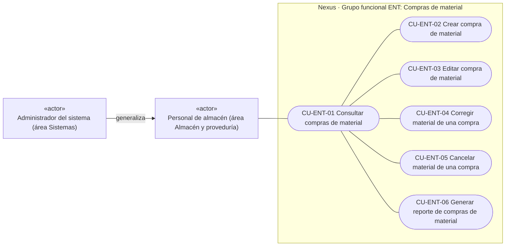
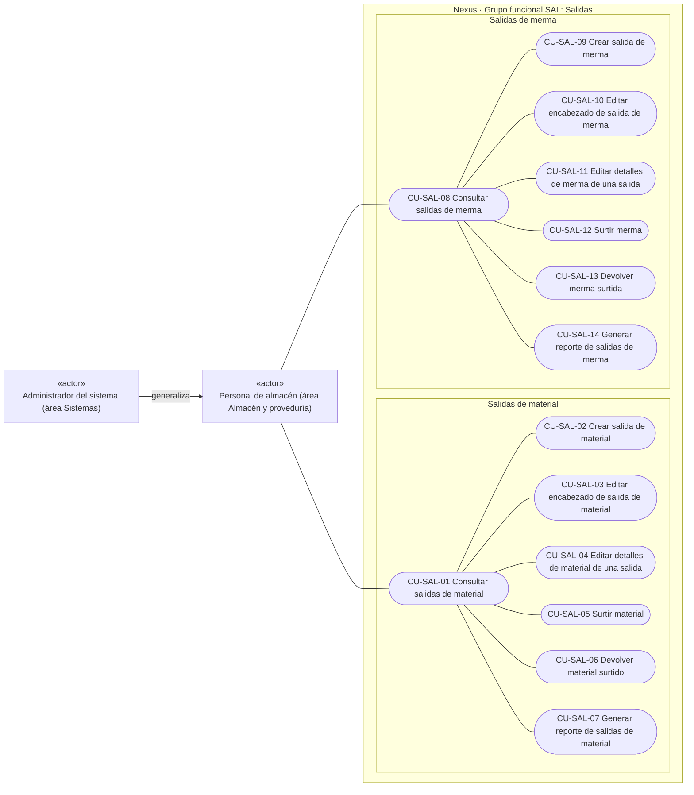

# 3. Casos de uso vigentes

El diagrama se mantiene en Mermaid para que GitHub lo represente correctamente. Es una
**aproximación visual a un diagrama UML de casos de uso**, no UML estricto: Mermaid no
ofrece ese tipo de diagrama y se emplean nodos de `flowchart` con la semántica que se
explica a continuación. Los límites rectangulares representan el sistema. Cada actor se
muestra fuera de esos límites como un clasificador con el estereotipo UML `«actor»`; se
usa esta notación alternativa a la figura humana porque Mermaid no incorpora actores en
`flowchart`. Las asociaciones muestran quién inicia un objetivo y no equivalen a
permisos individuales. Cuando una acción opcional nace dentro de una consulta, se usa
`«extend»` hacia el caso base; la asociación directa con el actor sigue indicando quién
puede iniciar la acción. Ventas no es
actor: el área no tiene acceso. Tampoco se asignan salidas a otras áreas solicitantes;
su participación futura queda pendiente de definición.

Los participantes, precondiciones, garantías, pasos, alternativas y excepciones de cada
objetivo se detallan por tema en el
[catálogo de descripciones de casos de uso](../use-cases/index.md).
La vista se divide en bloques por grupo funcional para mantenerla legible. Estos bloques
no son paquetes UML ni paquetes documentales: el único límite de sistema es Nexus. Cada
bloque conserva los actores fuera del sistema y muestra una sola vez los casos que le
pertenecen; juntos forman el diagrama de casos de uso. Los actores concretos se
generalizan mediante un actor común cuando comparten asociaciones y la distinción entre
ellos aporta información al grupo. Si todos participan de la misma forma, el actor común
los representa sin enumerar cada rol o área.

Se conservan seis grupos funcionales propietarios porque representan capacidades estables del
negocio: autenticación, identidad y acceso, almacén, catálogos, compras de material y
salidas. Las consultas y exportaciones se integran en el grupo del recurso que las
origina; no forman un paquete funcional independiente. Dividirlos otra vez en nuevos
grupos por cada entidad fragmentaría procesos que comparten actor, reglas y ciclo
operativo; agruparlos sólo por acción mezclaría entidades con validaciones distintas.
Dentro de cada grupo se usa por ello un **segundo nivel visual por entidad o documento**.
Este nivel mejora la lectura, pero no cambia identificadores ni fusiona casos de uso.
La decisión y las familias resultantes se resumen en el
[criterio de agrupación vigente](../use-cases/index.md#criterio-de-agrupación-vigente).

### Grupo funcional AUT — Autenticación

### Grupo funcional IDA — Identidad y acceso

### Grupo funcional ALM — Almacén

El grupo de **Almacén** concentra los casos operativos de material y merma porque comparten
actor, reglas de inventario, ciclo de consulta y operación sobre la misma área funcional.
Los recursos comerciales y de configuración quedan para `CAT`, mientras los documentos de
entrada y salida mantienen su propio grupo de negocio. La numeración `CU-ALM-*` sustituye en
este ámbito el uso previo de `CU-CAT-*` para material y merma, sin cambiar la intención del
objetivo ni la lógica del flujo.

### Grupo funcional CAT — Catálogos

La administración de **Áreas**, **Roles**, **Presentaciones**, **Unidades de medida**,
**Motivos de ajuste** y **Estados de cumplimiento** se asocia directamente con el
administrador: no se hereda hacia Almacén y exige `catalogs:manage` en cada vista y
solicitud API. Las consultas operativas de roles, áreas, presentaciones, unidades de
medida, motivos de ajuste y estados de cumplimiento alimentan controles de selección
dentro de otros flujos. Se conservan como soporte técnico autorizado de esos casos, pero
no reciben identificador ni se representan como objetivos independientes del actor.

### Grupo funcional ENT — Compras de material

### Grupo funcional SAL — Salidas de material y de merma

### Criterio de inclusión, exclusión y relaciones entre casos

La revisión de las capacidades transversales detectó que **iniciar sesión** y **cerrar
sesión** estaban implementados y especificados, pero no se visualizaban como objetivos
del usuario. Se incorporan porque cada uno tiene disparador, interacción y resultado
observable: obtener acceso a las capacidades autorizadas o terminar ese acceso. Su
visibilidad permite entender el impacto de Nexus sobre el control de acceso al negocio,
aunque no pertenezcan a un CRUD operativo.

La revisión aplica estas decisiones de forma explícita:

| Situación revisada | Decisión de modelado | Motivo |
| --- | --- | --- |
| El actor persigue un resultado observable y Nexus ofrece una interacción completa para lograrlo. | Incluir como caso de uso. | Expone una capacidad y su impacto en el trabajo o control del negocio. |
| El comportamiento siempre forma parte del objetivo base y tiene un objetivo reutilizable propio. | Modelar `«include»`, sólo si ambos casos y el retorno al caso base están definidos. | La ejecución obligatoria no debe confundirse con una asociación temática. |
| El comportamiento es opcional, se inserta bajo una condición y tiene sentido como objetivo separado. | Modelar `«extend»`, sólo si existe un punto de extensión explícito. | Una alternativa interna no crea por sí sola otro caso. |
| La acción es validación, persistencia, auditoría, cálculo, movimiento o coordinación interna. | Excluir como caso independiente y describirla dentro del flujo que apoya. | Nexus participa internamente; no existe otro objetivo iniciado por el actor. |
| Una consulta sólo llena un selector dentro de otro objetivo y no ofrece una opción independiente. | Excluir de la asociación del actor para ese contexto. | Es una capacidad auxiliar, no mantenimiento del catálogo. |
| Existe sólo modelo, servicio parcial, permiso, ruta técnica sin interacción definida o intención futura. | Excluir del diagrama vigente y conservar su estado como modelado, parcial o fuera de alcance. | No debe presentarse una capacidad aún no disponible para el negocio. |

Con este criterio, **renovar credenciales** y **consultar la sesión actual** no se
incorporan como casos de uso: son mecanismos técnicos que Nexus ejecuta para conservar
o reconstruir una sesión, no objetivos que el usuario seleccione. Tampoco se crea
`«include»` desde cada caso protegido hacia `CU-AUT-01`: una sesión iniciada es una
precondición, y el inicio de sesión no se ejecuta obligatoriamente dentro de cada
consulta o mutación. `CU-AUT-02` es independiente porque el usuario sí decide terminar
su acceso. La revisión no encontró otra capacidad implementada con actor, disparador y
resultado de negocio que permanezca oculta; proyectos, ajustes parciales y requisiciones
continúan fuera del diagrama por su estado no vigente.

`CU-SAL-05` y `CU-SAL-12` actualizan la existencia y registra el movimiento como parte de su propio
flujo; `CU-SAL-06` y `CU-SAL-13` registran la reversión y el movimiento inverso. No existe una relación
`«include»` con `CU-ALM-07` y `CU-ALM-14`: consultar movimientos es otro objetivo iniciado por un
actor, mientras registrar un movimiento es una responsabilidad interna de Nexus. Por la
misma razón, compartir servicios entre grupos no se representa como salto, inclusión o
extensión entre casos de uso.

Los actores vigentes son **Personal de almacén** del área Almacén y proveduría y
**Administrador del sistema** del área Sistemas. El Administrador del sistema se muestra
como especialización en los grupos operativos donde su acceso heredado debe distinguirse
del correspondiente al Personal de almacén; en `CAT` conserva además asociaciones
directas con las operaciones restringidas de proveedores, clientes, ajustes y catálogos
auxiliares. En `AUT`, **Usuario registrado** representa a ambos porque no varían
los casos de inicio y cierre de sesión. Esta generalización expresa disponibilidad
funcional, no omite las comprobaciones de permiso del servidor. Solicitantes,
aprobadores, asesores y proveedores participan como roles o entidades del negocio, pero
no se dibujan como actores porque no inician estos casos mediante acceso a Nexus.

Cada caso pertenece a un único grupo funcional propietario; no quedan casos sueltos ni
un paquete independiente de reportes dentro del límite de Nexus. Los identificadores se numeran secuencialmente dentro de su grupo propietario y los
reportes se muestran junto a la consulta o recurso desde el que se inician. Los identificadores son los mismos del catálogo
operativo y permiten pasar de cada objetivo visual a su descripción y a su diagrama de
flujo específico en
[Diagramas de requisitos](../diagrams/index.md#flujos-de-cada-caso-de-uso).
No se usa «administrar» o «mantener» como objetivo: cada óvalo expresa una operación
observable.

Dentro de cada grupo, la lectura se organiza por recurso: desde la consulta se trazan
asociaciones simples, sin etiqueta, hacia las operaciones CRUD y específicas que le
corresponden. En `CAT`, las asociaciones directas adicionales del administrador hacen
explícitas las operaciones restringidas comprobadas por las rutas API. Sólo las
relaciones con semántica `«include»` o `«extend»` deben indicarla explícitamente.
Corregir, cancelar, ajustar, cambiar estado, surtir o devolver permanecen junto al
recurso que modifican y reciben la secuencia correspondiente a esa posición.
Cuando el orden cambia, catálogo, fichas, diagramas y referencias técnicas se renumeran
en conjunto para conservar la trazabilidad. Una asociación simple no implica inclusión,
extensión ni dependencia de ejecución; una relación `«include»` o `«extend»` sólo existe
cuando aparece etiquetada explícitamente.
La generalización de actores también se identifica de forma expresa.

Los grupos son ayudas de lectura, no límites del sistema ni permisos. El Administrador
del sistema del área Sistemas tiene acceso vigente a todos los casos visualizados, pero
cada petición conserva la comprobación de su política; el Personal de almacén sólo
opera entradas, inventario y salidas autorizadas.
Las demás áreas aparecen
únicamente cuando una política de lectura o el encabezado de una salida lo permite.
Consultar un catálogo desde un `combobox` es una capacidad auxiliar de lectura y no un
caso de uso independiente: debe autorizarse en el servidor, pero no se asocia como si el
actor mantuviera el catálogo. Dirección no se dibuja como actor vigente: su
participación y alcance permanecen por definir y las políticas actuales no justifican
atribuirle el conjunto de consultas y reportes. Cuando esa decisión se apruebe, deberán actualizarse conjuntamente políticas,
requisitos, fichas y asociaciones, sin inferir acceso por el nombre del área o del rol.

Los casos de uso son objetivos del actor, no módulos de código. Por ello **no se requiere
crear una carpeta `useCases` ni renombrar los dominios existentes**. La trazabilidad se
mantiene desde el identificador hacia rutas, controllers, DTO, servicios y pruebas; una
operación puede coordinar varios de esos artefactos y un servicio puede apoyar más de un
caso sin que ambos deban compartir nombre.

No se dibujan operaciones pendientes como asociaciones. Las áreas que eventualmente
soliciten o registren salidas, y el mantenimiento de proyectos, deben definirse primero
como alcance, permisos y criterios de aceptación.
