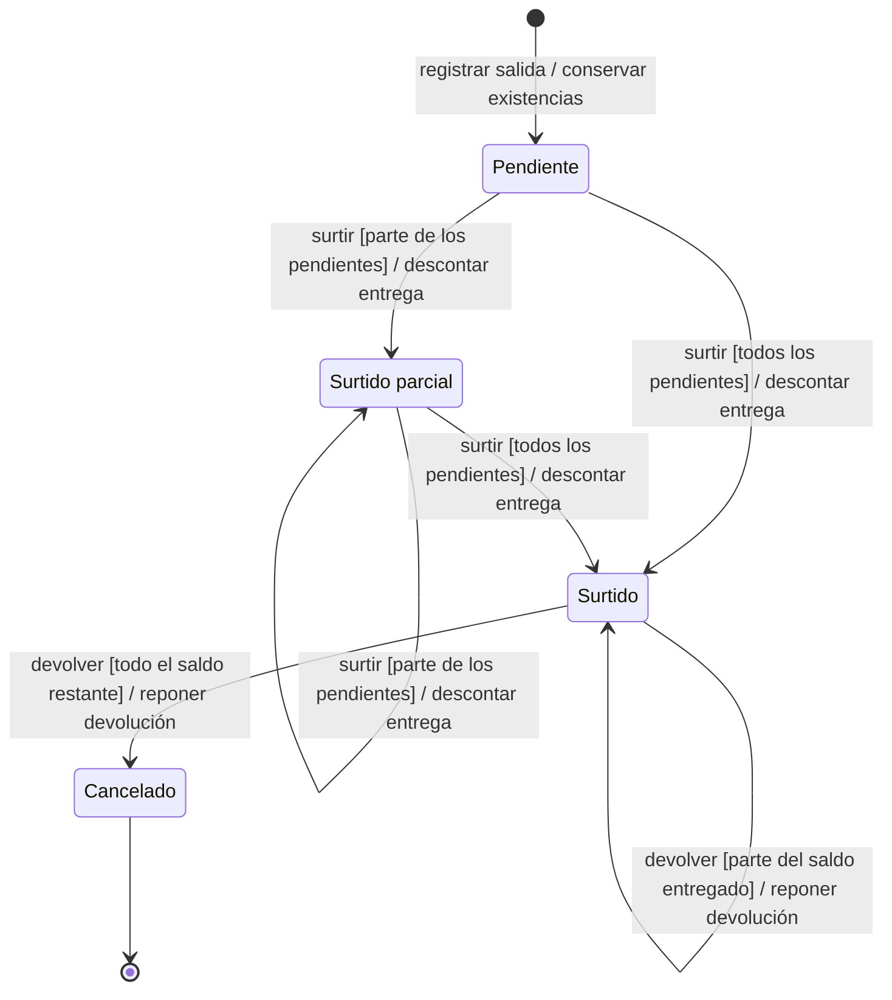
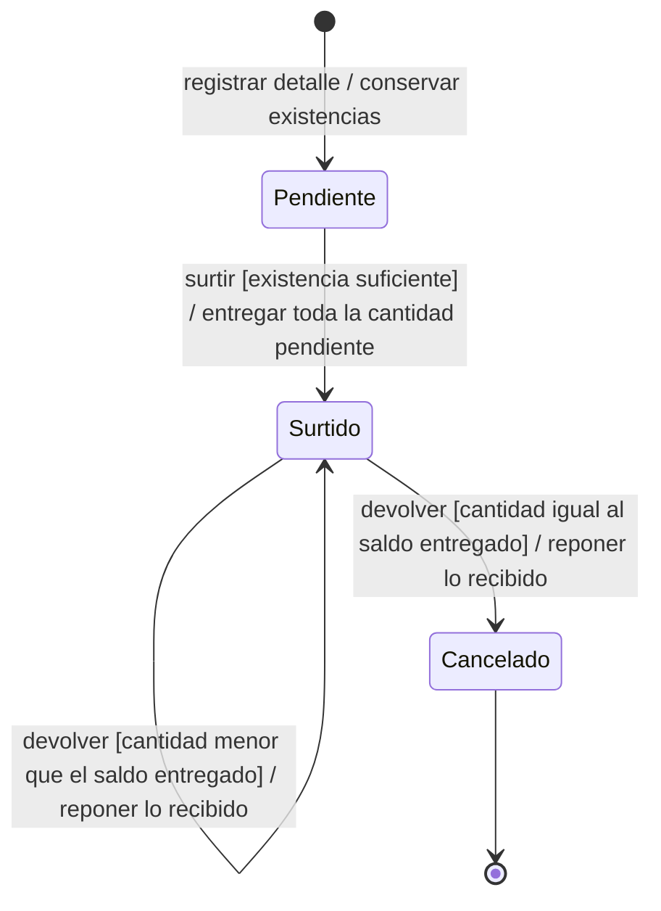
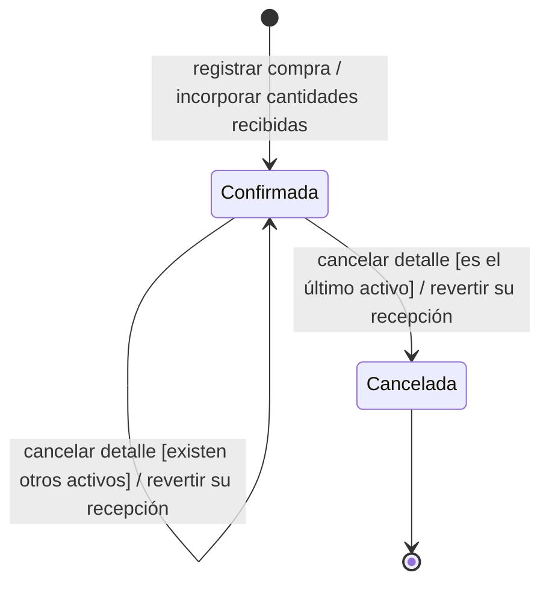
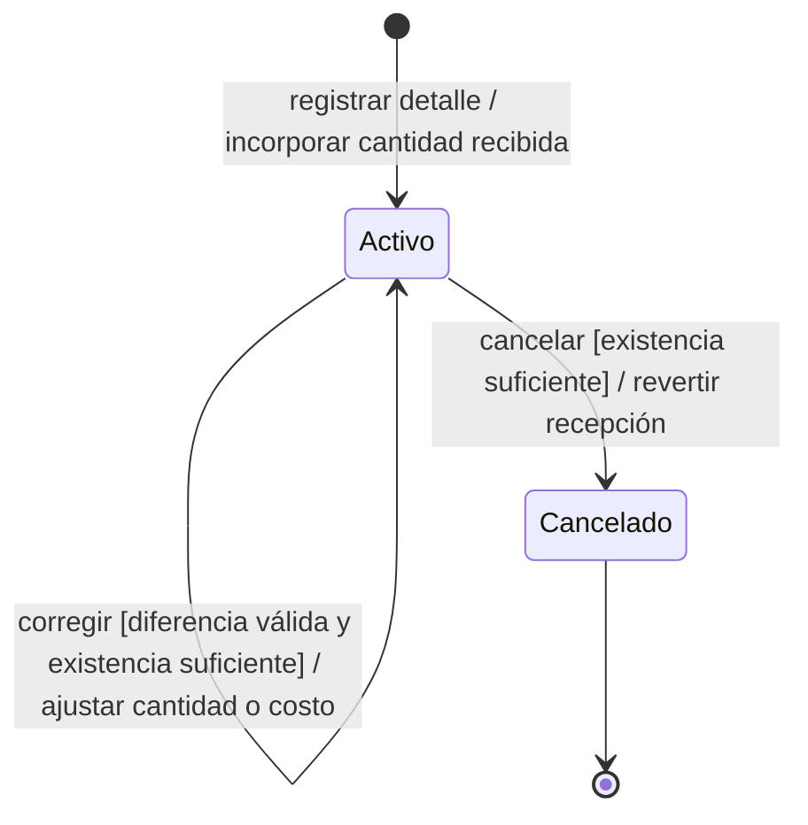

# 3. Estados y datos modificados por acción

Los estados describen situaciones del negocio, no modos de formulario ni pasos de
procesamiento. Las siguientes máquinas distinguen el cumplimiento de una salida,
el cumplimiento de cada detalle y los estados de una compra y de sus detalles.
Se leen como **acción [condición] / efecto**. Las condiciones se comprueban antes de
aceptar la acción; si ésta se rechaza, se conserva el estado y no cambian las existencias.

## Cumplimiento de una salida de material o merma

El objeto representado es **una salida completa**. Su cumplimiento depende de todos
sus detalles: `Pendiente` si ninguno está surtido, `Surtido parcial` si sólo algunos
están surtidos y `Surtido` cuando todos se han surtido. Cada detalle seleccionado se
surte por toda su cantidad pendiente; el cumplimiento parcial de la salida no significa
que el actor pueda elegir entregar sólo una parte de la cantidad de un detalle.

Para surtir, debe existir cantidad pendiente y existencia suficiente para todos los
detalles seleccionados. Para devolver, la salida debe tener cumplimiento `Surtido`
y la cantidad recibida debe ser positiva y no superar lo entregado que aún no se haya
devuelto. No hay devolución desde `Pendiente` o `Surtido parcial`.

Una devolución mantiene el cumplimiento `Surtido` mientras quede alguna cantidad por
devolver, aunque un detalle individual ya esté cancelado. Cuando todos los detalles
están íntegramente devueltos, el cumplimiento del encabezado pasa a `Cancelado` y el
estado general del documento a `Cancelada`. No existe una acción independiente para
cancelar directamente la salida. El final cierra el ciclo de entrega y devolución;
el documento y su historia siguen disponibles para consulta.

## Cumplimiento de un detalle de salida

El objeto representado es **un detalle de material o merma**. Se distingue de la
máquina anterior porque una salida puede contener detalles en situaciones diferentes.
La devolución del detalle requiere además que la salida completa esté `Surtido`.

El saldo entregado es la cantidad surtida menos las devoluciones anteriores. Una
devolución parcial conserva `Surtido`; la devolución de todo el saldo restante deja
el detalle `Cancelado`. Los acumulados y la historia de entrega y devolución se
conservan. El recorrido operativo vigente no necesita un estado de detalle
`Surtido parcial`, aunque ese nombre sí corresponde al cumplimiento del encabezado.

## Estado de una compra de material o consumible

El objeto representado es **una compra recibida**. Su registro incrementa existencias
y deja la compra `Confirmada`. Corregir un detalle o cancelar sólo algunos conserva
ese estado. Cancelar el último detalle activo deja la compra `Cancelada`.

La cancelación requiere existencia suficiente para revertir la cantidad recibida por
el detalle. No elimina el documento ni su historia. Una compra cancelada se consulta
sin habilitar su modificación.

## Estado de un detalle de compra

El objeto representado es **un detalle recibido**. Una corrección mantiene el detalle
`Activo`, conserva sus valores anteriores y ajusta la existencia, los importes y la
historia que correspondan. Una cancelación lo deja `Cancelado` y revierte su recepción.

## Acciones que conservan el estado

| Objeto y acción | Condición de negocio | Efecto |
| --- | --- | --- |
| Salida / editar datos generales | Salida no cancelada y campos admitidos para su situación | Cambia el contexto de la solicitud; no cambia existencias ni cumplimiento. |
| Salida / editar detalles | Salida pendiente y cantidades todavía modificables | Cambia lo solicitado sin entregar ni descontar existencias. |
| Compra / editar datos generales | Compra no cancelada | Cambia los datos admitidos sin volver a sumar las cantidades ya recibidas. |
| Compra / agregar detalle | Compra no cancelada y artículo del mismo contexto | Incorpora una nueva recepción; conserva la compra confirmada. |
| Documento / consultar o generar reporte | Actor autorizado | Muestra información sin modificar estados ni existencias. |

Los valores de cumplimiento y los estados generales son conceptos distintos. Los
formularios no permiten capturarlos libremente ni convierten «editar», «devolver» o
«corregir» en estados nuevos. Los permisos, campos y efectos de las acciones se detallan
en [Modos, precondiciones y efectos](../requirements-specification/06-operation-modes-and-effects.md);
los recorridos se describen en las fichas de [Compras](../use-cases/purchases/index.md)
y [Salidas](../use-cases/issues/index.md).
