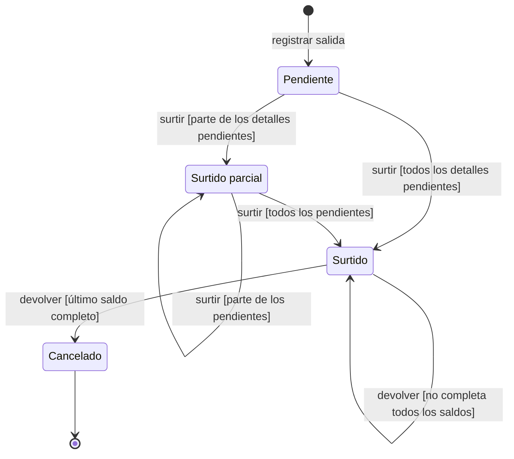
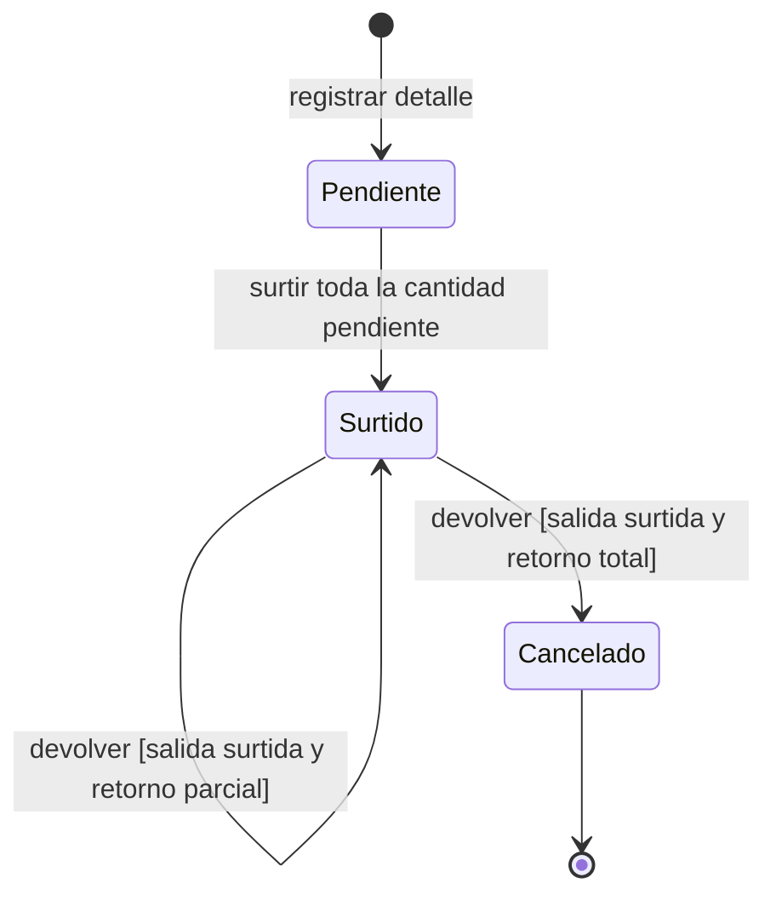
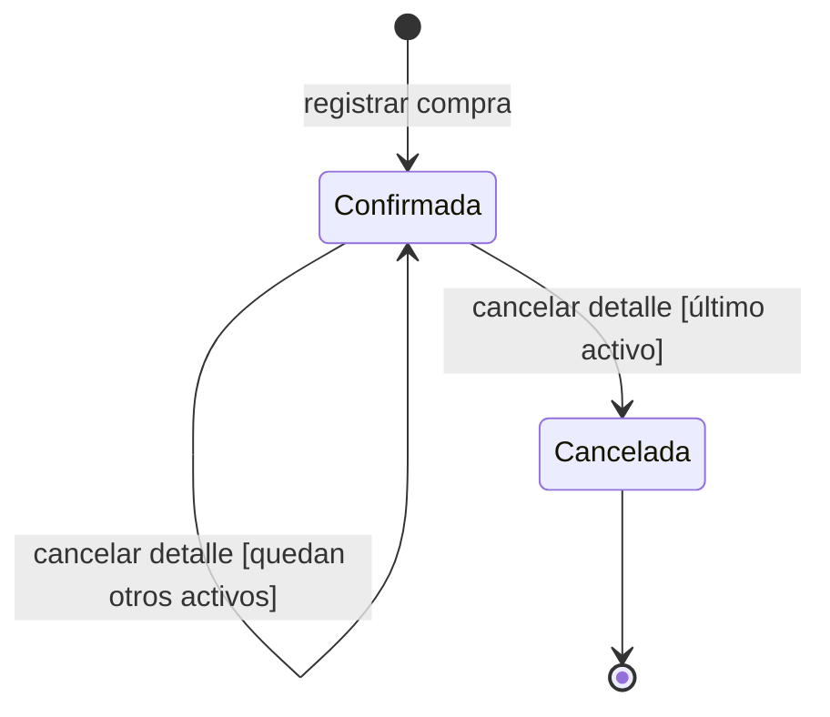
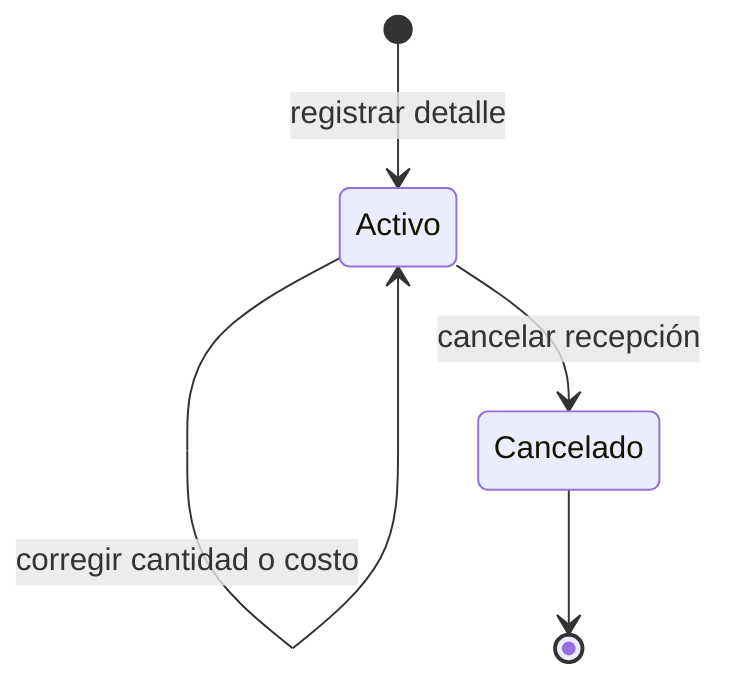

# 3. Estados y datos modificados por acción

Los diagramas muestran estados de negocio. Las etiquetas **acción [condición]**
conservan las guardas que distinguen transiciones; los efectos de inventario se
resumen una sola vez en la tabla común. Los modos de formulario no son estados.
La notación **acción [guarda] / efecto** permite nombrar un efecto breve sin código.
Aquí las acciones remiten a la tabla para no repetirlo en cada flecha.

## Cumplimiento de una salida de material, consumible o merma

El ciclo es común a los tres tipos de salida. Cada detalle seleccionado se surte por
toda su cantidad pendiente; la salida queda parcialmente surtida si quedan otros
detalles pendientes. Sólo se devuelve cuando la salida completa está `Surtido`.

La salida pasa a cumplimiento `Cancelado` y estado general `Cancelada` sólo cuando
todos sus detalles están íntegramente devueltos; no existe cancelación directa.

## Cumplimiento de un detalle de material, consumible o merma

El saldo entregado es la cantidad surtida menos las devoluciones anteriores.
Una devolución parcial conserva `Surtido`; devolver todo el saldo cancela el detalle.
Ambas transiciones requieren que el encabezado de la salida esté completamente
`Surtido`; un detalle ya entregado no puede devolverse mientras otro siga pendiente.

## Estado de una compra de material o consumible

La compra recibida queda `Confirmada`. Cancelar algunos detalles conserva ese estado;
cancelar el último detalle activo deja la compra `Cancelada`.

## Estado de un detalle de compra

Corregir cantidad o costo conserva el detalle `Activo` y su historia.
Cancelar el detalle lo deja `Cancelado`.

## Reglas y efectos comunes

Todas las acciones requieren autorización y datos válidos. Surtir exige existencia
suficiente; devolver no puede superar el saldo entregado; reducir o cancelar una
recepción exige existencia suficiente para revertirla. Un rechazo conserva el estado
y no confirma cambios.

| Acción | Efecto breve | Cambio de existencia |
| --- | --- | --- |
| Registrar salida o editar datos generales | Sin cambio | Ninguno. |
| Registrar compra o detalle | Incorporar recepción | + cantidad recibida. |
| Surtir | Descontar entrega | − cantidad entregada. |
| Devolver | Reponer devolución | + cantidad devuelta. |
| Corregir cantidad recibida | Aplicar diferencia | + (cantidad corregida − cantidad anterior). |
| Corregir sólo costo de compra | Sin cambio de cantidad | Ninguno; conserva el cambio de costo e importes. |
| Cancelar detalle de compra | Revertir recepción | − cantidad recibida vigente del detalle. |

Los signos resumen cambios en la unidad de existencia del recurso, con su conversión
cuando corresponda. Documento y detalle muestran la misma operación a distinta escala;
no duplican el efecto. Otros datos modificados se especifican en la SRS.

El final cierra el ciclo operativo; los documentos, detalles y su historia permanecen
consultables. Los campos, condiciones de edición y reglas completas se mantienen en
[Modos, precondiciones y efectos](../requirements-specification/06-operation-modes-and-effects.md)
y en el [catálogo de casos de uso](../use-cases/index.md).
