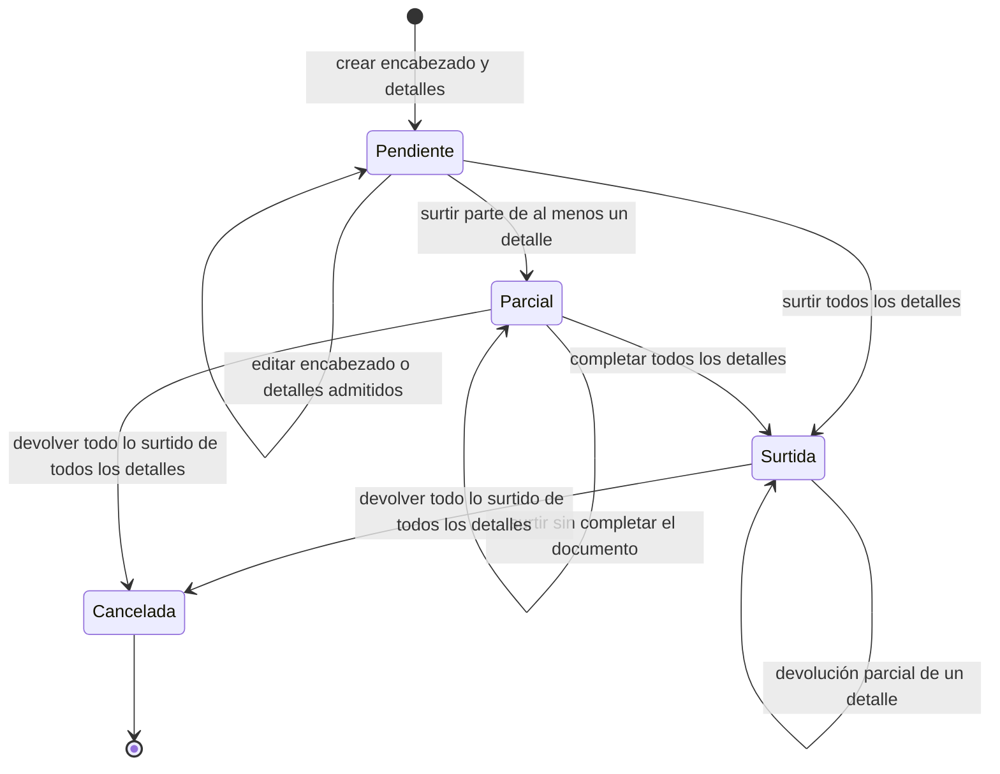

# 4. Estados y datos modificados por acción

Los modos de formulario (`crear`, `editar`, `surtir`, `devolver`) no son estados del
documento. El siguiente UML usa exclusivamente los nombres persistidos que resuelve el
código (`Pendiente`, `Surtido parcial`, `Surtido` y `Cancelado`); por tanto, no presenta
`Borrador` o `Devuelta` como estados aunque esas palabras puedan describir una acción o
una condición funcional. La máquina resume el **cumplimiento agregado** común a salidas
de material y merma. El estado de cada detalle y el del encabezado se derivan después de
la operación, no se asignan desde el formulario.

Las diferencias de permisos, campos y efectos se consultan en la
[matriz de operaciones](../requirements-operations-matrix.md#modos-precondiciones-y-datos-modificados),
y las reglas verificables están en `src/constants/warehouseStatuses.js`,
`src/services/warehouse/issues/issueFulfillmentRules.js` y los servicios específicos de
salidas de material y merma.

`Parcial` es la etiqueta abreviada de cumplimiento `Surtido parcial` y `Surtida` representa
el cumplimiento persistido `Surtido`. La devolución es una operación, no un estado ni un
sinónimo de cancelar: una devolución parcial conserva el detalle `Surtido`, mientras que
devolver todo lo surtido deriva `Cancelado` para ese detalle. Sólo cuando todos los detalles
resultan cancelados se derivan cumplimiento `Cancelado` y estado documental `Cancelada`
para el encabezado. Esta aclaración evita interpretar el diagrama como un catálogo adicional
de estados o como una acción independiente de cancelación.
