# Diagramas de requisitos

Este documento resume visualmente el alcance observable de Nexus y relaciona actores,
capacidades y atributos de calidad. La definición, estado, criterios de aceptación y
reglas de negocio se detallan en la
[especificación de requisitos](requirements-specification.md). Este archivo es un mapa
para conversación y revisión: las rutas del
[mapa generado](../generated/code-map.md), el esquema Prisma y las pruebas siguen siendo
las fuentes verificables de implementación. Estas vistas aplican las
[convenciones y patrones para diagramas](../architecture/diagram-conventions.md): cada sección conserva
un propósito, alcance, semántica y fuente de verdad definidos.

## Vista de requisitos y dependencias

Esta vista contiene **requisitos**, no actores ni casos de uso. Las operaciones del
usuario se muestran exclusivamente en el [diagrama de casos de uso](domain-and-use-cases.md#casos-de-uso-vigentes). Una flecha `A --> B` significa que el cumplimiento de `A`
depende de `B`; no representa navegación, permiso ni interacción humana.

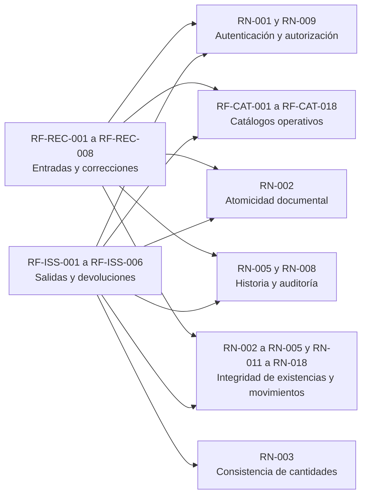

El texto verificable y el estado de cada identificador se mantienen una sola vez en la
[especificación](requirements-specification.md#4-requisitos-funcionales). La
[matriz de operaciones](requirements-operations-matrix.md#matriz-vigente) documenta los
permisos, y el mapa generado documenta las rutas; repetirlos aquí mezclaría vistas.

## Ciclo vigente de los requisitos CRUD

Los catálogos reutilizan un mismo ciclo de interacción, con autorización y validación
particulares según el recurso. La eliminación física sólo aparece cuando las relaciones
del dominio la permiten; en los demás casos el ciclo usa activación, desactivación o
cancelación. Los documentos operativos reutilizan listado y formulario, pero agregan
acciones de detalle, existencias y movimientos sin presentarlas como un CRUD idéntico.

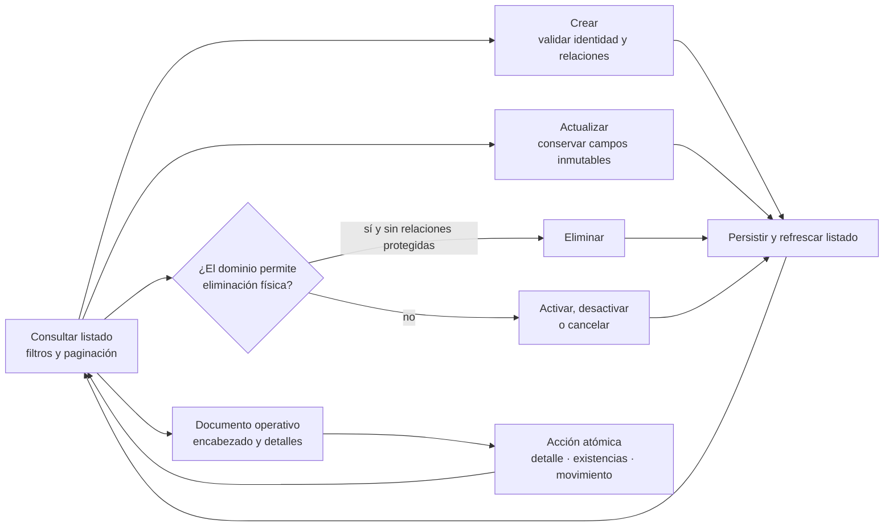

Las flechas representan transiciones observables del usuario, no rutas concretas de la API.
La bifurcación de eliminación aplica `RN-007`; el límite atómico aplica `RN-002`. La
matriz de operaciones define cuál de estas ramas existe realmente para cada módulo.

## Revisión de flujos y nivel de detalle

La revisión del catálogo de casos de uso y de los servicios coordinadores distingue los
flujos que pueden reutilizar el ciclo CRUD anterior de aquellos cuya consistencia depende
de varias cantidades, estados o escrituras. Cada caso tiene una vista propia para poder
seguirlo de principio a fin; la reutilización consiste en conservar la misma estructura
y señalar sus diferencias, no en omitir el caso.

| Área revisada | Complejidad observada | Decisión visual |
| --- | --- | --- |
| Personas, usuarios y catálogos | Validación y política de eliminación propias, pero transición CRUD común. | Crear una vista por caso reutilizando la estructura **seleccionar operación → validar → persistir → refrescar**. |
| Creación y edición de documentos | Encabezado y detalles varían por contexto, pero siguen el límite transaccional ya representado. | Crear una vista por caso y hacer explícito cuándo cambia el inventario. |
| Corrección o cancelación de una entrada | Debe conciliar snapshot, diferencia de cantidad, stock, movimiento, totales e historial en una sola transacción. | Agregar una secuencia de coordinación atómica. |
| Surtimiento y devolución de una salida | La cantidad solicitada, surtida y devuelta determina estados de detalle y documento; una devolución crea además un movimiento inverso. | Agregar una máquina de estados con invariantes cuantitativas. |
| Material frente a merma | El proceso es equivalente, aunque cambian inventario, conversión y reglas contextuales. | Un mismo caso muestra la bifurcación de contexto y el proceso compartido. |
| Consultas, filtros y exportación | No modifica estados y combina filtros, paginación y formatos de salida. | Crear una vista propia de consulta sin presentarla como escritura CRUD. |

Esta clasificación se revisa cuando un caso de uso incorpora una bifurcación, una
transacción con un nuevo efecto persistente o una transición de estado. Los diagramas
por caso reutilizan nodos y semántica cuando el proceso es equivalente, mientras los
diagramas de secuencia o estados se reservan para explicar coordinación adicional.

## Organización visual de los casos

Los flujos conservan los cinco grupos funcionales del catálogo y se leen dentro de las
familias por entidad definidas en el
[criterio de agrupación vigente](use-case-descriptions.md#criterio-de-agrupación-vigente).
La familia sólo permite localizar casos relacionados: cada encabezado y cada diagrama
siguiente sigue representando una acción sobre una entidad concreta. El primer nodo
nombra al actor como iniciador y corresponde al disparador de la ficha; los nodos
siguientes identifican las respuestas de Nexus.


## Flujos de cada caso de uso

Cada vista comienza con un identificador `CU-<GRUPO>-<SECUENCIA>` y representa
exclusivamente ese objetivo. Los encabezados conservan los mismos grupos funcionales y códigos del
catálogo; los diagramas reutilizan la misma semántica cuando el proceso es equivalente,
pero no agrupan objetivos distintos en una sola vista. Las flechas resumen los pasos
observables y no representan endpoints. El recorrido contrastado contra vista, router,
controller y servicio se conserva en la sección
[inferencia de pasos desde la implementación](use-case-descriptions.md#inferencia-de-pasos-desde-la-implementación),
y la fuente curada de cada ficha es el
[catálogo operativo](use-case-descriptions.md#catálogo-operativo-y-granularidad).

### Grupo funcional IDA — Identidad y acceso

#### `CU-IDA-01` — Consultar personas

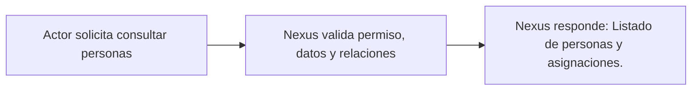

#### `CU-IDA-02` — Crear persona

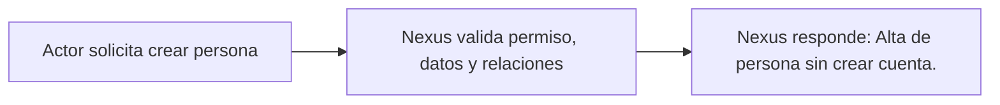

#### `CU-IDA-03` — Editar persona

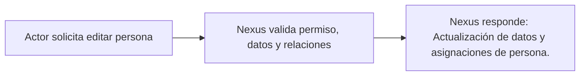

#### `CU-IDA-04` — Consultar usuarios

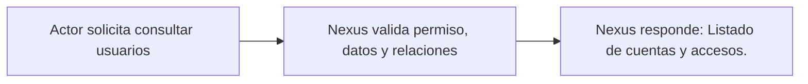

#### `CU-IDA-05` — Crear usuario y asignar acceso

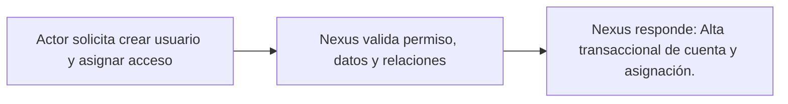

#### `CU-IDA-06` — Editar usuario y acceso

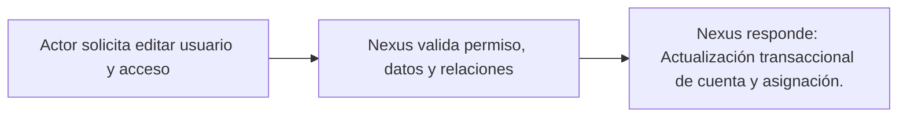

#### `CU-IDA-07` — Cambiar contraseña de usuario

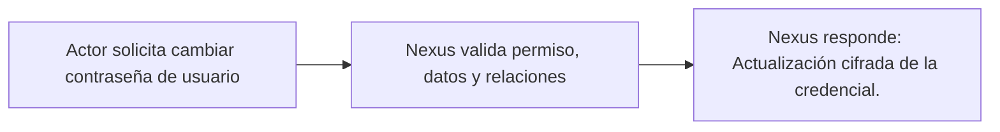

#### `CU-IDA-08` — Consultar roles

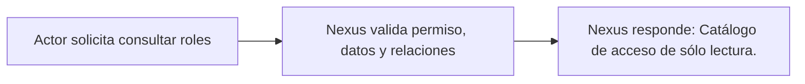

#### `CU-IDA-09` — Consultar departamentos

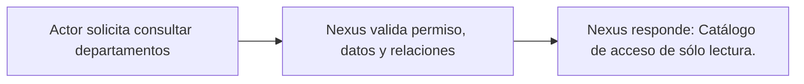

### Grupo funcional CAT — Catálogos

#### `CU-CAT-01` — Consultar materiales

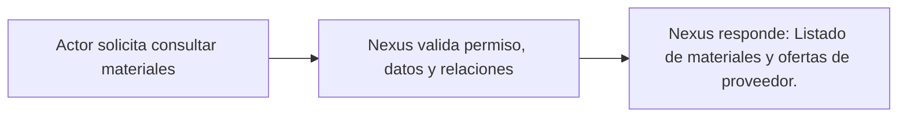

#### `CU-CAT-02` — Crear material

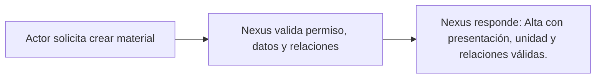

#### `CU-CAT-03` — Editar material

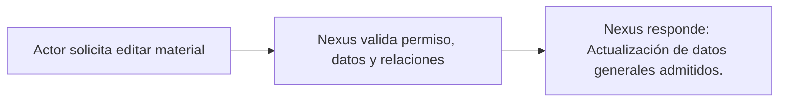

#### `CU-CAT-04` — Retirar material

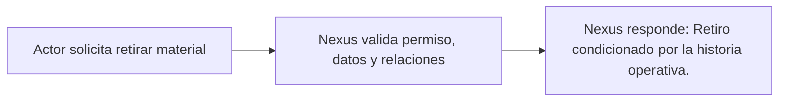

#### `CU-CAT-05` — Ajustar existencia de material

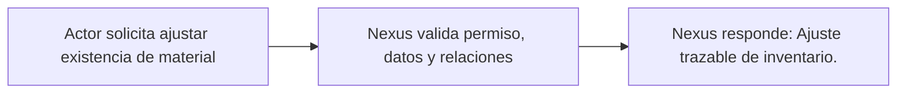

#### `CU-CAT-06` — Consultar proveedores

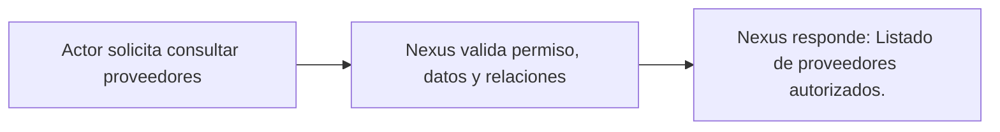

#### `CU-CAT-07` — Crear proveedor

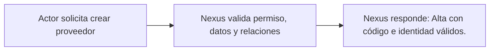

#### `CU-CAT-08` — Editar proveedor

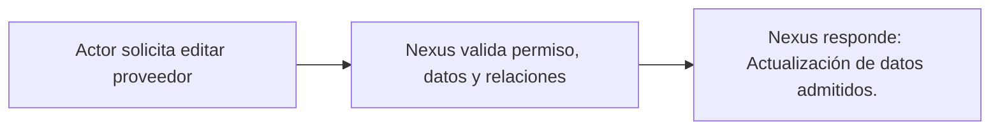

#### `CU-CAT-09` — Consultar clientes

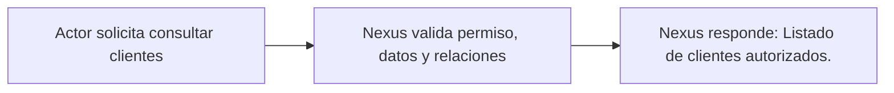

#### `CU-CAT-10` — Crear cliente

```mermaid
flowchart LR
    request["Actor solicita crear cliente"] --> validate["Nexus valida permiso, datos y relaciones"]
    validate --> result["Nexus responde: Alta con asesor opcional válido."]
```

#### `CU-CAT-11` — Editar cliente

```mermaid
flowchart LR
    request["Actor solicita editar cliente"] --> validate["Nexus valida permiso, datos y relaciones"]
    validate --> result["Nexus responde: Actualización de datos y asesor opcional."]
```

#### `CU-CAT-12` — Consultar mermas

```mermaid
flowchart LR
    request["Actor solicita consultar mermas"] --> validate["Nexus valida permiso, datos y relaciones"]
    validate --> result["Nexus responde: Listado de existencias de merma."]
```

#### `CU-CAT-13` — Registrar merma

```mermaid
flowchart LR
    request["Actor solicita registrar merma"] --> validate["Nexus valida permiso, datos y relaciones"]
    validate --> result["Nexus responde: Alta desde una plantilla material-proveedor."]
```

#### `CU-CAT-14` — Editar merma

```mermaid
flowchart LR
    request["Actor solicita editar merma"] --> validate["Nexus valida permiso, datos y relaciones"]
    validate --> result["Nexus responde: Actualización sin alterar su identidad física."]
```

#### `CU-CAT-15` — Ajustar existencia de merma

```mermaid
flowchart LR
    request["Actor solicita ajustar existencia de merma"] --> validate["Nexus valida permiso, datos y relaciones"]
    validate --> result["Nexus responde: Ajuste trazable de inventario de merma."]
```

#### `CU-CAT-16` — Consultar presentaciones

```mermaid
flowchart LR
    request["Actor solicita consultar presentaciones"] --> validate["Nexus valida permiso, datos y relaciones"]
    validate --> result["Nexus responde: Catálogo auxiliar de sólo lectura."]
```

#### `CU-CAT-17` — Consultar unidades de medida

```mermaid
flowchart LR
    request["Actor solicita consultar unidades de medida"] --> validate["Nexus valida permiso, datos y relaciones"]
    validate --> result["Nexus responde: Catálogo auxiliar de sólo lectura."]
```

#### `CU-CAT-18` — Consultar motivos de ajuste

```mermaid
flowchart LR
    request["Actor solicita consultar motivos de ajuste"] --> validate["Nexus valida permiso, datos y relaciones"]
    validate --> result["Nexus responde: Catálogo auxiliar de sólo lectura."]
```

#### `CU-CAT-19` — Consultar estados de cumplimiento

```mermaid
flowchart LR
    request["Actor solicita consultar estados de cumplimiento"] --> validate["Nexus valida permiso, datos y relaciones"]
    validate --> result["Nexus responde: Catálogo auxiliar de sólo lectura."]
```

#### `CU-CAT-20` — Cambiar estado de proveedor

```mermaid
flowchart LR
    request["Actor solicita cambiar estado de proveedor"] --> validate["Nexus valida permiso, datos y relaciones"]
    validate --> result["Nexus responde: Activación o desactivación del proveedor."]
```

### Grupo funcional ENT — Compras de material

#### `CU-ENT-01` — Consultar compras de material

```mermaid
flowchart LR
    request["Actor solicita consultar compras de material"] --> validate["Nexus valida permiso, datos y relaciones"]
    validate --> result["Nexus responde: Listado y detalle sin modificar inventario."]
```

#### `CU-ENT-02` — Crear compra de material

```mermaid
flowchart LR
    request["Actor solicita crear compra de material"] --> validate["Nexus valida permiso, datos y relaciones"]
    validate --> result["Nexus responde: Compra, detalles, existencias y movimientos transaccionales."]
```

#### `CU-ENT-03` — Editar compra de material

```mermaid
flowchart LR
    request["Actor solicita editar compra de material"] --> validate["Nexus valida permiso, datos y relaciones"]
    validate --> result["Nexus responde: Edición de encabezado y detalles admitidos."]
```

#### `CU-ENT-04` — Corregir material de una compra

```mermaid
flowchart LR
    request["Actor solicita corregir material de una compra"] --> validate["Nexus valida permiso, datos y relaciones"]
    validate --> result["Nexus responde: Corrección de cantidad o costo con historial."]
```

#### `CU-ENT-05` — Cancelar material de una compra

```mermaid
flowchart LR
    request["Actor solicita cancelar material de una compra"] --> validate["Nexus valida permiso, datos y relaciones"]
    validate --> result["Nexus responde: Cancelación del detalle y reversión de inventario."]
```

### Grupo funcional SAL — Salidas de material y de merma

#### `CU-SAL-01` — Consultar salidas de material

```mermaid
flowchart LR
    request["Actor solicita consultar salidas de material"] --> validate["Nexus valida permiso, datos y relaciones"]
    validate --> result["Nexus responde: Consulta sin modificar existencias."]
```

#### `CU-SAL-02` — Crear salida de material

```mermaid
flowchart LR
    request["Actor solicita crear salida de material"] --> validate["Nexus valida permiso, datos y relaciones"]
    validate --> result["Nexus responde: Creación pendiente sin descontar existencias."]
```

#### `CU-SAL-03` — Editar encabezado de salida de material

```mermaid
flowchart LR
    request["Actor solicita editar encabezado de salida de material"] --> validate["Nexus valida permiso, datos y relaciones"]
    validate --> result["Nexus responde: Edición de los campos admitidos."]
```

#### `CU-SAL-04` — Ajustar materiales de una salida

```mermaid
flowchart LR
    request["Actor solicita ajustar materiales de una salida"] --> validate["Nexus valida permiso, datos y relaciones"]
    validate --> result["Nexus responde: Actualización de detalles todavía modificables."]
```

#### `CU-SAL-05` — Surtir material

```mermaid
flowchart LR
    request["Actor solicita surtir material"] --> validate["Nexus valida permiso, datos y relaciones"]
    validate --> result["Nexus responde: Descuento de existencia y registro de movimiento."]
```

#### `CU-SAL-06` — Devolver material surtido

```mermaid
flowchart LR
    request["Actor solicita devolver material surtido"] --> validate["Nexus valida permiso, datos y relaciones"]
    validate --> result["Nexus responde: Reintegro de existencia y movimiento inverso."]
```

#### `CU-SAL-07` — Consultar salidas de merma

```mermaid
flowchart LR
    request["Actor solicita consultar salidas de merma"] --> validate["Nexus valida permiso, datos y relaciones"]
    validate --> result["Nexus responde: Consulta sin modificar existencias."]
```

#### `CU-SAL-08` — Crear salida de merma

```mermaid
flowchart LR
    request["Actor solicita crear salida de merma"] --> validate["Nexus valida permiso, datos y relaciones"]
    validate --> result["Nexus responde: Creación pendiente sin descontar existencias."]
```

#### `CU-SAL-09` — Editar encabezado de salida de merma

```mermaid
flowchart LR
    request["Actor solicita editar encabezado de salida de merma"] --> validate["Nexus valida permiso, datos y relaciones"]
    validate --> result["Nexus responde: Edición de los campos admitidos."]
```

#### `CU-SAL-10` — Ajustar mermas de una salida

```mermaid
flowchart LR
    request["Actor solicita ajustar mermas de una salida"] --> validate["Nexus valida permiso, datos y relaciones"]
    validate --> result["Nexus responde: Actualización de detalles todavía modificables."]
```

#### `CU-SAL-11` — Surtir merma

```mermaid
flowchart LR
    request["Actor solicita surtir merma"] --> validate["Nexus valida permiso, datos y relaciones"]
    validate --> result["Nexus responde: Descuento de existencia y registro de movimiento."]
```

#### `CU-SAL-12` — Devolver merma surtida

```mermaid
flowchart LR
    request["Actor solicita devolver merma surtido"] --> validate["Nexus valida permiso, datos y relaciones"]
    validate --> result["Nexus responde: Reintegro de existencia y movimiento inverso."]
```

### Grupo funcional REP — Consultas y reportes

#### `CU-REP-01` — Consultar inventario de materiales

```mermaid
flowchart LR
    request["Actor solicita consultar inventario de materiales"] --> validate["Nexus valida permiso, datos y relaciones"]
    validate --> result["Nexus responde: Consulta autorizada sin modificar datos."]
```

#### `CU-REP-02` — Consultar inventario de mermas

```mermaid
flowchart LR
    request["Actor solicita consultar inventario de mermas"] --> validate["Nexus valida permiso, datos y relaciones"]
    validate --> result["Nexus responde: Consulta autorizada sin modificar datos."]
```

#### `CU-REP-03` — Consultar movimientos de materiales

```mermaid
flowchart LR
    request["Actor solicita consultar movimientos de materiales"] --> validate["Nexus valida permiso, datos y relaciones"]
    validate --> result["Nexus responde: Consulta autorizada sin modificar datos."]
```

#### `CU-REP-04` — Consultar movimientos de mermas

```mermaid
flowchart LR
    request["Actor solicita consultar movimientos de mermas"] --> validate["Nexus valida permiso, datos y relaciones"]
    validate --> result["Nexus responde: Consulta autorizada sin modificar datos."]
```

#### `CU-REP-05` — Generar reporte de inventario de materiales

```mermaid
flowchart LR
    request["Actor solicita generar reporte de inventario de materiales"] --> validate["Nexus valida permiso, datos y relaciones"]
    validate --> result["Nexus responde: Archivo Excel con filtros, columnas y cálculos propios del reporte."]
```

#### `CU-REP-06` — Generar reporte de salidas de material

```mermaid
flowchart LR
    request["Actor solicita generar reporte de salidas de material"] --> validate["Nexus valida permiso, datos y relaciones"]
    validate --> result["Nexus responde: Archivo Excel con filtros, columnas y cálculos propios del reporte."]
```

#### `CU-REP-07` — Generar reporte de salidas de merma

```mermaid
flowchart LR
    request["Actor solicita generar reporte de salidas de merma"] --> validate["Nexus valida permiso, datos y relaciones"]
    validate --> result["Nexus responde: Archivo Excel con filtros, columnas y cálculos propios del reporte."]
```

#### `CU-REP-08` — Generar reporte de compras de material

```mermaid
flowchart LR
    request["Actor solicita generar reporte de compras de material"] --> validate["Nexus valida permiso, datos y relaciones"]
    validate --> result["Nexus responde: Archivo Excel con filtros, columnas y cálculos propios del reporte."]
```

#### `CU-REP-09` — Generar reporte de mermas

```mermaid
flowchart LR
    request["Actor solicita generar reporte de mermas"] --> validate["Nexus valida permiso, datos y relaciones"]
    validate --> result["Nexus responde: Archivo Excel con filtros, columnas y cálculos propios del reporte."]
```

#### `CU-REP-10` — Generar reporte de proveedores

```mermaid
flowchart LR
    request["Actor solicita generar reporte de proveedores"] --> validate["Nexus valida permiso, datos y relaciones"]
    validate --> result["Nexus responde: Archivo Excel con filtros, columnas y cálculos propios del reporte."]
```

#### `CU-REP-11` — Generar reporte de clientes

```mermaid
flowchart LR
    request["Actor solicita generar reporte de clientes"] --> validate["Nexus valida permiso, datos y relaciones"]
    validate --> result["Nexus responde: Archivo Excel con filtros, columnas y cálculos propios del reporte."]
```

#### `CU-REP-12` — Generar reporte de personas

```mermaid
flowchart LR
    request["Actor solicita generar reporte de personas"] --> validate["Nexus valida permiso, datos y relaciones"]
    validate --> result["Nexus responde: Archivo Excel con filtros, columnas y cálculos propios del reporte."]
```

#### `CU-REP-13` — Generar reporte de usuarios

```mermaid
flowchart LR
    request["Actor solicita generar reporte de usuarios"] --> validate["Nexus valida permiso, datos y relaciones"]
    validate --> result["Nexus responde: Archivo Excel con filtros, columnas y cálculos propios del reporte."]
```

#### `CU-REP-14` — Generar reporte de movimientos de materiales

```mermaid
flowchart LR
    request["Actor solicita generar reporte de movimientos de materiales"] --> validate["Nexus valida permiso, datos y relaciones"]
    validate --> result["Nexus responde: Archivo Excel con filtros, columnas y cálculos propios del reporte."]
```

#### `CU-REP-15` — Generar reporte de movimientos de mermas

```mermaid
flowchart LR
    request["Actor solicita generar reporte de movimientos de mermas"] --> validate["Nexus valida permiso, datos y relaciones"]
    validate --> result["Nexus responde: Archivo Excel con filtros, columnas y cálculos propios del reporte."]
```

## Casos con vistas adicionales y nivel de coordinación

La necesidad de otra vista se evaluó con cuatro señales: **cantidad de decisiones de
negocio**, **escrituras coordinadas**, **cambio de estado o acumulados** y **efecto que
debe revertirse ante un fallo**. Como todos los casos ya tienen un flujo funcional y una
vista técnica, **no se asigna una prioridad visual**: la cobertura no depende de atender
primero un caso. El nivel sólo clasifica la coordinación que debe conservar cada vista y
ayuda a elegir entre actividad, secuencia, decisión o máquina de estados cuando cambie
el código.

| Nivel de coordinación | Casos revisados | Motivo | Vista aplicada |
| --- | --- | --- | --- |
| Compleja | `CU-IDA-05`, `CU-IDA-06`, `CU-IDA-07` | Contraseña cifrada, persona opcional y asignación rol/departamento; al editar se reemplaza la asignación dentro de una transacción. | Secuencia de identidad y acceso incluida abajo. |
| Compleja | `CU-CAT-04` | La historia operativa impide eliminar; si quedan otros proveedores sólo se retira la relación proveedor-material. | Decisión de eliminación incluida abajo. |
| Compleja | `CU-ENT-02` | Referencia, documento, detalles, stock y movimientos se confirman juntos; el costo se revisa después del commit. | Secuencia de registro incluida abajo. |
| Compleja | `CU-ENT-04`, `CU-ENT-05` | Corrección/cancelación altera historia, totales, stock y movimiento. | Secuencia atómica ya incluida en este documento. |
| Compleja | `CU-SAL-05`, `CU-SAL-06`, `CU-SAL-11`, `CU-SAL-12` | Acumulados, estados, existencias y movimientos dependen de cantidades previas. | Máquina de estados ya incluida en este documento. |
| Compleja | `CU-REP-05` a `CU-REP-15` | Filtros, variantes mensual/detallada, fórmulas, totales y archivo deben conservar el mismo resultado de dominio. | Canal de generación de reportes incluido abajo. |
| Intermedia | `CU-CAT-02`, `CU-CAT-03`, `CU-CAT-07`, `CU-CAT-08`, `CU-CAT-10`, `CU-CAT-11`, `CU-CAT-13`, `CU-CAT-14`, `CU-ENT-03`, `CU-SAL-02` a `CU-SAL-04` y `CU-SAL-08` a `CU-SAL-10` | Coordinan relaciones o detalles, pero no agregan participantes o estados que justifiquen una secuencia transaccional. | Flujo funcional en su grupo y vista técnica complementaria incluida abajo. |
| Directa | `CU-IDA-01` a `CU-IDA-03`, `CU-CAT-01`, `CU-CAT-06`, `CU-CAT-09`, `CU-CAT-12`, `CU-CAT-16` a `CU-CAT-19`, `CU-ENT-01`, `CU-SAL-01`, `CU-SAL-07`, `CU-REP-01` a `CU-REP-04` | Consulta o mutación directa sin estados coordinados adicionales. | Flujo funcional en su grupo y vista técnica complementaria incluida abajo. |

Las vistas siguientes completan los casos de coordinación intermedia y directa con el
mismo criterio aplicado a los casos de coordinación compleja: muestran la ejecución
entre capas y nombran el punto que el flujo funcional resumido no alcanza a representar.
No sustituyen los diagramas individuales anteriores; los complementan con una lectura
orientada al código.

### Consultar personas y usuarios — `CU-IDA-01` y `CU-IDA-04`

```mermaid
sequenceDiagram
    actor Admin as Administración
    participant Route as personApiRoute / userApiRoute
    participant Auth as Autenticación y permiso
    participant Controller as personController / userController
    participant Service as personService / userService
    participant Db as Prisma

    Admin->>Route: solicitar listado con filtros
    Route->>Auth: verificar token y permiso del recurso
    Auth->>Controller: petición autorizada
    Controller->>Service: consulta normalizada
    Service->>Db: buscar y contar registros
    Db-->>Service: página y total
    Service-->>Controller: resultado autorizado
    Controller-->>Admin: respuesta paginada
```

Personas y usuarios son consultas separadas y conservan permisos, filtros y forma de
respuesta propios. La vista omite el montaje completo de la URL, que permanece en el
mapa generado, y no implica que una consulta entregue credenciales.

### Crear persona — `CU-IDA-02`

```mermaid
sequenceDiagram
    actor Admin as Administración
    participant Route as personApiRoute
    participant Validation as personValidation
    participant Controller as personController
    participant Service as personService
    participant Db as Prisma

    Admin->>Route: POST con datos de persona
    Route->>Validation: validar campos e identidad
    Validation->>Controller: datos admitidos
    Controller->>Service: registrar persona
    Service->>Db: comprobar identidad y crear
    Db-->>Service: persona creada
    Service-->>Controller: resultado de dominio
    Controller-->>Admin: confirmación
```

La validación de transporte ocurre antes del controller y la regla de identidad se
conserva en el servicio. El refresco del listado del diagrama funcional sucede en el
navegador después de esta respuesta y no es otra escritura.

### Editar persona — `CU-IDA-03`

```mermaid
sequenceDiagram
    actor Admin as Administración
    participant Route as personApiRoute
    participant Validation as personValidation
    participant Controller as personController
    participant Service as personService
    participant Db as Prisma

    Admin->>Route: PUT /:id con cambios
    Route->>Validation: validar campos editables
    Validation->>Controller: petición válida
    Controller->>Service: editar persona identificada
    Service->>Db: comprobar existencia e identidad
    Service->>Db: actualizar campos admitidos
    Db-->>Service: persona actualizada
    Service-->>Controller: resultado de dominio
    Controller-->>Admin: confirmación
```

La secuencia hace visible que la existencia y la identidad no se confían al formulario.
No muestra componentes EJS ni refresco de DataTable porque pertenecen a la presentación,
no a la actualización de dominio.

### Patrón de consulta de catálogos — `CU-CAT-01`, `CU-CAT-06`, `CU-CAT-09`, `CU-CAT-12` y `CU-CAT-16` a `CU-CAT-19`

```mermaid
flowchart LR
    catalogRoute["Router del catálogo<br/>GET y permiso"] --> catalogController["Controller de listado<br/>configuración del recurso"]
    catalogController --> listFactory["createDataTableListController<br/>normalizar paginación y filtros"]
    listFactory --> catalogService["Servicio del catálogo<br/>buscar y contar"]
    catalogService --> catalogDb[("Prisma")]
    catalogDb --> catalogResponse["Página del recurso"]
```

La fábrica de listado se reutiliza cuando el recurso la configura; el diagrama no afirma
que todos los catálogos compartan filtros o permisos. Los routers y servicios concretos
siguen siendo las fuentes verificables de cada variante.

### Patrón de alta de catálogos — `CU-CAT-02`, `CU-CAT-07`, `CU-CAT-10` y `CU-CAT-13`

```mermaid
flowchart LR
    catalogCreateRoute["POST del recurso<br/>validación y permiso"] --> catalogCreateController["Controller<br/>adaptar cuerpo"]
    catalogCreateController --> catalogCreateService["Servicio del recurso<br/>validar identidad y relaciones"]
    catalogCreateService --> catalogCreateDb[("Prisma<br/>crear registro")]
    catalogCreateDb --> catalogCreateUi["Respuesta y refresco CRUD"]
```

Cliente, proveedor, material, merma y catálogos auxiliares recorren capas equivalentes,
pero sus relaciones y reglas no se trasladan a una fábrica común. El refresco final es
una reacción de `createCrudApplication`, no parte de la transacción de persistencia.

### Patrón de edición de catálogos — `CU-CAT-03`, `CU-CAT-08`, `CU-CAT-11` y `CU-CAT-14`

```mermaid
flowchart LR
    catalogEditRoute["PUT o PATCH del recurso<br/>validación y permiso"] --> catalogEditController["Controller<br/>identificador y cambios"]
    catalogEditController --> catalogEditService["Servicio del recurso<br/>existencia · identidad · relaciones"]
    catalogEditService --> catalogEditDb[("Prisma<br/>actualizar")]
    catalogEditDb --> catalogEditUi["Respuesta y refresco CRUD"]
```

El método HTTP y los campos editables dependen del router concreto. La vista sólo
reutiliza la cadena estable de capas y no supone que crear y editar tengan exactamente
las mismas validaciones.

### Consultar compras de material — `CU-ENT-01`

```mermaid
sequenceDiagram
    actor Warehouse as Almacén
    participant Route as goodsReceiptApiRoute
    participant Controller as goodsReceiptController
    participant Service as goodsReceiptService
    participant Db as Prisma

    Warehouse->>Route: GET con búsqueda, fechas y relaciones
    Route->>Route: verificar token y permiso
    Route->>Controller: consulta autorizada
    Controller->>Service: filtros y paginación
    Service->>Db: consultar entradas y total
    Db-->>Service: página con relaciones
    Service-->>Controller: resultado de consulta
    Controller-->>Warehouse: resultado serializado
```

La consulta no abre la transacción documental ni recalcula inventario. Los totales y
relaciones devueltos son proyecciones de lectura; el dibujo funcional los agrupa bajo
«mostrar página».

### Editar compra de material — `CU-ENT-03`

```mermaid
sequenceDiagram
    actor Warehouse as Almacén
    participant Route as goodsReceiptApiRoute
    participant Validation as goodsReceiptHeaderValidation
    participant Controller as goodsReceiptController
    participant Service as goodsReceiptService
    participant Db as Prisma

    Warehouse->>Route: PATCH /:id con encabezado
    Route->>Validation: validar campos admitidos
    Validation->>Controller: petición válida y autorizada
    Controller->>Service: actualizar encabezado
    Service->>Db: comprobar entrada y persistir cambios
    Db-->>Service: entrada actualizada
    Service-->>Controller: resultado de dominio
    Controller-->>Warehouse: confirmación
```

La ruta vigente edita el encabezado y no vuelve a aplicar el stock de detalles ya
registrados. Agregar o corregir detalles usa operaciones distintas, por lo que no se
representan como efectos implícitos de esta secuencia.

### Consultar salidas de material o de merma — `CU-SAL-01` y `CU-SAL-07`

```mermaid
flowchart LR
    issueContext{"¿Material o merma?"}
    issueContext --> goodsIssueRoute["goodsIssueApiRoute<br/>GET y permiso"]
    issueContext --> wasteIssueRoute["wasteIssueApiRoute<br/>GET y permiso"]
    goodsIssueRoute --> goodsIssueService["goodsIssueService<br/>filtros y estados"]
    wasteIssueRoute --> wasteIssueService["wasteIssueService<br/>filtros y estados"]
    goodsIssueService --> issuePage["Página de salidas"]
    wasteIssueService --> issuePage
```

La bifurcación es técnica además de funcional: cada contexto conserva router, permiso,
servicio e inventario propios. Compartir el resultado visual no significa consultar una
tabla o conversión única.

### Crear salida de material o de merma — `CU-SAL-02` y `CU-SAL-08`

```mermaid
sequenceDiagram
    actor Warehouse as Almacén
    participant Route as Router de salida del contexto
    participant Validation as Validador de material o merma
    participant Controller as Controller del contexto
    participant Service as Servicio de salida
    participant Db as Prisma

    Warehouse->>Route: POST con encabezado y detalles
    Route->>Validation: validar relaciones y cantidades
    Validation->>Controller: DTO admitido y autorizado
    Controller->>Service: registrar salida
    Service->>Db: crear documento y detalles pendientes
    Db-->>Service: salida creada
    Service-->>Controller: resultado de dominio
    Controller-->>Warehouse: confirmación sin movimiento
```

Crear la salida no descuenta inventario ni registra el movimiento de surtimiento. Esos
efectos comienzan al confirmar detalles en `CU-SAL-05`, aunque la interfaz presente ambos
pasos dentro del mismo módulo.

### Editar encabezado de salida de material o de merma — `CU-SAL-03` y `CU-SAL-09`

```mermaid
flowchart LR
    issueHeaderRoute["PATCH /:id/header<br/>validación y permiso"] --> issueHeaderController["Controller del contexto"]
    issueHeaderController --> issueHeaderContext["goodsIssueService o wasteIssueService"]
    issueHeaderContext --> issueHeaderRules["issueHeaderService<br/>resolver campos admitidos"]
    issueHeaderRules --> issueHeaderDb[("Prisma<br/>actualizar encabezado")]
    issueHeaderDb --> issueHeaderResult["Respuesta sin efecto de inventario"]
```

`issueHeaderService` concentra la resolución compartida del encabezado y cada servicio
contextual conserva sus relaciones. La ruta general `PATCH /:id` es otra entrada del
contrato y no convierte esta edición en surtimiento.

### Ajustar materiales o mermas de una salida — `CU-SAL-04` y `CU-SAL-10`

```mermaid
flowchart LR
    issueDetailRoute["PATCH /:id/details<br/>permiso de detalles"] --> issueDetailValidation["Validar cantidades y estado"]
    issueDetailValidation --> issueDetailService["Servicio contextual<br/>comparar detalles vigentes"]
    issueDetailService --> issueDetailDecision{"¿Sólo ajustar o<br/>confirmar surtimiento?"}
    issueDetailDecision -->|ajustar| issueDetailDb[("Actualizar detalles")]
    issueDetailDecision -->|confirmar| issueSupply["Aplicar reglas de CU-SAL-05 o CU-SAL-11"]
    issueDetailDb --> issueDetailStatus["Derivar estado del documento"]
    issueSupply --> issueDetailStatus
```

No existe una URL `/supply`: en material, la misma entrada de detalles puede confirmar
el surtimiento según el estado y los datos recibidos. La rama de confirmación continúa
en la máquina de estados y en la transacción de `CU-SAL-05` o `CU-SAL-11`; no se duplica aquí.

### Consultar inventarios y movimientos — `CU-REP-01` a `CU-REP-04`

```mermaid
flowchart TB
    reportReadContext{"¿Movimientos o inventario?"}
    reportReadContext --> movementRoute["movementApiRoute<br/>permiso administrativo"]
    reportReadContext --> inventoryController["Consulta de inventario<br/>permiso de almacén"]
    movementRoute --> movementQuery["movementQueryService<br/>material o merma"]
    inventoryController --> inventoryQuery["reportService de inventario<br/>existencias y relaciones"]
    movementQuery --> reportReadResult["Página, filtros y total"]
    inventoryQuery --> reportReadResult
```

Movimientos e inventario son modelos de lectura diferentes y sólo comparten el objetivo
de consulta. Esta vista no incluye Excel: la exportación agrega transformación, columnas
y fórmulas y pertenece a `CU-REP-05` a `CU-REP-15`.

### Crear o editar usuario y acceso — `CU-IDA-05`, `CU-IDA-06`, `CU-IDA-07`

```mermaid
sequenceDiagram
    actor Admin as Administración
    participant Controller as userController
    participant Service as userService
    participant Person as personService
    participant Db as Prisma

    Admin->>Controller: enviar cuenta, persona, rol y departamento
    Controller->>Service: crear o editar DTO validado
    Service->>Person: comprobar persona cuando fue indicada
    alt crear usuario
        Service->>Service: cifrar contraseña
        Service->>Db: crear cuenta y asignación anidada
    else editar cuenta y acceso
        Service->>Db: iniciar transacción
        Service->>Db: actualizar cuenta y persona
        Service->>Db: eliminar asignación anterior
        Service->>Db: crear asignación rol/departamento
        Db-->>Service: commit
    else cambiar contraseña
        Service->>Service: cifrar contraseña nueva
        Service->>Db: actualizar credencial
    end
    Service-->>Controller: usuario actualizado sin exponer contraseña
```

La edición de cuenta no representa activación o desactivación: el router vigente ofrece
actualización general y cambio separado de contraseña. Si se incorpora un endpoint de
estado, deberá agregarse como caso o alternativa verificable antes de dibujar esa
transición.

### Eliminar material o relación de proveedor — `CU-CAT-04`

```mermaid
flowchart TB
    materialRequest["Solicitar eliminación de SupplierMaterial"] --> materialExists{"¿Existe la relación?"}
    materialExists -->|no| materialNotFound["Responder material no encontrado"]
    materialExists -->|sí| materialHistory{"¿El material participa en entradas,<br/>salidas, movimientos, ajustes o correcciones?"}
    materialHistory -->|sí| materialConflict["Rechazar para conservar historia"]
    materialHistory -->|no| materialDeleteRelation["Eliminar relación proveedor-material"]
    materialDeleteRelation --> materialRemaining{"¿Quedan otros proveedores?"}
    materialRemaining -->|sí| materialKeep["Conservar material"]
    materialRemaining -->|no| materialDelete["Eliminar material"]
```

La comprobación y ambas eliminaciones pertenecen a una sola transacción. El listado
reutiliza las mismas relaciones de uso para mostrar `canDelete`; no mantiene una segunda
definición de qué significa «sin historia».

### Crear compra de material — `CU-ENT-02`

```mermaid
sequenceDiagram
    actor Warehouse as Almacén
    participant Service as goodsReceiptService
    participant Rules as Proveedor · factura · receptor · detalles
    participant Tx as Transacción Prisma
    participant Inventory as movementService
    participant Cost as supplierMaterialService

    Warehouse->>Service: confirmar entrada validada
    Service->>Rules: validar relaciones y factura única
    Service->>Rules: normalizar detalles y calcular totales
    Service->>Tx: iniciar transacción
    Tx->>Tx: generar referencia anual
    Tx->>Tx: crear encabezado y detalles
    Tx->>Inventory: incrementar existencias y crear movimientos
    Inventory-->>Tx: efectos conciliados
    Tx-->>Service: commit de entrada
    Service->>Cost: actualizar costo sólo si el nuevo es mayor
    Service-->>Warehouse: entrada confirmada
```

El ajuste posterior del costo no se presenta como parte del límite atómico de documento,
stock y movimiento. Esta diferencia debe permanecer visible en pruebas y documentación.

### Generar reportes específicos — `CU-REP-05` a `CU-REP-15`

```mermaid
flowchart LR
    reportRequest["Elegir reporte y parámetros"] --> reportMode{"¿Mensual o filtrado?"}
    reportMode -->|mensual| reportRange["Derivar rango del mes y neutralizar filtros incompatibles"]
    reportMode -->|filtrado| reportFilters["Normalizar búsqueda, fechas, relaciones y orden"]
    reportRange --> reportQuery["Consultar filas autorizadas en servicio de reportes"]
    reportFilters --> reportQuery
    reportQuery --> reportTransform["Construir encabezados, filas, agrupaciones y totales"]
    reportTransform --> reportFormula["Agregar fórmulas conservando valores calculados"]
    reportFormula --> reportExcel["Crear una hoja con nombre y columnas del reporte"]
    reportExcel --> reportResponse["Enviar archivo Excel"]
```

Los reportes concretos reutilizan el canal consulta → transformación → Excel, pero
mantienen columnas, agrupación, fórmulas, permiso y nombre de hoja propios. Una nueva
variante replica ese proceso con configuración contextual antes de crear otro canal.

## Coordinación atómica de correcciones de entrada

Esta secuencia ayuda a desarrollo y pruebas a localizar el límite de `CU-ENT-04` y `CU-ENT-05`. Su alcance comienza después de autorizar y validar la petición y termina con la
respuesta del servicio. Los mensajes dentro del bloque **Transacción Prisma** son una
unidad: cualquier excepción revierte todos sus efectos. La actualización del costo
unitario ocurre después del commit y no forma parte de esa unidad.

```mermaid
sequenceDiagram
    participant C as Controller
    participant S as Servicio de corrección/cancelación
    participant T as Transacción Prisma
    participant I as Inventario y movimientos
    participant D as Entrada, detalle e historial
    participant U as Costo unitario

    C->>S: corregir o cancelar detalle validado
    S->>T: iniciar transacción
    T->>D: obtener detalle y comprobar estado
    D-->>T: snapshot vigente
    T->>T: calcular diferencia y tipo de cambio
    alt corrección o cancelación válida
        T->>I: aplicar diferencia de inventario y movimiento
        I-->>T: movimiento trazable
        T->>D: actualizar detalle y totales
        T->>D: registrar valores anterior/resultante, motivo y actor
        T-->>S: commit con resultado coordinado
        S->>U: recalcular costo del material/proveedor
        S-->>C: detalle, entrada, cambio y movimiento
    else estado, cantidad, stock o motivo inválido
        T-->>S: rollback sin cambios parciales
        S-->>C: error de dominio
    end
```

Las flechas son llamadas coordinadas, no endpoints. La fuente verificable son
`goodsReceiptCorrectionService.js`, `goodsReceiptCancellationService.js` y sus ayudas de
inventario; el detalle contractual permanece en `CU-ENT-04` y `CU-ENT-05`. Si cambia el orden de las
escrituras, el límite transaccional o el recálculo posterior, deben actualizarse esta
vista y las pruebas unitarias ubicadas en la ruta paralela del servicio. El CRUD HTTP de
entradas conserva su cobertura de integración en `tests/integration/controllers`.

## Estados de surtimiento y devolución

Esta máquina responde qué transición admite un detalle de `CU-SAL-05` y `CU-SAL-06`.
Aplica al proceso compartido de salidas de material y merma; el adaptador de cada
contexto resuelve inventario y conversión sin cambiar las invariantes. Una flecha es una
operación de negocio confirmada, no navegación ni una asignación directa del usuario.

```mermaid
stateDiagram-v2
    [*] --> Pendiente: crear detalle\nsolicitada > 0
    Pendiente --> Parcial: surtir 0 < cantidad < pendiente
    Pendiente --> Surtido: surtir cantidad pendiente
    Parcial --> Parcial: surtir menos que la diferencia
    Parcial --> Surtido: completar diferencia pendiente
    Surtido --> Surtido: devolución parcial\ndevuelta < surtida
    Surtido --> Cancelado: devolver todo lo surtido
    Cancelado --> [*]
```

En cada surtimiento se cumple `0 < cantidad ≤ solicitada − surtida`, se descuenta stock
y se crea un movimiento de salida. En cada devolución se cumple
`0 < cantidad ≤ surtida − devuelta`, se reintegra stock y se conserva el movimiento
original mediante un movimiento de entrada trazable. Después de cada transición se
deriva nuevamente el estado agregado del documento; si todos sus detalles quedan
cancelados, también se cancela el documento.

La fuente de verdad de los nombres y derivación de estados está en
`warehouseStatuses.js`, `issueFulfillmentRules.js` y las reglas específicas de cada
contexto; las transacciones de surtimiento y devolución son la evidencia de sus efectos.
Al modificar una fórmula, estado o regla de agregación se actualizan esta vista,
`CU-SAL-05`, `CU-SAL-06`, `CU-SAL-11`, `CU-SAL-12` y las pruebas paralelas de reglas y servicios. Las pruebas de
integración CRUD continúan en `tests/integration/controllers/*DbTest.js`, conforme a la
estrategia documentada, en vez de trasladarse junto al diagrama.

## Requisitos de calidad y restricciones

```mermaid
flowchart TB
    nexus["Nexus"]
    security["Seguridad<br/>autenticación, permisos por rol/área<br/>y separación de credenciales"]
    integrity["Integridad<br/>transacciones, claves y restricciones<br/>de inventario"]
    traceability["Trazabilidad<br/>referencias, movimientos y auditoría<br/>del actor"]
    usability["Usabilidad<br/>flujos consistentes, componentes<br/>reutilizables y retroalimentación"]
    maintainability["Mantenibilidad<br/>capas por dominio, pruebas CRUD<br/>y documentación verificable"]
    operability["Operabilidad<br/>migraciones reproducibles, registros<br/>y comprobaciones de CI"]
    nexus --> security
    nexus --> integrity
    nexus --> traceability
    nexus --> usability
    nexus --> maintainability
    nexus --> operability
```

## Trazabilidad del requisito a la evidencia

```mermaid
flowchart LR
    requirement["Requisito"] --> route["Ruta web / API"]
    route --> validation["Permiso y validadores"]
    validation --> controller["Controlador / DTO"]
    controller --> service["Servicio de dominio"]
    service --> schema["Prisma / migración"]
    validation --> unit["Pruebas unitarias en ubicación paralela<br/>validadores · DTO · controlador · servicio · interfaz CRUD"]
    route --> integration["Integración CRUD HTTP + Prisma<br/>tests/integration/controllers/*DbTest.js"]
    schema --> integration
    route --> generated["Mapa generado y<br/>comprobación de CI"]
```

Al modificar un requisito se revisan su ruta, autorización, validación, persistencia y
pruebas relacionadas. La ubicación y estrategia de estas últimas se detalla en
[Estrategia y cobertura de pruebas](../testing/service-test-coverage.md).
