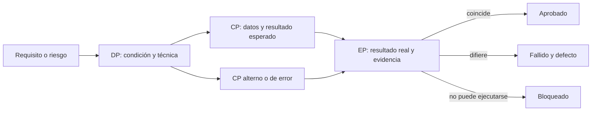

# Plan de pruebas

## Objetivo y alcance

Este plan acepta cambios de Nexus mediante evidencia de los flujos que registran o
consultan datos. La [estrategia de pruebas](service-test-coverage.md) define técnicas y
ubicación; este documento establece la cobertura CRUD mínima y la ejecución.

Cada prueba nueva debe identificar el requisito o regla, la operación CRUD y el dato o
efecto observable. No se agrega cobertura sólo para aumentar conteos ni para fijar
detalles de HTML, estilos, selectores, eventos o estructura de archivos.

Como marco selectivo se usa **ISO/IEC/IEEE 29119-2** para separar planificación,
diseño, ejecución, reporte y cierre, e **ISO/IEC/IEEE 29119-3** para recordar la
información mínima de los artefactos. Nexus no declara conformidad: adopta un vocabulario
comprensible y conserva la evidencia ejecutable en el repositorio.

La referencia aplicable a la pregunta de **cómo documentar** es ISO/IEC/IEEE 29119-3
(*Test Documentation*). ISO/IEC/IEEE 29119-2 define el proceso en el que se producen y
mantienen esos artefactos, mientras que ISO/IEC/IEEE 29119-4 describe técnicas de diseño
como particiones, valores frontera, tablas de decisión y transiciones de estado. Las
ediciones contractuales deben consultarse en el catálogo de ISO o IEEE; este plan no
reproduce sus plantillas ni convierte su uso selectivo en una certificación.

| Actividad inspirada en ISO 29119 | Aplicación sencilla en Nexus | Evidencia |
| --- | --- | --- |
| Planificar | Delimitar requisito, riesgo, nivel, ambiente y criterio de salida. | Incidencia y este plan. |
| Diseñar | Preparar precondiciones, datos, pasos y resultados esperados, incluidos alternos y errores. | Prueba o caso manual trazado a `RF-*`, `RN-*` o `CU-*`. |
| Ejecutar | Registrar comando, versión/commit, ambiente y resultado real. | Salida de Vitest/CI y consultas Prisma. |
| Informar | Distinguir aprobado, fallido, bloqueado y no ejecutado. | Resumen de solicitud de cambio. |
| Cerrar | Confirmar criterios, defectos pendientes y evidencia conservada. | Revisión de la entrega. |

Una prueba se redacta como **Dado / Cuando / Entonces** cuando mejora la lectura, sin
forzar una biblioteca BDD. Alternativas y excepciones se mantienen como casos separados
para que un fallo señale una causa concreta.

## Forma de documentar diseño, casos y ejecución

Nexus separa tres registros para no confundir lo que se planeó con lo que realmente se
ejecutó. En una prueba automatizada, el archivo y los nombres `describe`/`it` son la
especificación ejecutable; una tabla de este paquete puede agrupar casos equivalentes y
debe enlazar la ruta o grupo correspondiente. Una prueba manual o una validación de
aceptación que no tenga archivo ejecutable conserva las tres tablas en la incidencia o
en un documento de la familia `docs/testing`.

### 1. Diseño y trazabilidad

Esta tabla identifica **qué se necesita probar** antes de enumerar datos. Una fila puede
representar una condición de cobertura o un grupo homogéneo de casos, pero no debe mezclar
resultados independientes.

| ID de diseño | Requisito / riesgo | Nivel y técnica | Condición que se cubrirá | Casos asociados |
| --- | --- | --- | --- | --- |
| `DP-<DOM>-NNN` | `RF-*`, `RN-*`, `CU-*` o riesgo identificado | Unitario, integración, esquema o manual; técnica de 29119-4 aplicada | Regla, frontera, combinación o transición observable | `CP-<DOM>-NNN-*` o ruta/grupo automatizado |

### 2. Especificación del caso y datos

Cada caso registra al menos los datos de entrada y el resultado esperado que permiten
decidir objetivamente si pasa. Los valores sensibles se reemplazan por fixtures o
referencias reproducibles; no se copian credenciales ni datos personales reales.

| ID de caso | Precondiciones y estado inicial | Datos de prueba | Acción / pasos | Resultado esperado | Limpieza |
| --- | --- | --- | --- | --- | --- |
| `CP-<DOM>-NNN-01` | Estado, permisos, fixture y ambiente requeridos | Valores concretos, clase de equivalencia o frontera y su procedencia | Operación reproducible o nombre del `it` | Respuesta, cambio persistido, ausencia de efecto o error observable | Restauración requerida o `No aplica` |

Cuando varias combinaciones comparten preparación y acción se documentan como tabla de
decisión y se materializan con `it.each` si son automatizadas. Cada fila conserva su
propio resultado esperado:

| Regla | Condición A | Condición B | Datos representativos | Resultado esperado |
| --- | --- | --- | --- | --- |
| `R1` | Verdadera | Verdadera | Fixture o valores de la combinación | Acción o respuesta permitida |
| `R2` | Verdadera | Falsa | Fixture o valores de la combinación | Rechazo y ausencia de escritura |

### 3. Registro de ejecución y resultado real

El resultado esperado pertenece al diseño y no se sobrescribe después de ejecutar. El
resultado real se agrega en el registro de ejecución para conservar discrepancias y
repeticiones.

| Ejecución | Caso / suite | Revisión y ambiente | Fecha UTC y responsable | Resultado real | Estado | Evidencia / defecto |
| --- | --- | --- | --- | --- | --- | --- |
| `EP-NNN` | ID del caso, `SU-*`, ruta o comando focalizado | Commit, Node/Vitest, SO y servicios usados | Fecha y persona o CI | Conteos y observación obtenida | Aprobado, fallido, bloqueado o no ejecutado | Salida de CI, consulta verificable o incidencia |

En este repositorio, `unit-test-catalog.md` mantiene el diseño agrupado de la suite
unitaria y `unit-test-results.md` mantiene su última ejecución. No se duplican 280 filas
si los nombres y datos ya están en el código; sí se crea o amplía una ficha cuando el
caso es manual, regula una aceptación contractual, introduce una técnica o ambiente no
catalogado, o necesita evidencia que el runner no conserva.

### Grafos y modelos de comportamiento

Un grafo no sustituye las tablas anteriores ni es obligatorio para cada prueba. Se usa
cuando las relaciones, caminos o estados aportan información que una lista ocultaría:

- **transición de estados:** nodos como estados del negocio y aristas como acciones; cada
  transición permitida o rechazada se vincula con un caso;
- **flujo o camino:** nodos como decisiones observables y aristas como alternativas,
  manteniendo separados el camino feliz y los fallos;
- **dependencia de datos:** nodos como fixtures o entidades cuando el orden de creación y
  limpieza afecta la reproducibilidad.

Los grafos se escriben en Mermaid y siguen las
[convenciones de diagramas](../architecture/diagram-conventions.md). Debajo de cada grafo
se documentan su propósito, alcance, fuente y límites; los IDs visibles deben coincidir
con las tablas y con la prueba ejecutable.

## Cobertura CRUD mínima

Sólo se cubren operaciones disponibles en el producto. Una eliminación puede ser una
cancelación o transición de estado, según el dominio.

| Operación | Evidencia principal | Casos relevantes |
| --- | --- | --- |
| Consultar/listar | respuesta HTTP y datos devueltos | filtros, paginación, vacío, acceso y límites |
| Crear | respuesta y lectura posterior con Prisma | validación, duplicado, relaciones y ausencia de escritura parcial |
| Actualizar | respuesta y valores persistidos | inexistente, conflicto, campos conservados y efectos atómicos |
| Eliminar/cancelar | estado o ausencia consultable | transición inválida, relaciones protegidas y reversión de efectos |

Los catálogos pueden reutilizar preparación y casos tabulados, pero cada contexto debe
demostrar su router, configuración y persistencia. Los documentos operativos añaden
stock, movimientos, detalles y rollback cuando esos efectos formen parte del flujo.

## Niveles y ubicación

| Nivel | Ubicación | Uso |
| --- | --- | --- |
| Unitario | `tests/unit/<ruta paralela al código>` | reglas, límites, decisiones y transformaciones de un registro o consulta |
| Integración | `tests/integration/controllers` | CRUD por HTTP con servicios reales y comprobación mediante Prisma |
| Esquema | migraciones sobre `DATABASE_TEST_URL` | restricciones, relaciones y atomicidad no demostrables con mocks |
| Documentación | `npm run docs:check` | documentos generados sincronizados con código y Prisma |

No se crea un nivel unitario para componentes visuales o infraestructura incidental.
Si un helper compartido coordina datos CRUD, se prueba una vez en la ruta paralela a su
módulo y los contextos reutilizan ese contrato.

El runtime, el aislamiento, las técnicas y las suites incluidas en el nivel unitario se
detallan en el [ambiente, estrategia y catálogo unitario](unit-test-catalog.md).

## Registro de aplicación de pruebas unitarias

Además del código, esta tabla registra **cómo** se aplica el nivel unitario. La fuente
ejecutable continúa en `tests/unit`; la tabla explica intención, aislamiento y evidencia
sin copiar cada `it`. La trazabilidad funcional se mantiene en la
[matriz técnica](../architecture/traceability-matrix.md).

| Unidad / ubicación | Técnica aplicada | Resultado que se observa | Ejemplos vigentes |
| --- | --- | --- | --- |
| Servicios de dominio | Colaboradores Prisma/servicios sustituidos; entradas límite y errores por caso | Regla, argumentos, retorno y ausencia de colaboración inválida | identidad de material, consulta de movimientos, relaciones proveedor-material, reportes y mermas. |
| Controllers API | Harness Express/Supertest con servicio simulado | status/body, DTO y efecto posterior como evento de inventario | entradas, salidas, materiales, mermas y reportes de almacén. |
| Rutas y políticas | Router aislado y combinaciones tabuladas | orden/acceso positivo y rechazo antes del controller | rutas de merma y permisos rol–departamento. |
| DTO, validadores y helpers | Funciones puras con clases de equivalencia y fronteras decimales | selección, normalización, precisión, totales o error | DTO de entrada/merma, validaciones y helpers de inventario. |
| Aplicación del navegador | Requests simulados e inyección de configuración | adaptación del payload/respuesta y reutilización sin DOM | fábricas CRUD, salida y reporte; contextos y catálogos. |
| UI, plugins y utilidades del navegador | DOM mínimo o doubles de plugin; eventos observables | estado visual contractual, callback y transformación | formularios, DataTable, Select2, MDB, Flatpickr y utilidades. |

Cada incorporación registra en el nombre `describe/it` la regla o `RF/RN/CU` cuando
resulte útil, conserva preparación–ejecución–aserción y evita probar imports o detalles
privados. La salida de Vitest en CI/PR registra comando, commit, ambiente y resultado; el
[registro de resultados unitarios](unit-test-results.md) conserva además el último
resumen verificado dentro del paquete documental. Este documento no se marca como
“aprobado” sólo porque exista el archivo.

## Cobertura prioritaria

| Capacidad | Estado / siguiente paso |
| --- | --- |
| Catálogos, clientes y proveedores | Mantener integraciones de alta y consulta; ampliar actualización o baja sólo al modificar esos flujos. |
| Salidas de merma | Mantener registro, persistencia, movimiento y rollback existentes. |
| Salidas de material | Incorporar integración HTTP de registro, entrega/devolución, stock y rollback. |
| Entradas de compra | Incorporar integración HTTP de registro, corrección, costo, movimiento y rollback. |
| Personas y usuarios | Incorporar persistencia de relaciones de rol y departamento. |
| Autorización por contexto | Mantener casos unitarios positivos y negativos por combinación rol/departamento; ventas permanece sin permisos del sistema. |
| Auditoría de escrituras | Incorporar unitarias de clasificación/sanitizado y middleware, más integración que distinga respuesta exitosa, fallida y persistencia best effort. |
| Ajustes, requisiciones y proyectos | Probar únicamente cuando exista el CRUD accesible desde controller. |
| Reportes y movimientos | Cubrir consultas, permisos, filtros y datos exportados. |

## Entrada, salida y evidencia

Antes de implementar debe existir un flujo real, una regla identificada y un ambiente
aislado si se usa Prisma. Para aceptar el cambio:

- pasan las pruebas relacionadas al CRUD afectado;
- cada escritura integrada se consulta con Prisma;
- los errores de operaciones compuestas no dejan registros parciales;
- no hay pruebas deshabilitadas ni duplicación del mismo camino feliz;
- `npm run docs:check` confirma la documentación generada.

En desarrollo se ejecutan primero las unitarias e integraciones del área. En el pull
request se ejecutan `npm run test:unit`, `npm run test:integration` con base aislada y
`npm run docs:check`. La evidencia indica comando, resultado y commit; una captura no
sustituye aserciones HTTP o Prisma.
