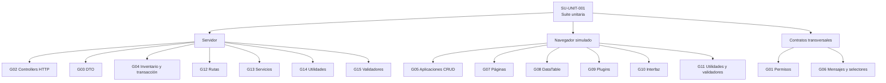

# Ambiente, estrategia y catálogo de pruebas unitarias

## Alcance del catálogo

Este documento identifica la suite que ejecuta `npm run test:unit` y explica la
estrategia, la técnica y el resultado observable de sus casos. Los nombres concretos de
los casos permanecen en `describe`/`it` como evidencia ejecutable; este catálogo permite
revisar fuera del código qué se comprueba y cómo se aísla.

El inventario corresponde a la revisión indicada en el
[registro de resultados](unit-test-results.md). Cuando se agrega, elimina o reclasifica
un archivo de prueba, se actualizan conjuntamente este catálogo y ese registro.

## Ficha de la suite unitaria

La referencia estable de la ejecución completa es **`SU-UNIT-001` — Suite unitaria de
Nexus**. El término *suite* designa aquí el conjunto seleccionado por Vitest; cada
`*Test.js` es un archivo de prueba y cada `it` o fila materializada por `it.each` es un
caso. Esta distinción evita presentar los 70 archivos como si fueran 70 ejecuciones
independientes.

| Campo | Definición de `SU-UNIT-001` |
| --- | --- |
| Objetivo | Detectar regresiones en reglas, transformaciones, decisiones, contratos entre capas y efectos observables que pueden aislarse de infraestructura real. |
| Elemento bajo prueba | Módulos de servidor y navegador localizados por los 70 archivos de prueba inventariados en este documento. |
| Orquestador | Script `test:unit` de `package.json`, con selección y exclusiones definidas en `vitestConfig.js`. |
| Precondiciones | Dependencias instaladas mediante `npm ci`, runtime admitido y ejecución desde la raíz. No requiere servidor, navegador, Redis ni PostgreSQL activos. |
| Preparación | Cada archivo construye fixtures y dobles locales; los hooks `beforeEach`/`afterEach` restablecen mocks o globals cuando corresponde. |
| Ejecución | Vitest importa los archivos seleccionados, materializa los casos parametrizados y ejecuta los archivos con el aislamiento propio del runner. |
| Criterio de aprobación | Todos los archivos y casos descubiertos terminan aprobados, ninguno queda fallido y no existe un error del runner. Una advertencia o desviación ambiental se conserva en el registro y se resuelve antes de usar la corrida como validación del runtime admitido. |
| Criterio de bloqueo | Fallo al instalar/importar, runtime no disponible o dependencia ambiental inesperada que impida ejecutar los casos; se informa como bloqueado, no como aprobado. |
| Resultado producido | Resumen de archivos/casos aprobados, fallidos u omitidos, duración y código de salida. La última evidencia se conserva en `unit-test-results.md`. |
| Fuera de alcance | Persistencia real, migraciones, contrato HTTP con servicios reales, renderizado en navegador y pruebas manuales; corresponden a integración, esquema o validación manual. |

La suite completa se referencia por `SU-UNIT-001` en resultados y solicitudes de
cambio. Los grupos `SU-UNIT-001-G01` a `SU-UNIT-001-G15` permiten indicar qué parte se
afecta o se ejecuta de forma focalizada sin inventar una suite distinta para cada
archivo.

## Ambiente de pruebas unitarias

| Elemento | Configuración y límite |
| --- | --- |
| Runtime admitido | Node.js `>=22 <25`, de acuerdo con `package.json`. Una ejecución con otra versión se registra como observación y no reemplaza la validación en el runtime admitido. |
| Runner | Vitest `4.1.9`, instalado como dependencia de desarrollo. |
| Comando | `npm run test:unit`, equivalente a `vitest run --config vitestConfig.js`. |
| Descubrimiento | `tests/**/*Test.js`; la suite de integración `tests/integration/**` queda excluida expresamente. |
| Ambiente Vitest | Ambiente `node` predeterminado. No se configura `jsdom` ni un navegador real. |
| Estado compartido | No hay `setupFiles`, `globalSetup` ni `teardown` en `vitestConfig.js`; cada suite prepara y restaura sus dobles y globals. |
| Base de datos | Las unitarias no requieren migraciones ni una conexión real. Prisma, transacciones y servicios colaboradores se sustituyen cuando forman parte del borde de la unidad. La persistencia real pertenece a `npm run test:integration`. |
| Interfaz web | Las suites crean stubs mínimos de `window`, `document`, jQuery o plugins. No validan renderizado en un motor de navegador. |
| HTTP | Los controllers que requieren el borde HTTP reutilizan `createControllerTestApp` y Supertest con servicios simulados; no levantan el servidor completo ni abren un puerto. |
| Red y servicios externos | No son precondición de la suite. Requests, plugins y dependencias externas se reemplazan por dobles controlados. |

Para reproducir el ambiente se ejecuta `npm ci` con una versión admitida de Node.js y,
desde la raíz del repositorio, `npm run test:unit`. La evidencia de una entrega registra
versión de Node.js y Vitest, sistema operativo, revisión, conteos, duración y cualquier
desviación del ambiente anterior.

## Estrategia y técnicas aplicadas

| Estrategia | Técnica | Aplicación en los casos |
| --- | --- | --- |
| Aislamiento de unidad | Mocks, spies, stubs y funciones inyectadas | Sustituir Prisma, servicios, requests y plugins; verificar retorno, error, argumentos y ausencia de efectos no permitidos. |
| Partición de equivalencia | Casos válidos, inválidos, ausentes y de estado | Separar caminos aceptados y rechazados en DTO, validadores, permisos, controllers y reglas de interfaz. |
| Análisis de valores frontera | Cero, negativos, máximos, precisión decimal y colecciones vacías | Probar cantidades, costos, existencias, retornos y campos obligatorios en sus límites. |
| Tablas de decisión | `it.each` y matrices de rol, departamento, estado o contexto | Verificar combinaciones sin duplicar preparación y mantener visible el resultado esperado de cada fila. |
| Transición de estado | Estado inicial, acción y estado permitido o rechazado | Cubrir edición, cancelación, entrega, devolución y controles habilitados según el estado documental. |
| Prueba de interacción | Verificación de colaboraciones observables | Confirmar DTO, status/body, callback, payload o transacción sin fijar detalles privados de implementación. |
| Prueba negativa y de fallo | Rechazos, excepciones y rollback forzado | Comprobar propagación del error y que no continúen escrituras, eventos o callbacks después del fallo. |

## Grupos, archivos y casos de la suite

La columna **Casos observados** resume los comportamientos cubiertos por todos los
archivos indicados en cada fila. Las rutas terminadas en `*Test.js` representan cada
archivo coincidente dentro de esa carpeta; no incluyen subcarpetas distintas de las que se
declaran expresamente.

| Referencia y unidad | Archivos | Casos observados | Estrategia y técnica aplicada |
| --- | --- | --- | --- |
| `SU-UNIT-001-G01` Permisos | `tests/unit/constants/permissionsTest.js` (1) | Acceso permitido y denegado por combinación de rol y departamento. | Tabla de decisión; particiones positivas y negativas. |
| `SU-UNIT-001-G02` Controllers de almacén | `tests/unit/controllers/api/warehouse/*Test.js` (8) | Recepciones, salidas, materiales, mermas, reportes, registro y eventos posteriores; respuestas exitosas, validaciones, inexistencia y fallos de colaboradores. | Harness HTTP o invocación aislada, servicios simulados, spies y pruebas negativas/de interacción. |
| `SU-UNIT-001-G03` DTO | `tests/unit/dtos/*Test.js` (2) | Normalización y conservación de datos de recepción y merma, incluidos valores opcionales y decimales. | Partición de equivalencia y valores frontera sobre funciones puras. |
| `SU-UNIT-001-G04` Inventario y transacción | `tests/unit/helpers/rollbackTransactionTest.js`, `tests/unit/inventory/*Test.js` y `tests/unit/warehouse/goodsReceiptHelpersTest.js` (4) | Commit/rollback controlado, movimientos, cálculo y validación de existencias, y transformaciones de detalles de recepción. | Dobles del cliente transaccional, fronteras numéricas y prueba negativa de fallo. |
| `SU-UNIT-001-G05` Aplicaciones cliente | `tests/unit/public/js/application/**/*Test.js` (7) | Fábricas CRUD y reportes, configuraciones de catálogos/contextos, materiales y salidas; payloads, callbacks, reutilización y errores. | Inyección de configuración y requests simulados; interacción y tablas de contexto. |
| `SU-UNIT-001-G06` Constantes cliente | `tests/unit/public/js/constants/*Test.js` (2) | Mensajes de recepción y selectores públicos esperados por consumidores. | Prueba de contrato exportado y particiones por mensaje/contexto. |
| `SU-UNIT-001-G07` Páginas cliente | `tests/unit/public/js/pages/**/*Test.js` (2) | Edición de detalles de recepción y ciclo del modal de merma. | Stubs mínimos del DOM, eventos/callbacks observables y transiciones de modo. |
| `SU-UNIT-001-G08` DataTable | `tests/unit/public/js/plugins/datatable/**/*Test.js` (10) | Acciones, operaciones, filtros, dependencias, estado, inventario, columnas/encabezados/reglas de detalles y filas de material. | Datos tabulados, callbacks simulados y transformaciones puras; casos vacíos, activos y editables. |
| `SU-UNIT-001-G09` Plugins de fecha, MDB y Select2 | `tests/unit/public/js/plugins/flatpickr/*Test.js`, `tests/unit/public/js/plugins/mdb/*Test.js` y `tests/unit/public/js/plugins/select2/**/*Test.js` (6) | Inicialización y reutilización de instancias, selección de merma/material y sincronización de valores. | Dobles de plugin, `window`/`document` controlados, spies y equivalencias con/sin selección. |
| `SU-UNIT-001-G10` Interfaz cliente | `tests/unit/public/js/ui/**/*Test.js` (5) | Estado de formularios, totales, modal/selector de inventario y permisos de edición de salidas según estado. | Stubs del DOM, tablas de estado y verificación de propiedades/callbacks observables. |
| `SU-UNIT-001-G11` Utilidades y validadores cliente | `tests/unit/public/js/utils/**/*Test.js` (5) | Colecciones de detalles, operaciones DOM y validaciones de recepción, material y merma. | Funciones puras o DOM mínimo; equivalencias, fronteras y entradas ausentes. |
| `SU-UNIT-001-G12` Rutas | `tests/unit/routes/api/warehouse/*Test.js` y `tests/unit/routes/web/warehouse/*Test.js` (3) | Orden de middleware, autorización y enlace de controllers para merma y salida de merma. | Router aislado, spies y decisiones de acceso positivas/negativas. |
| `SU-UNIT-001-G13` Servicios | `tests/unit/services/**/*Test.js` (9) | Identidad y consulta de movimientos, factura de recepción, relación proveedor-material, reportes, listado/material/snapshot de merma. | Prisma y colaboradores simulados; fronteras, errores, argumentos y ausencia de colaboración inválida. |
| `SU-UNIT-001-G14` Utilidades de servidor | `tests/unit/utils/*Test.js` (4) | Formato, exportación Excel, query/paginación e identidad canónica del inventario. | Funciones puras, tablas de entrada, colecciones vacías y valores frontera. |
| `SU-UNIT-001-G15` Validadores de servidor | `tests/unit/validators/*Test.js` (3) | Precisión decimal, cantidad de devolución y obligatoriedad de campos. | Clases de equivalencia y análisis de límites con casos aceptados y rechazados. |

La suite contiene **70 archivos de prueba**. El número de casos puede cambiar cuando se
amplían tablas parametrizadas; el conteo efectivo y su estado se toman siempre de la
ejecución de Vitest registrada, no de una suma manual de llamadas a `it`.

## Aplicación del formato documental a los casos vigentes

Los grupos anteriores constituyen los registros de diseño de la suite. Para hacer
explícita su correspondencia con el formato del [plan de pruebas](test-plan.md), cada
grupo recibe un ID `DP-UNIT-GNN`; sus casos son los `it` y las filas de `it.each` de los
archivos indicados, identificados documentalmente como `CP-UNIT-GNN-*`. El asterisco no
es un caso genérico: remite al nombre completo que Vitest materializa como evidencia
ejecutable y evita mantener una segunda copia de los 280 nombres.

Todos los casos comparten las precondiciones, el ambiente y la limpieza de la ficha
`SU-UNIT-001`. La siguiente tabla agrega los datos variables y el resultado esperado de
cada diseño. Si un caso deja de corresponder a esta fila, se actualiza el grupo o se crea
otro antes de registrar su ejecución.

| Diseño / casos | Condición que se debe probar | Datos de prueba vigentes | Resultado esperado del grupo |
| --- | --- | --- | --- |
| `DP-UNIT-G01` / `CP-UNIT-G01-*` | Decisión de acceso por rol, departamento y operación. | Combinaciones tabuladas de administrador, almacén y asesor; permisos CRUD de salidas. | Cada combinación devuelve exactamente permitido o denegado y un asesor no obtiene acceso operativo. |
| `DP-UNIT-G02` / `CP-UNIT-G02-*` | Contrato HTTP aislado de controllers de almacén en caminos exitosos, límites y fallos. | Requests con filtros, DTO válidos o manipulados, valores máximos, IDs existentes/inexistentes y errores de servicios simulados. | Status/body y argumentos enviados al servicio coinciden con el contrato; campos no permitidos se descartan y los efectos posteriores sólo ocurren tras el éxito. |
| `DP-UNIT-G03` / `CP-UNIT-G03-*` | Normalización y conservación de identidad en DTO de entradas y mermas. | Facturas con variantes de formato, nombres, IDs, detalles repetidos, opcionales y decimales. | El DTO produce el payload normalizado esperado sin fusionar ni perder identidades o partidas válidas. |
| `DP-UNIT-G04` / `CP-UNIT-G04-*` | Cálculo de stock/movimientos y frontera transaccional ante éxito o error. | Cantidades con/sin dimensiones, cero, decimales, stock suficiente/insuficiente y callbacks que resuelven o lanzan error. | Cálculos y agrupaciones conservan los detalles; la transacción revierte siempre y propaga el error original cuando corresponde. |
| `DP-UNIT-G05` / `CP-UNIT-G05-*` | Reutilización del contrato CRUD/reporte por cada contexto de aplicación cliente. | Configuraciones de catálogo, materiales, salidas y reportes; respuestas presentes/ausentes, IDs y payloads por contexto. | Cada instancia conserva aislamiento, adapta sólo las claves configuradas y envía el request/callback esperado sin duplicar el contrato común. |
| `DP-UNIT-G06` / `CP-UNIT-G06-*` | Contrato público de mensajes y selectores consumidos por la interfaz. | Contextos y claves exportadas de recepción y selectores. | Las claves resuelven el mensaje o selector contractual esperado para cada consumidor. |
| `DP-UNIT-G07` / `CP-UNIT-G07-*` | Transiciones de modo en páginas de detalle y modal. | Detalles de recepción y apertura/cierre del modal de merma con DOM simulado. | La edición actualiza el detalle correcto y el modal restaura el estado observable al cambiar de modo. |
| `DP-UNIT-G08` / `CP-UNIT-G08-*` | Decisiones de columnas, acciones, filtros y filas en DataTable. | Modos crear/editar/devolver, estados pendiente/surtido/cancelado, permisos, filas vacías/activas y filtros dependientes. | Sólo aparecen acciones y columnas permitidas; filtros, dependencias, estado y transformaciones producen los valores esperados sin mutación accidental. |
| `DP-UNIT-G09` / `CP-UNIT-G09-*` | Inicialización, reutilización y sincronización de plugins de fecha, MDB y Select2. | Instancia existente/ausente, selección con/sin valor, inputs de texto/número y estado habilitado/deshabilitado. | Se crea o reutiliza una sola instancia y el valor/estado se refleja en el input y wrapper correspondientes. |
| `DP-UNIT-G10` / `CP-UNIT-G10-*` | Estado contractual de formularios, resumen e inventario según modo y estado documental. | Alta/edición, documento pendiente/cancelado, selección presente/ausente y detalles nuevos/existentes. | Identidad, campos, totales, permisos y callbacks quedan habilitados, bloqueados, completados o limpiados según la regla. |
| `DP-UNIT-G11` / `CP-UNIT-G11-*` | Colecciones, DOM y validaciones de entradas, materiales y mermas. | Colecciones vacías o repetidas, IDs de cliente/documento, campos ausentes/válidos y valores de frontera. | Se agrega, sustituye o elimina el renglón correcto sin afectar otros; selectores y validadores devuelven la configuración o error esperado. |
| `DP-UNIT-G12` / `CP-UNIT-G12-*` | Orden de middleware, autorización y enlace de handlers en rutas de merma. | Requests por rol/departamento y spies de middleware/controller para rutas API y web. | El acceso autorizado alcanza el handler en el orden previsto y el no autorizado se rechaza antes del controller. |
| `DP-UNIT-G13` / `CP-UNIT-G13-*` | Reglas y consultas de servicios con persistencia sustituida. | Identidades completas/incompletas, filtros, snapshots, relaciones, facturas duplicadas/no duplicadas y errores Prisma simulados. | Retorno y argumentos Prisma respetan filtros y relaciones; entradas inválidas o fallos no disparan colaboraciones posteriores. |
| `DP-UNIT-G14` / `CP-UNIT-G14-*` | Transformación compartida de formatos, Excel, queries e identidad de inventario. | Mes válido/inválido o bisiesto, paginación negativa, rangos, fórmulas, relaciones serializadas y colecciones vacías. | Fechas, filtros, filas, fórmulas y representación canónica coinciden con el contrato y usan defaults seguros. |
| `DP-UNIT-G15` / `CP-UNIT-G15-*` | Clases de equivalencia y fronteras de validadores del servidor. | Campo ausente/nulo/válido, cantidad positiva/no positiva y decimales dentro/fuera de precisión. | Cada valor válido se acepta; cada clase inválida devuelve el código correspondiente sin aceptar datos fuera del límite. |

La acción reproducible de cada `CP-UNIT-*` es la invocación descrita por su nombre
`it`; el detalle de fixtures permanece junto a esa invocación. El registro de ejecución
vigente es `SU-UNIT-001` en `unit-test-results.md`, que conserva revisión, ambiente,
fecha, conteos, resultado real y observaciones.

## Diagrama de identificación de lo probado

Sí se justifica un diagrama para esta suite porque permite localizar rápidamente las
familias de comportamiento y sus fronteras. No representa pasos de ejecución ni sustituye
los datos y resultados esperados de la tabla anterior. Cada nodo terminal referencia un
diseño vigente; por tanto, un área sin nodo se considera fuera del alcance unitario hasta
que se incorpore y catalogue una prueba.

**Propósito:** identificar qué debe comprobar la suite y ubicar su ficha de diseño.
**Alcance:** los 15 grupos y 70 archivos seleccionados por `vitestConfig.js`.
**Fuente:** tabla de grupos, archivos `tests/unit/**/*Test.js` y configuración de
Vitest. **Límite:** muestra cobertura estructural documentada, no porcentaje de código,
persistencia real, navegador real ni integración entre capas.
