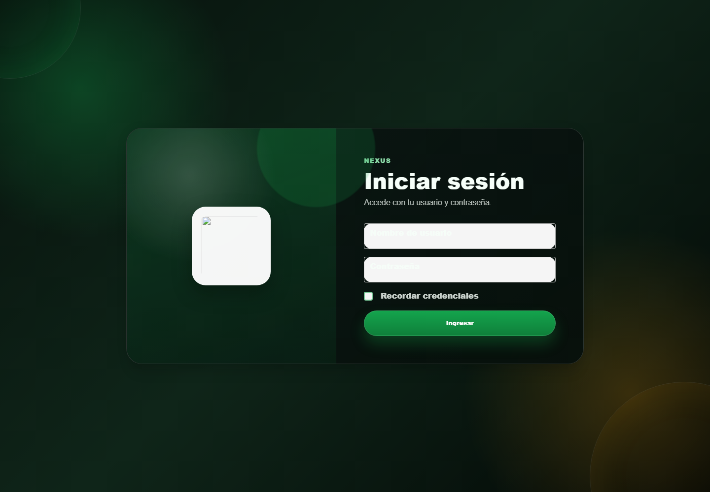
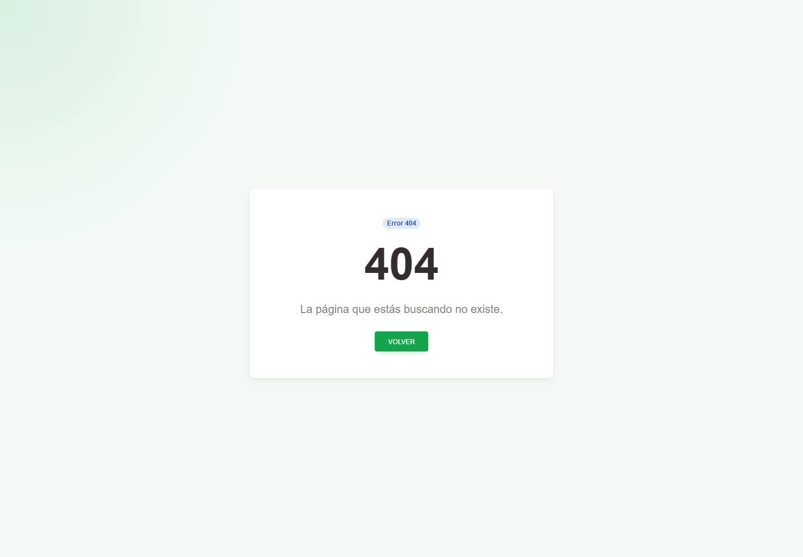

# Casos: Autenticación y navegación

Cada procedimiento identifica sus casos de uso, controles, errores posibles y captura de referencia.

## Acceso

**Propósito.** Autenticar una cuenta autorizada y reconocer la navegación disponible.

### CAP-AUT-01-LOGIN — Inicio sesion

**Casos:** `CU-AUT-01`.

**Errores posibles:** [Acceso y autorización](../error-messages.md#errores-acceso).

**Controles que debe usar:** Campos **Nombre de usuario** y **Contraseña**, casilla **Recordar credenciales** y botón **Iniciar sesión**.

1. Capture las credenciales asignadas y seleccione **Iniciar sesión**.
2. Compruebe que la pantalla coincida con la captura antes de continuar.

## Página no encontrada

**Propósito.** Reconocer una dirección que no corresponde a una página disponible.

### CAP-ERR-404-NOT-FOUND — Pagina no encontrada

**Casos:** Transversal.

**Errores posibles:** [Error 404](../error-messages.md#error-404).

**Controles que debe usar:** Botón **Volver**; no capture datos ni modifique manualmente la dirección para buscar una opción restringida.

1. Conserve la dirección y regrese mediante la navegación de Nexus.
2. Compruebe que la pantalla coincida con la captura antes de continuar.

