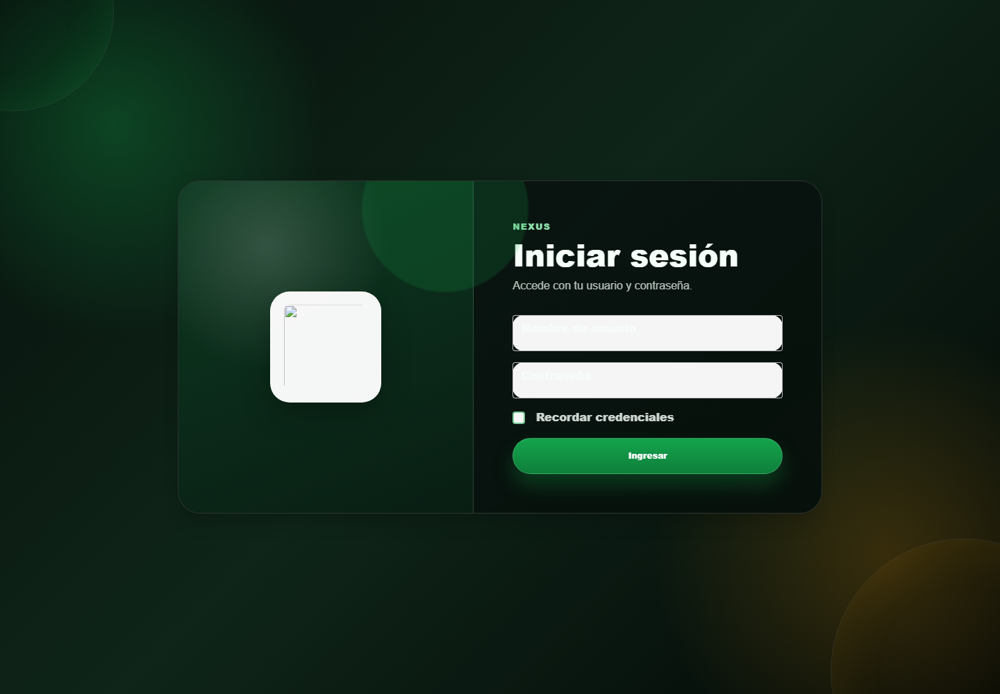

# 1. CAP-AUT-01-LOGIN — Iniciar sesión

**Casos de uso:** `CU-AUT-01` — Iniciar sesión.

**Errores posibles:** [Acceso y autorización](../../error-messages.md#errores-acceso).

**Antes de empezar:** tenga la dirección de Nexus y su cuenta asignada.

**Controles que debe usar:** Campos **Nombre de usuario** y **Contraseña**, casilla **Recordar credenciales** y botón **Ingresar**.

1. Antes de usar los controles, compruebe que la pantalla inicial coincida con la captura:

   

2. Escriba la cuenta asignada en el campo **Nombre de usuario** y la clave en **Contraseña**.
3. Si corresponde, marque la casilla **Recordar credenciales** y seleccione el botón **Ingresar**.

**Compruebe el resultado:** la pantalla de acceso se cierra y puede abrir
**Menú principal**. Si los datos son rechazados, vuelva a revisar el nombre
de usuario y la contraseña; si no tiene una cuenta, solicítela al administrador.
