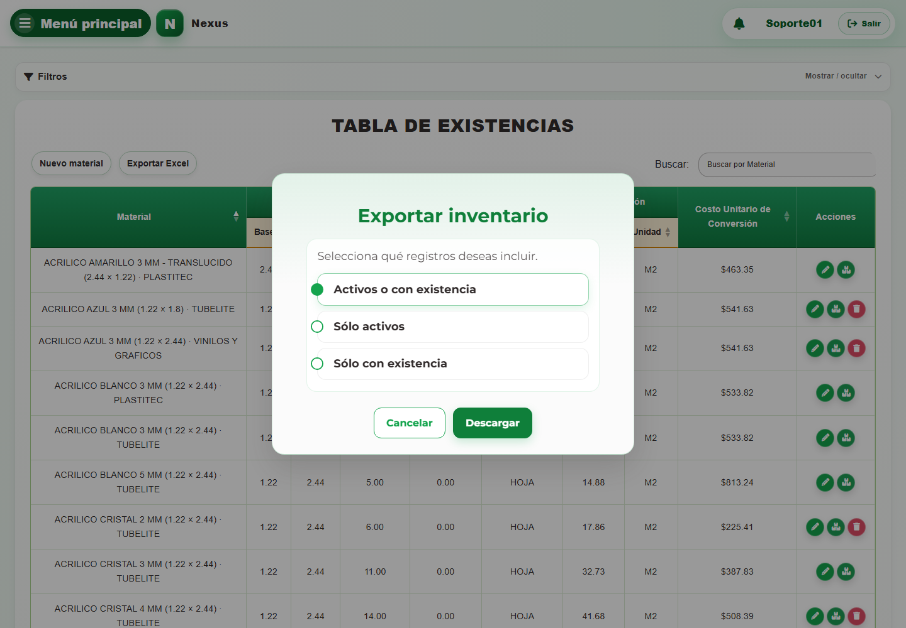

# Casos: Catálogos e inventario

Cada procedimiento identifica sus casos de uso, controles, errores posibles y captura de referencia.

## Materiales e inventario

**Propósito.** Consultar el inventario, registrar o editar materiales y ajustar existencias.

**Qué significa identidad y estado.** La identidad de un material es la combinación de
**Nombre**, **Presentación**, **Unidad**, **Base** y **Altura** que permite reconocer el mismo
artículo. **Proveedor** pertenece a una relación de inventario separada, por lo que una misma
identidad puede estar asociada con proveedores distintos. **Stock Mínimo**, **Costo Máximo**,
existencia y **Activo** no forman parte de la identidad. Desmarcar **Activo** conserva el material,
su relación con el proveedor, su existencia y su historia. Ya no puede incorporarse a una compra,
salida o relación nueva. Si estaba incluido en una salida antes de desactivarlo, todavía puede
surtirse el pendiente para completar ese compromiso, siempre que haya existencia suficiente. En
los reportes, **Sólo activos** lo excluye, mientras **Sólo con existencia** puede incluirlo si aún
conserva stock. Volver a marcarlo permite usarlo nuevamente en operaciones nuevas.

### CAP-CAT-MAT-01-LIST — Listado inventario

**Casos:** `CU-AUT-02`, `CU-CAT-01`, `CU-REP-01`, `CU-REP-03`.

**Errores posibles:** [Catálogos e inventario](../error-messages.md#errores-catalogos).

**Controles que debe usar:** Buscador **Buscar por Material**, filtro **Proveedor**, botones **Buscar / filtrar**, **Limpiar filtros**, **Exportar Excel** y **Nuevo material**, además de las acciones de cada fila.

1. Abra **Filtros** y compruebe que los controles desplegados coincidan con la captura:

   

2. Escriba un término en el buscador **Buscar por Material** o elija una opción en el filtro **Proveedor**.
3. Seleccione el botón **Buscar / filtrar** para actualizar la tabla; use **Limpiar filtros** para restablecerla.
4. En la tabla, seleccione **Nuevo material**, **Exportar Excel**, **Editar registro** o **Ajustar stock**, según la operación requerida.

### CAP-REP-MAT-05-EXPORT — Exportar inventario

**Casos:** `CU-REP-03`.

1. Seleccione **Exportar Excel** y compruebe el modal:

   

2. Elija **Activos o con existencia**, **Sólo activos** o **Sólo con existencia** y seleccione **Descargar**.

### CAP-CAT-MAT-02-CREATE — Formulario alta

**Casos:** `CU-CAT-02`, `CU-CAT-17`, `CU-CAT-18`.

**Errores posibles:** [Validación de formularios](../error-messages.md#errores-validacion), [Catálogos e inventario](../error-messages.md#errores-catalogos).

**Campos editables en modo alta:** **Nombre**, **Buscar proveedor...**, **Buscar presentación...**,
**Buscar unidad...**, **Stock Mínimo**, **Costo Máximo**, **Base**, **Altura**, **Nueva cantidad**,
**Observaciones** y **Activo**. La razón **Stock inicial** es automática. Use **Nuevo material** para
abrir el formulario y **Guardar** para confirmarlo.

1. Seleccione el botón **Nuevo material** para abrir el formulario de alta. Antes de continuar, compruebe que la pantalla mostrada coincida con la captura:

   

2. Complete **Nombre**; elija opciones en **Buscar proveedor...**, **Buscar presentación...** y **Buscar unidad...**; capture **Stock Mínimo**, **Costo Máximo**, **Base** y **Altura**, y revise la casilla **Activo**.
3. Seleccione el botón **Guardar** para registrar el material.

Si ya existe la misma combinación de nombre, presentación, unidad, dimensiones y proveedor, Nexus
rechaza el alta: localice el material existente y use **Ajustar stock**; **Nueva cantidad** representa
la existencia total que debe quedar, no una cantidad que se sume. Si la identidad ya existe para
otro proveedor, Nexus reutiliza el material y crea la relación de inventario con el proveedor
seleccionado.

### CAP-CAT-MAT-03-EDIT — Formulario edicion

**Casos:** `CU-CAT-03`, `CU-CAT-04`.

**Errores posibles:** [Validación de formularios](../error-messages.md#errores-validacion), [Catálogos e inventario](../error-messages.md#errores-catalogos).

**Campos editables en modo edición:** **Nombre**, **Stock Mínimo**, **Costo Máximo** y **Activo**.
**Proveedor**, **Presentación**, **Unidad**, **Base**, **Altura** y la existencia no se pueden editar en
este modo. Use la acción **Editar registro** y el botón **Actualizar**.

1. En la fila del material, seleccione la acción **Editar registro** para abrir el formulario. Antes de continuar, compruebe que la pantalla mostrada coincida con la captura:

   

2. Modifique **Nombre**, **Stock Mínimo**, **Costo Máximo** o **Activo** según corresponda. Revise los
   demás datos sólo como referencia.
3. Seleccione el botón **Actualizar** para guardar los cambios.

### CAP-CAT-MAT-04-STOCK — Ajuste existencia

**Casos:** `CU-CAT-05`, `CU-CAT-19`.

**Errores posibles:** [Validación de formularios](../error-messages.md#errores-validacion), [Catálogos e inventario](../error-messages.md#errores-catalogos).

**Campos editables en modo ajuste:** **Seleccione una razón...**, **Nueva cantidad** y
**Observaciones**. Los datos de identidad y catálogo quedan sólo para consulta. Use la acción
**Ajustar stock** y el botón **Ajustar**.

1. En la fila del material, seleccione la acción **Ajustar stock**. Antes de continuar, compruebe que la pantalla mostrada coincida con la captura:

   

2. Elija una opción en **Seleccione una razón...** y complete los campos **Nueva cantidad** y **Observaciones**.
3. Revise el efecto sobre la existencia y seleccione el botón **Ajustar**.

## Proveedores

**Propósito.** Consultar y mantener el catálogo de proveedores.

La casilla **Activo** controla el estado del proveedor dentro del mismo formulario de alta o
edición. Desmarcarla no elimina el proveedor ni sus materiales o documentos históricos; volver a
marcarla lo reactiva. Este cambio no es un ajuste de stock.

### CAP-CAT-SUP-01-LIST — Listado

**Casos:** `CU-CAT-06`, `CU-REP-12`.

**Errores posibles:** [Catálogos e inventario](../error-messages.md#errores-catalogos).

**Controles que debe usar:** Buscador **Buscar por Nombre comercial o Razón social**, botones **Exportar Excel** y **Nuevo proveedor**, y acción **Editar registro** de cada fila.

1. Antes de usar los controles, compruebe que la pantalla inicial coincida con la captura:

   

2. Escriba un término en el buscador **Buscar por Nombre comercial o Razón social** para localizar un proveedor.
3. En la tabla, seleccione **Nuevo proveedor**, **Exportar Excel** o la acción **Editar registro** de una fila.

### CAP-CAT-SUP-02-CREATE — Formulario alta

**Casos:** `CU-CAT-07`.

**Errores posibles:** [Validación de formularios](../error-messages.md#errores-validacion), [Catálogos e inventario](../error-messages.md#errores-catalogos).

**Controles que debe usar:** Botón **Nuevo proveedor**; campos **Razón social**, **Nombre comercial** y **Teléfono**; casilla **Activo** y botón **Guardar**.

1. Seleccione el botón **Nuevo proveedor** para abrir el formulario de alta. Antes de continuar, compruebe que la pantalla mostrada coincida con la captura:

   

2. Complete los campos **Razón social**, **Nombre comercial** y **Teléfono**, y revise la casilla **Activo**.
3. Seleccione el botón **Guardar** para registrar el proveedor.

### CAP-CAT-SUP-03-EDIT — Formulario edicion y estado

**Casos:** `CU-CAT-08`, `CU-CAT-09`.

**Errores posibles:** [Validación de formularios](../error-messages.md#errores-validacion), [Catálogos e inventario](../error-messages.md#errores-catalogos).

**Controles que debe usar:** Acción **Editar registro**; campos **Razón social**, **Nombre comercial** y **Teléfono**; casilla **Activo** y botón **Actualizar**.

1. En la fila del proveedor, seleccione la acción **Editar registro**. Antes de continuar, compruebe que la pantalla mostrada coincida con la captura:

   

2. Modifique los campos **Razón social**, **Nombre comercial** o **Teléfono** necesarios y revise la casilla **Activo**.
3. Seleccione el botón **Actualizar** para guardar los cambios.

## Clientes

**Propósito.** Consultar y mantener el catálogo de clientes.

### CAP-CAT-CLI-01-LIST — Listado

**Casos:** `CU-CAT-10`, `CU-REP-13`.

**Errores posibles:** [Catálogos e inventario](../error-messages.md#errores-catalogos).

**Controles que debe usar:** Buscador **Buscar por Nombre**, botones **Exportar Excel** y **Nuevo cliente**, y acción **Editar registro** de cada fila.

1. Antes de usar los controles, compruebe que la pantalla inicial coincida con la captura:

   

2. Escriba un término en el buscador **Buscar por Nombre** para localizar un cliente.
3. En la tabla, seleccione **Nuevo cliente**, **Exportar Excel** o la acción **Editar registro** de una fila.

### CAP-CAT-CLI-02-CREATE — Formulario alta

**Casos:** `CU-CAT-11`.

**Errores posibles:** [Validación de formularios](../error-messages.md#errores-validacion), [Catálogos e inventario](../error-messages.md#errores-catalogos).

**Controles que debe usar:** Botón **Nuevo cliente**, campo **Nombre** y botón **Guardar**.

1. Seleccione el botón **Nuevo cliente** para abrir el formulario de alta. Antes de continuar, compruebe que la pantalla mostrada coincida con la captura:

   

2. Complete el campo **Nombre** y seleccione el botón **Guardar**.

### CAP-CAT-CLI-03-EDIT — Formulario edicion

**Casos:** `CU-CAT-12`.

**Errores posibles:** [Validación de formularios](../error-messages.md#errores-validacion), [Catálogos e inventario](../error-messages.md#errores-catalogos).

**Controles que debe usar:** Acción **Editar registro**, campo **Nombre** y botón **Actualizar**.

1. En la fila del cliente, seleccione la acción **Editar registro**. Antes de continuar, compruebe que la pantalla mostrada coincida con la captura:

   

2. Modifique el campo **Nombre** y seleccione el botón **Actualizar**.

## Mermas e inventario

**Propósito.** Consultar y mantener mermas, ajustar existencias y delimitar reportes.

**Qué significa identidad y estado.** La identidad de una merma es la combinación de
**Proveedor**, **Nombre**, **Ancho/Base** y **Largo/Altura**. La presentación y unidad se conservan
como datos de la plantilla seleccionada; el stock mínimo, costo máximo, existencia y estado
**Activo** no forman parte de la identidad. Desmarcar **Activo** no elimina la merma ni cambia su
stock o historia, pero Nexus rechaza una merma inactiva al intentar registrarla en una nueva salida.
Si la merma ya pertenecía a una salida pendiente o parcial, puede surtirse el detalle restante para
cerrar el compromiso, siempre que haya stock; desactivarla no cancela la salida. Los reportes pueden
conservarla cuando se elige **Sólo con existencia** y aún tiene stock. Volver a marcarla permite
utilizarla nuevamente en una nueva salida.

### CAP-CAT-WAS-01-LIST — Listado inventario

**Casos:** `CU-CAT-13`, `CU-REP-06`, `CU-REP-09`.

**Errores posibles:** [Catálogos e inventario](../error-messages.md#errores-catalogos).

**Controles que debe usar:** Buscador **Buscar por Material o Proveedor**, filtro **Proveedor**, botones **Buscar / filtrar**, **Limpiar filtros**, **Exportar Excel** y **Nueva merma**, además de las acciones por fila.

1. Abra **Filtros** y compruebe que los controles desplegados coincidan con la captura:

   

2. Escriba un término en el buscador **Buscar por Material o Proveedor** o elija una opción en el filtro **Proveedor**.
3. Seleccione el botón **Buscar / filtrar** para actualizar la tabla; use **Limpiar filtros** para restablecerla.
4. En la tabla, seleccione **Nueva merma**, **Exportar Excel**, **Editar registro** o **Ajustar stock**, según la operación requerida.

### CAP-REP-WAS-05-EXPORT — Exportar inventario de mermas

**Casos:** `CU-REP-09`.

1. Seleccione **Exportar Excel** y compruebe el modal:

   

2. Elija **Activos o con existencia**, **Sólo activos** o **Sólo con existencia** y seleccione **Descargar**.

### CAP-CAT-WAS-02-CREATE — Formulario registro

**Casos:** `CU-CAT-14`.

**Errores posibles:** [Validación de formularios](../error-messages.md#errores-validacion), [Catálogos e inventario](../error-messages.md#errores-catalogos).

**Campos editables en modo alta:** **Buscar proveedor...**, **Buscar material de referencia...**,
**Ancho confirmado de la merma (m)**, **Largo real de la merma (m)**, **Stock mínimo**, **Costo
máximo unitario**, **Nuevo stock**, **Observaciones** y **Activo**. El nombre, presentación y unidad
provienen del material de referencia y la razón **Stock inicial** es automática. Use **Nueva merma**
para abrir el formulario y **Guardar** para confirmarlo.

1. Seleccione el botón **Nueva merma** para abrir el formulario de registro. Antes de continuar, compruebe que la pantalla mostrada coincida con la captura:

   

2. Elija opciones en **Buscar proveedor...** y **Buscar material de referencia...**; complete **Ancho confirmado de la merma (m)**, **Largo real de la merma (m)**, **Stock mínimo** y **Costo máximo unitario**, y revise la casilla **Activo**.
3. Seleccione el botón **Guardar** para registrar la merma.

Si ya existe una merma con el mismo nombre, proveedor, ancho y largo, Nexus rechaza el alta y no
suma la existencia capturada. Localice esa merma en el listado y use **Ajustar stock**; **Nuevo
stock** representa la existencia total que debe quedar, no una cantidad que se agregue al valor
actual.

### CAP-CAT-WAS-03-EDIT — Formulario edicion

**Casos:** `CU-CAT-15`.

**Errores posibles:** [Validación de formularios](../error-messages.md#errores-validacion), [Catálogos e inventario](../error-messages.md#errores-catalogos).

**Campos editables en modo edición:** **Nombre**, **Stock mínimo**, **Costo máximo unitario** y
**Activo**. **Proveedor**, material de referencia, presentación, unidad, ancho, largo y existencia
quedan sólo para consulta. Use la acción **Editar registro** y el botón **Actualizar**.

1. En la fila de la merma, seleccione la acción **Editar registro**. Antes de continuar, compruebe que la pantalla mostrada coincida con la captura:

   

2. Modifique **Nombre**, **Stock mínimo**, **Costo máximo unitario** o **Activo** según corresponda.
   Revise los demás datos sólo como referencia.
3. Seleccione el botón **Actualizar** para guardar los cambios.

### CAP-CAT-WAS-04-STOCK — Ajuste existencia

**Casos:** `CU-CAT-16`.

**Errores posibles:** [Validación de formularios](../error-messages.md#errores-validacion), [Catálogos e inventario](../error-messages.md#errores-catalogos).

**Campos editables en modo ajuste:** **Seleccione una razón...**, **Nuevo stock** y
**Observaciones**. Los datos de identidad y catálogo quedan sólo para consulta. Use la acción
**Ajustar stock** y el botón **Ajustar**.

1. En la fila de la merma, seleccione la acción **Ajustar stock**. Antes de continuar, compruebe que la pantalla mostrada coincida con la captura:

   

2. Elija una opción en **Seleccione una razón...** y complete los campos **Nuevo stock** y **Observaciones**.
3. Revise el efecto sobre la existencia y seleccione el botón **Ajustar**.
