# Casos: Catálogos e inventario

Cada procedimiento identifica sus casos de uso, controles, errores posibles y captura de referencia.

## Materiales e inventario

**Propósito.** Consultar el inventario, registrar o editar materiales y ajustar existencias.

### CAP-CAT-MAT-01-LIST — Listado inventario

**Casos:** `CU-AUT-02`, `CU-CAT-01`, `CU-REP-01`, `CU-REP-03`.

**Errores posibles:** [Catálogos e inventario](../error-messages.md#errores-catalogos).

**Controles que debe usar:** Buscador **Buscar por Material**, filtro **Proveedor**, botones **Buscar / filtrar**, **Limpiar filtros**, **Exportar Excel** y **Nuevo material**, además de las acciones de cada fila.

1. Antes de usar los controles, compruebe que la pantalla inicial coincida con la captura:

   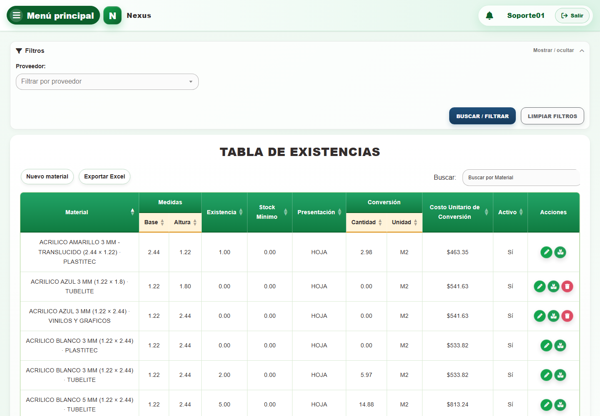

2. Escriba un término en el buscador **Buscar por Material** o elija una opción en el filtro **Proveedor**.
3. Seleccione el botón **Buscar / filtrar** para actualizar la tabla; use **Limpiar filtros** para restablecerla.
4. En la tabla, seleccione **Nuevo material**, **Exportar Excel**, **Editar registro** o **Ajustar stock**, según la operación requerida.

### CAP-CAT-MAT-02-CREATE — Formulario alta

**Casos:** `CU-CAT-02`, `CU-CAT-17`, `CU-CAT-18`.

**Errores posibles:** [Validación de formularios](../error-messages.md#errores-validacion), [Catálogos e inventario](../error-messages.md#errores-catalogos).

**Controles que debe usar:** Botón **Nuevo material**; campo **Nombre**; selectores **Buscar proveedor...**, **Buscar presentación...** y **Buscar unidad...**; campos **Stock Mínimo**, **Costo Máximo**, **Base** y **Altura**; casilla **Activo** y botón **Guardar**.

1. Seleccione el botón **Nuevo material** para abrir el formulario de alta. Antes de continuar, compruebe que la pantalla mostrada coincida con la captura:

   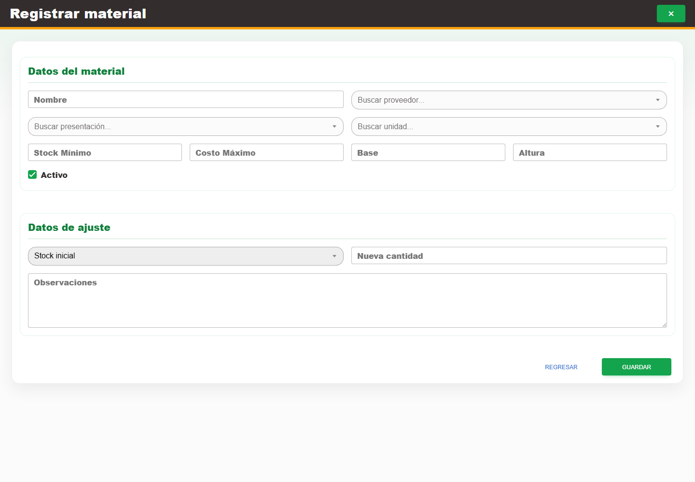

2. Complete **Nombre**; elija opciones en **Buscar proveedor...**, **Buscar presentación...** y **Buscar unidad...**; capture **Stock Mínimo**, **Costo Máximo**, **Base** y **Altura**, y revise la casilla **Activo**.
3. Seleccione el botón **Guardar** para registrar el material.

### CAP-CAT-MAT-03-EDIT — Formulario edicion

**Casos:** `CU-CAT-03`, `CU-CAT-04`.

**Errores posibles:** [Validación de formularios](../error-messages.md#errores-validacion), [Catálogos e inventario](../error-messages.md#errores-catalogos).

**Controles que debe usar:** Acción **Editar registro** de la fila; campo **Nombre**; selectores **Buscar proveedor...**, **Buscar presentación...** y **Buscar unidad...**; campos **Stock Mínimo**, **Costo Máximo**, **Base** y **Altura**; casilla **Activo** y botón **Actualizar**.

1. En la fila del material, seleccione la acción **Editar registro** para abrir el formulario. Antes de continuar, compruebe que la pantalla mostrada coincida con la captura:

   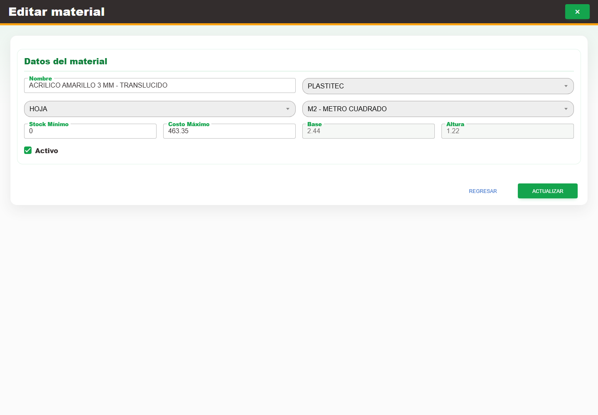

2. Modifique **Nombre**, **Buscar proveedor...**, **Buscar presentación...**, **Buscar unidad...**, **Stock Mínimo**, **Costo Máximo**, **Base** o **Altura** según corresponda, y revise la casilla **Activo**.
3. Seleccione el botón **Actualizar** para guardar los cambios.

### CAP-CAT-MAT-04-STOCK — Ajuste existencia

**Casos:** `CU-CAT-05`, `CU-CAT-19`.

**Errores posibles:** [Validación de formularios](../error-messages.md#errores-validacion), [Catálogos e inventario](../error-messages.md#errores-catalogos).

**Controles que debe usar:** Acción **Ajustar stock**; selector **Seleccione una razón...**, campos **Nueva cantidad** y **Observaciones**, y botón **Ajustar**.

1. En la fila del material, seleccione la acción **Ajustar stock**. Antes de continuar, compruebe que la pantalla mostrada coincida con la captura:

   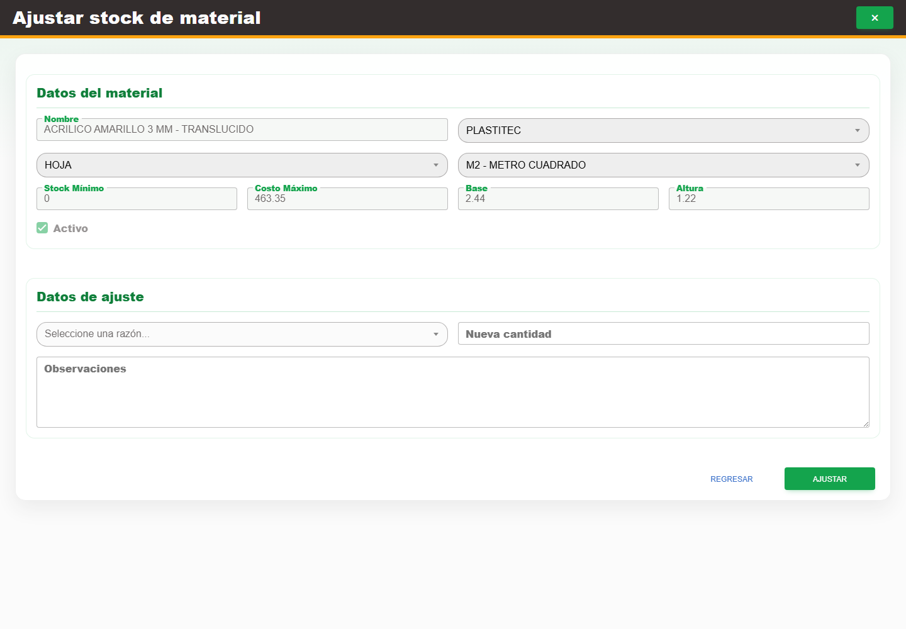

2. Elija una opción en **Seleccione una razón...** y complete los campos **Nueva cantidad** y **Observaciones**.
3. Revise el efecto sobre la existencia y seleccione el botón **Ajustar**.

## Proveedores

**Propósito.** Consultar y mantener el catálogo de proveedores.

### CAP-CAT-SUP-01-LIST — Listado

**Casos:** `CU-CAT-06`, `CU-REP-12`.

**Errores posibles:** [Catálogos e inventario](../error-messages.md#errores-catalogos).

**Controles que debe usar:** Buscador **Buscar por Nombre comercial o Razón social**, botones **Exportar Excel** y **Nuevo proveedor**, y acción **Editar registro** de cada fila.

1. Antes de usar los controles, compruebe que la pantalla inicial coincida con la captura:

   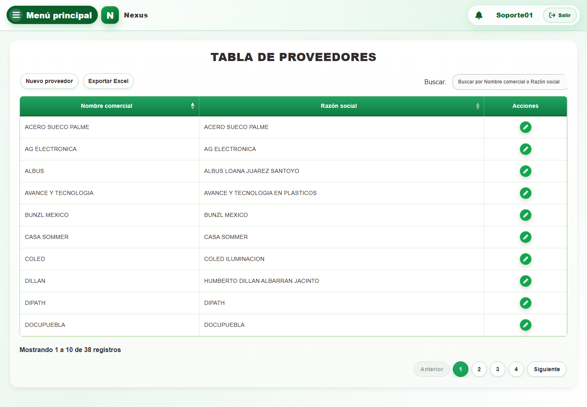

2. Escriba un término en el buscador **Buscar por Nombre comercial o Razón social** para localizar un proveedor.
3. En la tabla, seleccione **Nuevo proveedor**, **Exportar Excel** o la acción **Editar registro** de una fila.

### CAP-CAT-SUP-02-CREATE — Formulario alta

**Casos:** `CU-CAT-07`.

**Errores posibles:** [Validación de formularios](../error-messages.md#errores-validacion), [Catálogos e inventario](../error-messages.md#errores-catalogos).

**Controles que debe usar:** Botón **Nuevo proveedor**; campos **Razón social**, **Nombre comercial** y **Teléfono**; casilla **Activo** y botón **Guardar**.

1. Seleccione el botón **Nuevo proveedor** para abrir el formulario de alta. Antes de continuar, compruebe que la pantalla mostrada coincida con la captura:

   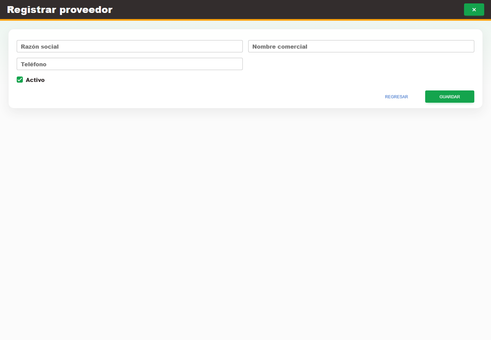

2. Complete los campos **Razón social**, **Nombre comercial** y **Teléfono**, y revise la casilla **Activo**.
3. Seleccione el botón **Guardar** para registrar el proveedor.

### CAP-CAT-SUP-03-EDIT — Formulario edicion y estado

**Casos:** `CU-CAT-08`, `CU-CAT-09`.

**Errores posibles:** [Validación de formularios](../error-messages.md#errores-validacion), [Catálogos e inventario](../error-messages.md#errores-catalogos).

**Controles que debe usar:** Acción **Editar registro**; campos **Razón social**, **Nombre comercial** y **Teléfono**; casilla **Activo** y botón **Actualizar**.

1. En la fila del proveedor, seleccione la acción **Editar registro**. Antes de continuar, compruebe que la pantalla mostrada coincida con la captura:

   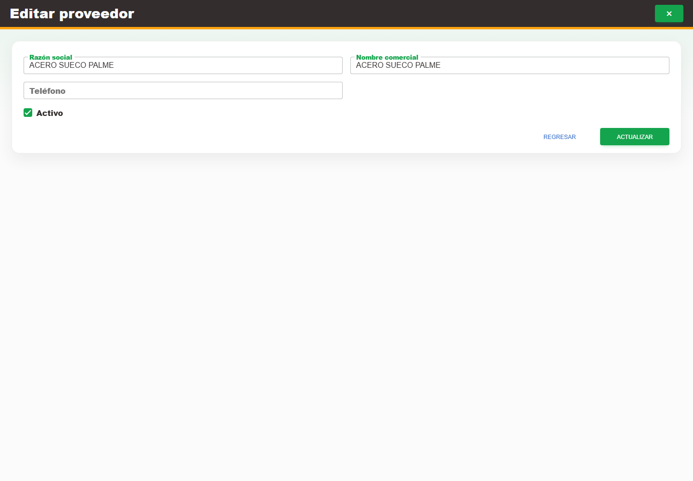

2. Modifique los campos **Razón social**, **Nombre comercial** o **Teléfono** necesarios y revise la casilla **Activo**.
3. Seleccione el botón **Actualizar** para guardar los cambios.

## Clientes

**Propósito.** Consultar y mantener el catálogo de clientes.

### CAP-CAT-CLI-01-LIST — Listado

**Casos:** `CU-CAT-10`, `CU-REP-13`.

**Errores posibles:** [Catálogos e inventario](../error-messages.md#errores-catalogos).

**Controles que debe usar:** Buscador **Buscar por Nombre**, botones **Exportar Excel** y **Nuevo cliente**, y acción **Editar registro** de cada fila.

1. Antes de usar los controles, compruebe que la pantalla inicial coincida con la captura:

   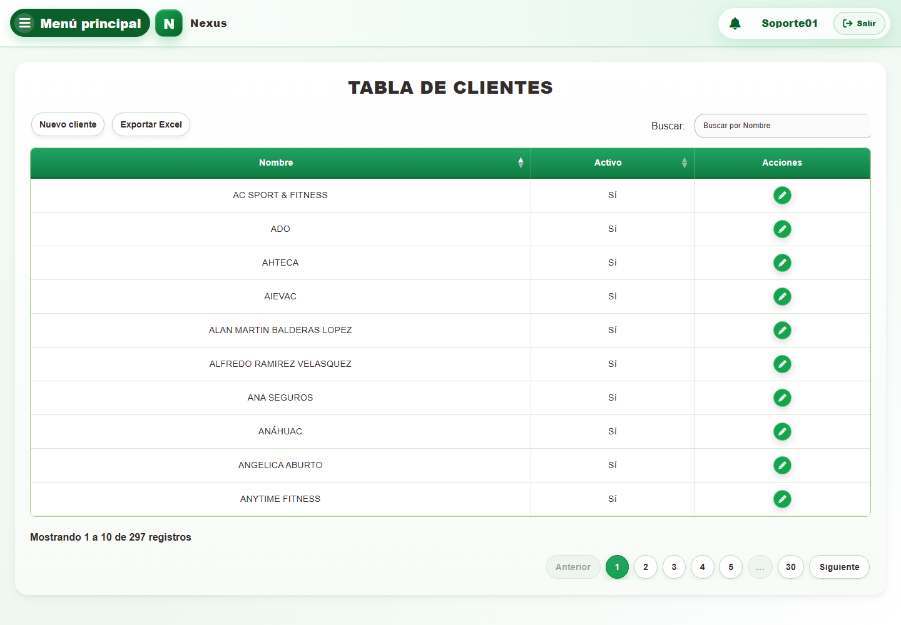

2. Escriba un término en el buscador **Buscar por Nombre** para localizar un cliente.
3. En la tabla, seleccione **Nuevo cliente**, **Exportar Excel** o la acción **Editar registro** de una fila.

### CAP-CAT-CLI-02-CREATE — Formulario alta

**Casos:** `CU-CAT-11`.

**Errores posibles:** [Validación de formularios](../error-messages.md#errores-validacion), [Catálogos e inventario](../error-messages.md#errores-catalogos).

**Controles que debe usar:** Botón **Nuevo cliente**, campo **Nombre** y botón **Guardar**.

1. Seleccione el botón **Nuevo cliente** para abrir el formulario de alta. Antes de continuar, compruebe que la pantalla mostrada coincida con la captura:

   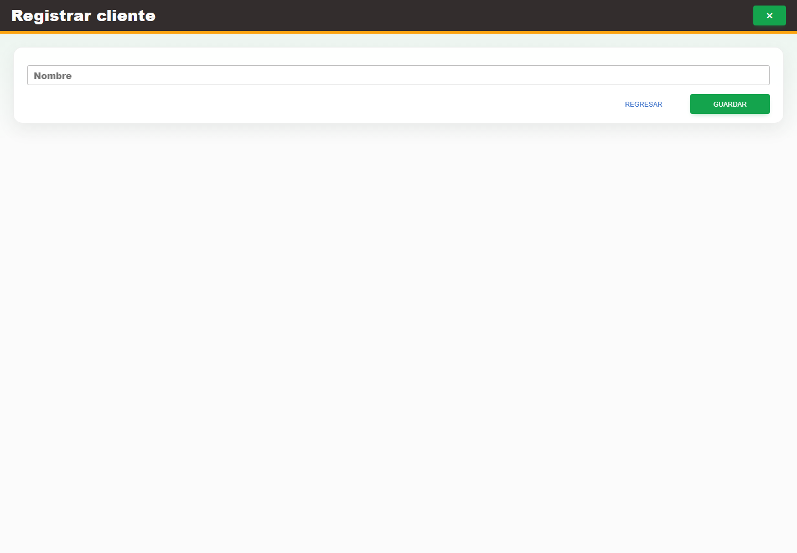

2. Complete el campo **Nombre** y seleccione el botón **Guardar**.

### CAP-CAT-CLI-03-EDIT — Formulario edicion

**Casos:** `CU-CAT-12`.

**Errores posibles:** [Validación de formularios](../error-messages.md#errores-validacion), [Catálogos e inventario](../error-messages.md#errores-catalogos).

**Controles que debe usar:** Acción **Editar registro**, campo **Nombre** y botón **Actualizar**.

1. En la fila del cliente, seleccione la acción **Editar registro**. Antes de continuar, compruebe que la pantalla mostrada coincida con la captura:

   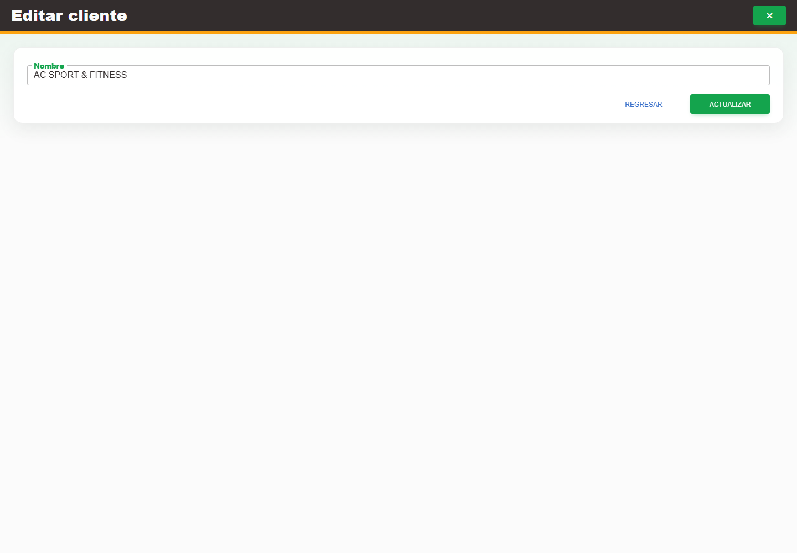

2. Modifique el campo **Nombre** y seleccione el botón **Actualizar**.

## Mermas e inventario

**Propósito.** Consultar y mantener mermas, ajustar existencias y delimitar reportes.

### CAP-CAT-WAS-01-LIST — Listado inventario

**Casos:** `CU-CAT-13`, `CU-REP-06`, `CU-REP-09`.

**Errores posibles:** [Catálogos e inventario](../error-messages.md#errores-catalogos).

**Controles que debe usar:** Buscador **Buscar por Material o Proveedor**, filtro **Proveedor**, botones **Buscar / filtrar**, **Limpiar filtros**, **Exportar Excel** y **Nueva merma**, además de las acciones por fila.

1. Antes de usar los controles, compruebe que la pantalla inicial coincida con la captura:

   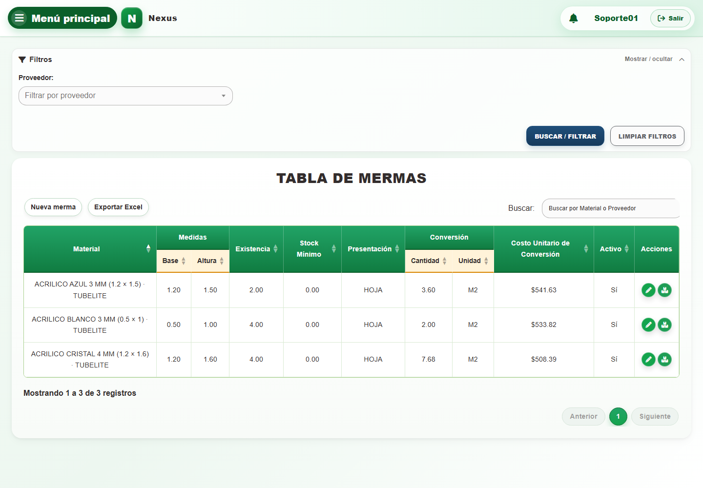

2. Escriba un término en el buscador **Buscar por Material o Proveedor** o elija una opción en el filtro **Proveedor**.
3. Seleccione el botón **Buscar / filtrar** para actualizar la tabla; use **Limpiar filtros** para restablecerla.
4. En la tabla, seleccione **Nueva merma**, **Exportar Excel**, **Editar registro** o **Ajustar stock**, según la operación requerida.

### CAP-CAT-WAS-02-CREATE — Formulario registro

**Casos:** `CU-CAT-14`.

**Errores posibles:** [Validación de formularios](../error-messages.md#errores-validacion), [Catálogos e inventario](../error-messages.md#errores-catalogos).

**Controles que debe usar:** Botón **Nueva merma**; selectores **Buscar proveedor...** y **Buscar material de referencia...**; campos **Ancho confirmado de la merma (m)**, **Largo real de la merma (m)**, **Stock mínimo** y **Costo máximo unitario**; casilla **Activo** y botón **Guardar**.

1. Seleccione el botón **Nueva merma** para abrir el formulario de registro. Antes de continuar, compruebe que la pantalla mostrada coincida con la captura:

   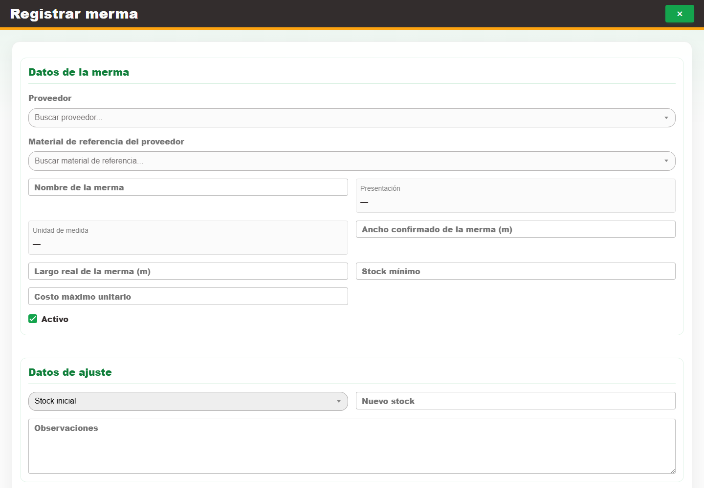

2. Elija opciones en **Buscar proveedor...** y **Buscar material de referencia...**; complete **Ancho confirmado de la merma (m)**, **Largo real de la merma (m)**, **Stock mínimo** y **Costo máximo unitario**, y revise la casilla **Activo**.
3. Seleccione el botón **Guardar** para registrar la merma.

### CAP-CAT-WAS-03-EDIT — Formulario edicion

**Casos:** `CU-CAT-15`.

**Errores posibles:** [Validación de formularios](../error-messages.md#errores-validacion), [Catálogos e inventario](../error-messages.md#errores-catalogos).

**Controles que debe usar:** Acción **Editar registro**; selectores **Buscar proveedor...** y **Buscar material de referencia...**; campos **Ancho confirmado de la merma (m)**, **Largo real de la merma (m)**, **Stock mínimo** y **Costo máximo unitario**; casilla **Activo** y botón **Actualizar**.

1. En la fila de la merma, seleccione la acción **Editar registro**. Antes de continuar, compruebe que la pantalla mostrada coincida con la captura:

   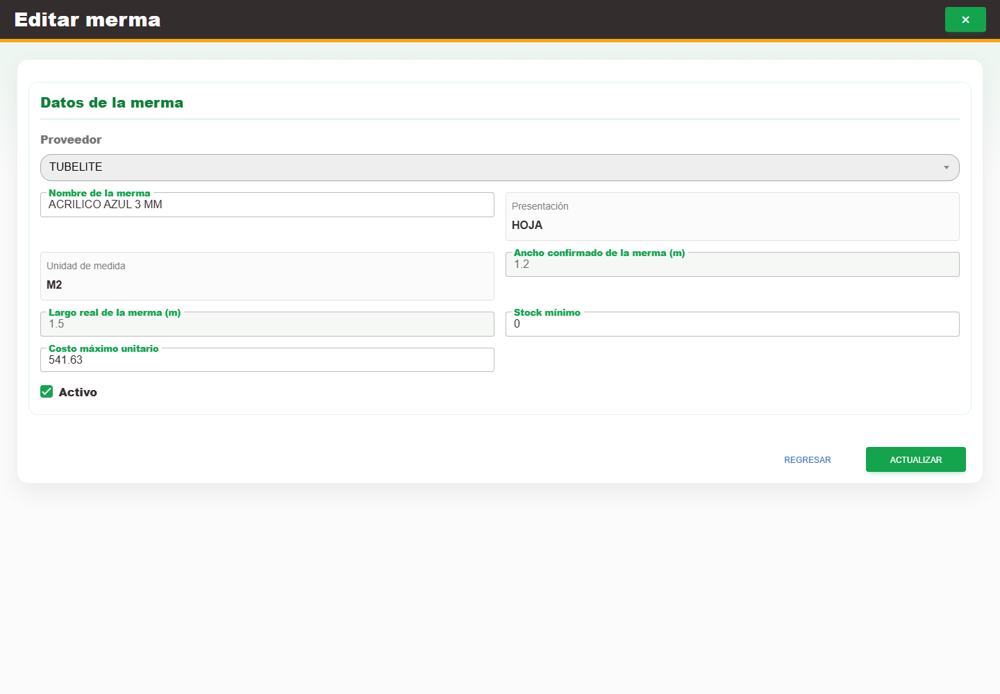

2. Modifique únicamente los selectores o campos indicados y revise la casilla **Activo**.
3. Seleccione el botón **Actualizar** para guardar los cambios.

### CAP-CAT-WAS-04-STOCK — Ajuste existencia

**Casos:** `CU-CAT-16`.

**Errores posibles:** [Validación de formularios](../error-messages.md#errores-validacion), [Catálogos e inventario](../error-messages.md#errores-catalogos).

**Controles que debe usar:** Acción **Ajustar stock**; selector **Seleccione una razón...**, campos **Nuevo stock** y **Observaciones**, y botón **Ajustar**.

1. En la fila de la merma, seleccione la acción **Ajustar stock**. Antes de continuar, compruebe que la pantalla mostrada coincida con la captura:

   

2. Elija una opción en **Seleccione una razón...** y complete los campos **Nuevo stock** y **Observaciones**.
3. Revise el efecto sobre la existencia y seleccione el botón **Ajustar**.

### CAP-REP-WAS-05-EXPORT — Exportar reporte

**Casos:** `CU-REP-09`.

**Errores posibles:** [Catálogos e inventario](../error-messages.md#errores-catalogos).

**Controles que debe usar:** Botón **Exportar Excel**; opciones **Mes actual**, **Otro mes** o **Personalizado: usar filtros aplicados**; campo **Mes del reporte** cuando corresponda y botón **Descargar**.

1. Seleccione el botón **Exportar Excel** para abrir el diálogo de alcance. Antes de continuar, compruebe que la pantalla mostrada coincida con la captura:

   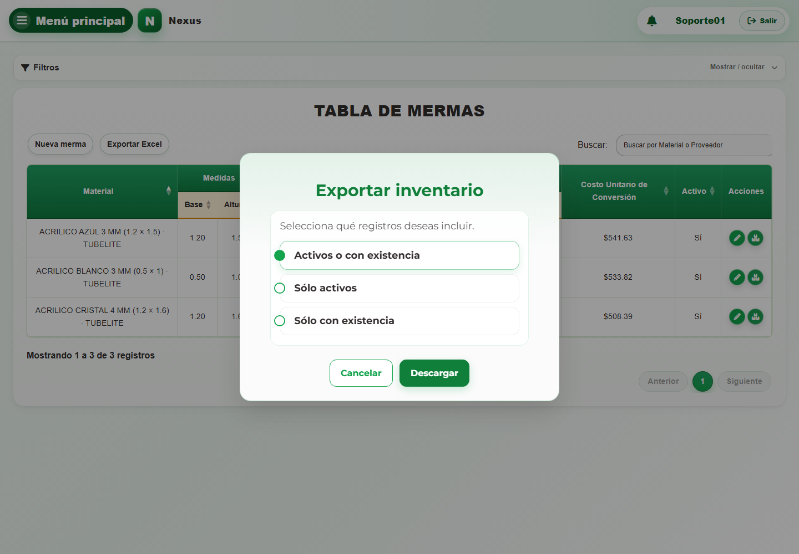

2. Elija **Mes actual**, **Otro mes** o **Personalizado: usar filtros aplicados** y, cuando corresponda, complete **Mes del reporte**.
3. Seleccione el botón **Descargar** para generar el archivo.
