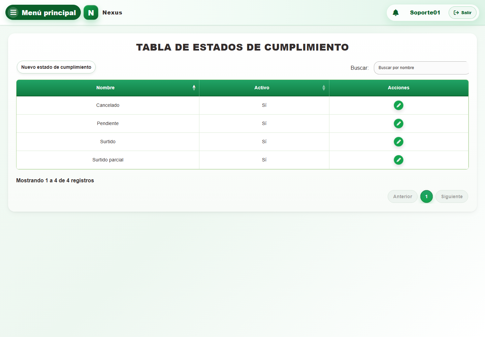
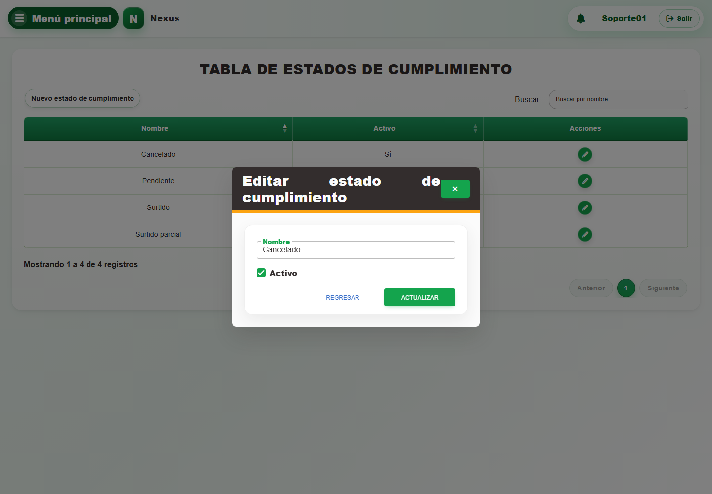

# Estados de cumplimiento

**Propósito.** Consultar, crear y editar el catálogo de estados de cumplimiento que configura los flujos del sistema.

**Ruta en el menú:** **Menú principal → Catálogos auxiliares → Estados de cumplimiento**.

**Casos de uso:** `CU-CAT-24` a `CU-CAT-26`, correspondientes a consultar, crear y editar.

**Acceso:** esta pantalla y sus escrituras son exclusivas del administrador del sistema del área Sistemas. Que una opción aparezca en un selector operativo no concede acceso a su mantenimiento.

1. Abra **Estados de cumplimiento** y compruebe que el encabezado y la tabla correspondan al catálogo que desea modificar:

   

2. Seleccione **Nuevo estado de cumplimiento** y compruebe que se abra el formulario de alta:

   

   Complete **Nombre** —máximo 50 caracteres—. Revise la casilla **Activo** y seleccione **Guardar**.

3. Seleccione **Editar registro** en la fila requerida y compruebe que se abra el formulario de edición:

   

   Cambie únicamente los campos habilitados —incluido **Activo**— y seleccione **Actualizar**.

4. Compruebe que la tabla de esa misma pantalla muestre el resultado.

Una entrada inactiva permanece en la tabla para poder consultarla o reactivarla, pero deja de ofrecerse en formularios operativos nuevos. El cambio de estado se confirma junto con los demás datos mediante **Guardar** o **Actualizar** y puede descartarse con **Regresar**.

**Errores posibles:** [Validación de formularios](../../error-messages.md#errores-validacion), [Acceso y autorización](../../error-messages.md#errores-acceso), [Catálogos e inventario](../../error-messages.md#errores-catalogos).
