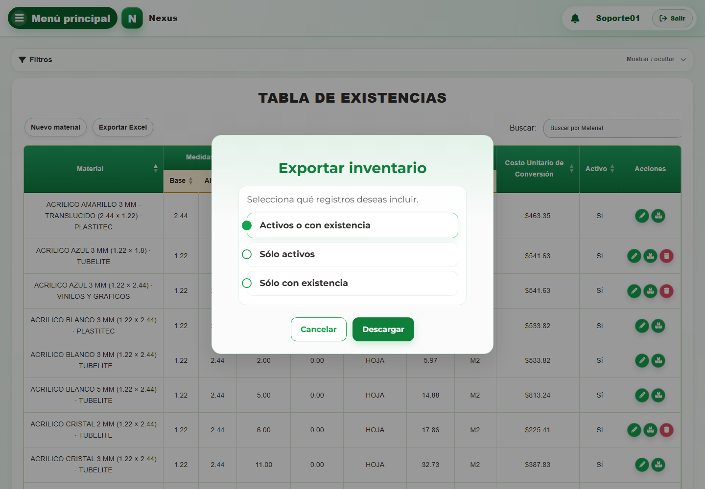

# 6. CAP-REP-MAT-05-EXPORT — Exportar inventario

**Casos de uso:** `CU-ALM-06` — Generar reporte de inventario de materiales.

1. Seleccione **Exportar Excel** y compruebe el modal:

   

2. Elija el alcance y seleccione **Descargar**:
   - **Activos o con existencia:** incluye toda oferta activa y también una oferta
     inactiva cuando aún conserva existencias.
   - **Sólo activos:** incluye únicamente ofertas activas, aunque su existencia sea cero.
   - **Sólo con existencia:** incluye ofertas activas o inactivas cuyo saldo sea mayor
     que cero.
