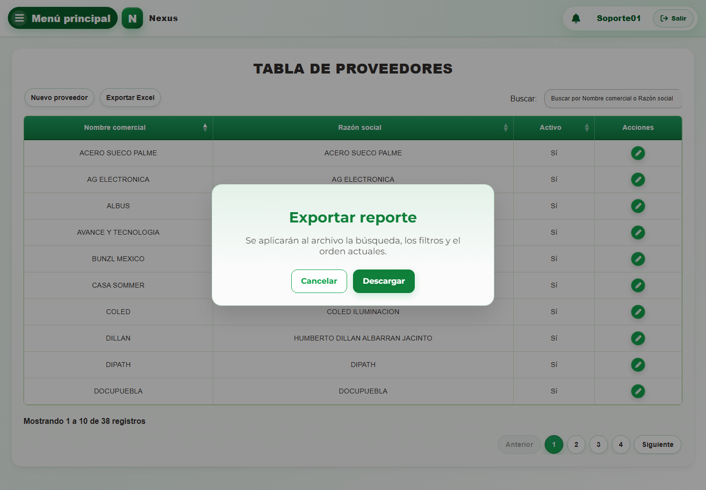

# 7. CAP-CAT-SUP-01-LIST — Listado

**Casos de uso:** `CU-CAT-01` — Consultar proveedores; `CU-CAT-04` — Generar reporte de proveedores.

**Errores posibles:** [Catálogos e inventario](../../error-messages.md#errores-catalogos).

**Controles que debe usar:** Buscador **Buscar por Nombre comercial o Razón social**, botones **Exportar Excel** y **Nuevo proveedor**, y acción **Editar registro** de cada fila.

1. Antes de usar los controles, compruebe que la pantalla inicial coincida con la captura:

   

2. Escriba un término en el buscador **Buscar por Nombre comercial o Razón social** para localizar un proveedor.
3. En la tabla, seleccione **Nuevo proveedor**, **Exportar Excel** o la acción **Editar registro** de una fila.
4. Si selecciona **Exportar Excel**, Nexus abre el modal **Exportar reporte**. Confirme que se aplicarán la búsqueda, los filtros y el orden actuales; seleccione **Descargar** para continuar o cierre el modal para cancelar.

   
   

La columna **Activo**, ubicada antes de **Acciones**, se muestra en el listado únicamente al
administrador del sistema.
