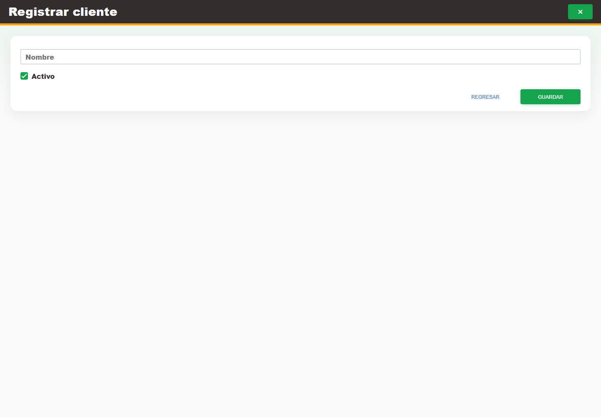

# 11. CAP-CAT-CLI-02-CREATE — Formulario alta

**Casos de uso:** `CU-CAT-06` — Crear cliente.

**Errores posibles:** [Validación de formularios](../../error-messages.md#errores-validacion), [Catálogos e inventario](../../error-messages.md#errores-catalogos).

**Controles que debe usar:** Opción **Nuevo cliente** del selector de una salida autorizada o botón **Nuevo cliente** del listado de Sistemas; campo **Nombre**, casilla **Activo** y botón **Guardar**.

1. Desde Almacén, abra **Nueva salida**, escriba el cliente que no existe en el selector y elija **Nuevo cliente**. Desde Sistemas también puede seleccionar el botón **Nuevo cliente** del listado independiente. Antes de continuar, compruebe que la pantalla mostrada coincida con la captura:

   

2. Complete el campo **Nombre**, revise la casilla **Activo** y seleccione el botón **Guardar**.
