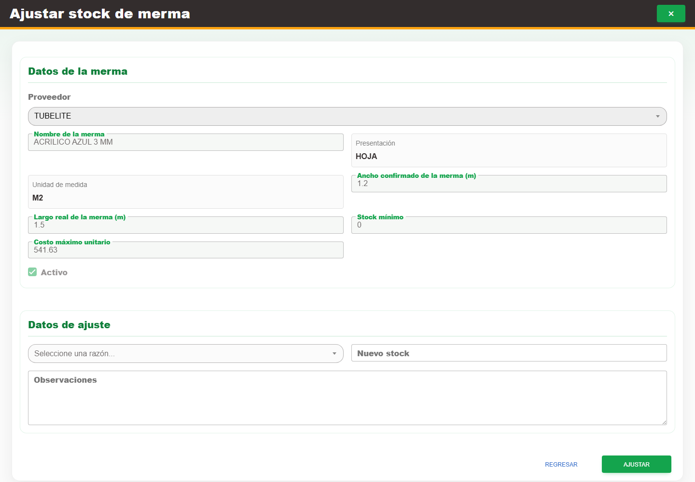

# 17. CAP-CAT-WAS-04-STOCK — Ajuste existencia

**Casos de uso:** `CU-ALM-12` — Ajustar existencia de merma.

**Errores posibles:** [Validación de formularios](../../error-messages.md#errores-validacion), [Catálogos e inventario](../../error-messages.md#errores-catalogos).

**Campos editables en modo ajuste:** **Seleccione una razón...**, **Nuevo stock** y
**Observaciones**. Los datos de identidad y catálogo quedan sólo para consulta. Use la acción
**Ajustar stock** y el botón **Ajustar**.

1. En la fila de la merma, seleccione la acción **Ajustar stock**. Antes de continuar, compruebe que la pantalla mostrada coincida con la captura:

   

2. Elija una opción en **Seleccione una razón...** y complete los campos **Nuevo stock** y **Observaciones**.

   🟨 **ADVERTENCIA:** **Nuevo stock** sustituye la existencia actual; no es una cantidad que Nexus
   sumará al inventario de merma.

3. Revise el efecto sobre la existencia y seleccione el botón **Ajustar**.

Al finalizar, vuelva al listado y confirme que la existencia mostrada sea exactamente la cantidad
capturada. Si no puede confirmarlo, actualice el listado antes de intentar otro ajuste.
