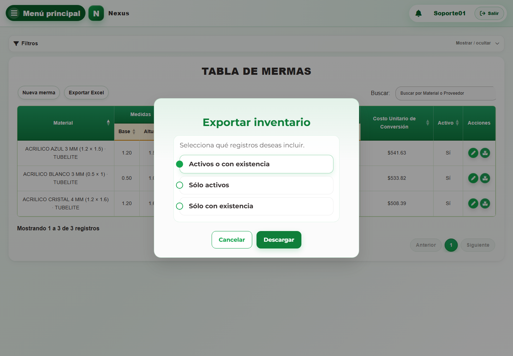

# 18. CAP-REP-WAS-05-EXPORT — Exportar inventario de mermas

**Casos de uso:** `CU-ALM-14` — Generar reporte de mermas.

1. Seleccione **Exportar Excel** y compruebe el modal:

   

2. Elija el alcance y seleccione **Descargar**:
   - **Activos o con existencia:** incluye toda merma activa y también una merma
     inactiva cuando aún conserva existencias.
   - **Sólo activos:** incluye únicamente mermas activas, aunque su existencia sea cero.
   - **Sólo con existencia:** incluye mermas activas o inactivas cuyo saldo sea mayor
     que cero.
