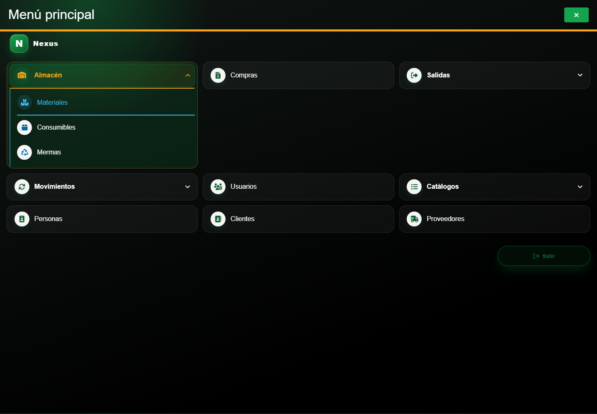
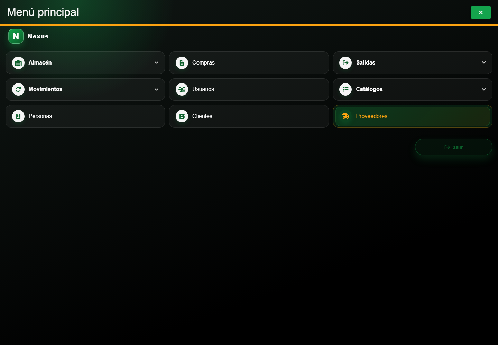

# Casos: Catálogos e inventario

Cada procedimiento identifica sus casos de uso, controles, errores posibles y captura de referencia.

## Capítulos

### Catálogos auxiliares

1. [1. Catálogos auxiliares](01-catalogs-auxiliary.md)

### Materiales e inventario

**Propósito.** Consultar el inventario, registrar o editar materiales y ajustar existencias.

**Ruta en el menú:** **Menú principal → Almacén → Materiales**.

**Qué significa identidad y estado.** La identidad de un material es la combinación de
**Nombre**, **Presentación**, **Unidad**, **Base** y **Altura** que permite reconocer el mismo
artículo. **Proveedor** pertenece a una relación de inventario separada, por lo que una misma
identidad puede estar asociada con proveedores distintos. **Stock Mínimo**, **Costo Máximo**,
existencia y **Activo** no forman parte de la identidad. **Activo** pertenece a cada oferta
proveedor-material: desmarcarlo conserva la identidad compartida, la relación seleccionada, su
existencia y su historia, sin desactivar las ofertas del mismo material asociadas con otros
proveedores. La oferta inactiva ya no puede incorporarse a una compra o salida nueva. Si estaba
incluida en una salida antes de desactivarla, todavía puede surtirse el pendiente para completar
ese compromiso, siempre que haya existencia suficiente. En
los reportes, **Sólo activos** la excluye, mientras **Sólo con existencia** puede incluirla si aún
conserva stock. Volver a marcarla permite usar esa oferta nuevamente en operaciones nuevas.

2. [2. CAP-CAT-MAT-01-LIST — Listado inventario](02-cap-cat-mat-01-list.md)
3. [3. CAP-REP-MAT-05-EXPORT — Exportar inventario](03-cap-rep-mat-05-export.md)
4. [4. CAP-CAT-MAT-02-CREATE — Formulario alta](04-cap-cat-mat-02-create.md)
5. [5. CAP-CAT-MAT-03-EDIT — Formulario edicion](05-cap-cat-mat-03-edit.md)
6. [6. CAP-CAT-MAT-04-STOCK — Ajuste existencia](06-cap-cat-mat-04-stock.md)

### Proveedores

**Propósito.** Consultar y mantener el catálogo de proveedores.

**Ruta en el menú:** **Menú principal → Proveedores**.

La casilla **Activo** controla el estado del proveedor dentro del mismo formulario de alta o
edición. Desmarcarla no elimina el proveedor ni sus materiales o documentos históricos; volver a
marcarla lo reactiva. Este cambio no es un ajuste de stock.

7. [7. CAP-CAT-SUP-01-LIST — Listado](07-cap-cat-sup-01-list.md)
8. [8. CAP-CAT-SUP-02-CREATE — Formulario alta](08-cap-cat-sup-02-create.md)
9. [9. CAP-CAT-SUP-03-EDIT — Formulario edición y estado](09-cap-cat-sup-03-edit.md)

### Clientes

**Propósito.** Consultar y mantener el catálogo de clientes.

**Ruta en el menú:** **Menú principal → Clientes**.

La casilla **Activo** permite retirar un cliente de las selecciones de operaciones nuevas sin
eliminarlo ni perder sus salidas históricas. La pantalla de Clientes sigue mostrando ambos estados
para que el administrador pueda revisarlos o reactivarlos.

10. [10. CAP-CAT-CLI-01-LIST — Listado](10-cap-cat-cli-01-list.md)
11. [11. CAP-CAT-CLI-02-CREATE — Formulario alta](11-cap-cat-cli-02-create.md)
12. [12. CAP-CAT-CLI-03-EDIT — Formulario edicion](12-cap-cat-cli-03-edit.md)

### Mermas e inventario

**Propósito.** Consultar y mantener mermas, ajustar existencias y delimitar reportes.

**Ruta en el menú:** **Menú principal → Almacén → Mermas**.

**Qué significa identidad y estado.** La identidad de una merma es la combinación de
**Proveedor**, **Nombre**, **Ancho/Base** y **Largo/Altura**. La presentación y unidad se conservan
como datos de la plantilla seleccionada; el stock mínimo, costo máximo, existencia y estado
**Activo** no forman parte de la identidad. Desmarcar **Activo** no elimina la merma ni cambia su
stock o historia, pero Nexus rechaza una merma inactiva al intentar registrarla en una nueva salida.
Si la merma ya pertenecía a una salida pendiente o parcial, puede surtirse el detalle restante para
cerrar el compromiso, siempre que haya stock; desactivarla no cancela la salida. Los reportes pueden
conservarla cuando se elige **Sólo con existencia** y aún tiene stock. Volver a marcarla permite
utilizarla nuevamente en una nueva salida.

13. [13. CAP-CAT-WAS-01-LIST — Listado inventario](13-cap-cat-was-01-list.md)
14. [14. CAP-REP-WAS-05-EXPORT — Exportar inventario de mermas](14-cap-rep-was-05-export.md)
15. [15. CAP-CAT-WAS-02-CREATE — Formulario registro](15-cap-cat-was-02-create.md)
16. [16. CAP-CAT-WAS-03-EDIT — Formulario edicion](16-cap-cat-was-03-edit.md)
17. [17. CAP-CAT-WAS-04-STOCK — Ajuste existencia](17-cap-cat-was-04-stock.md)
