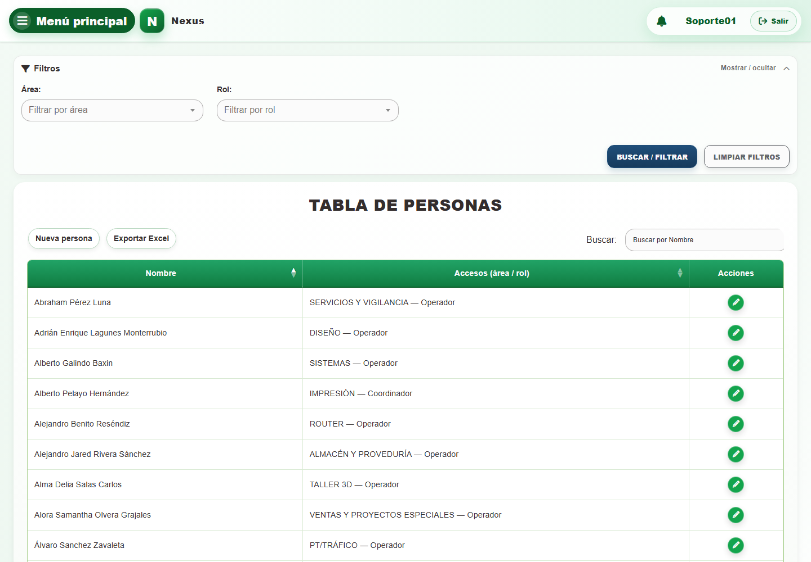
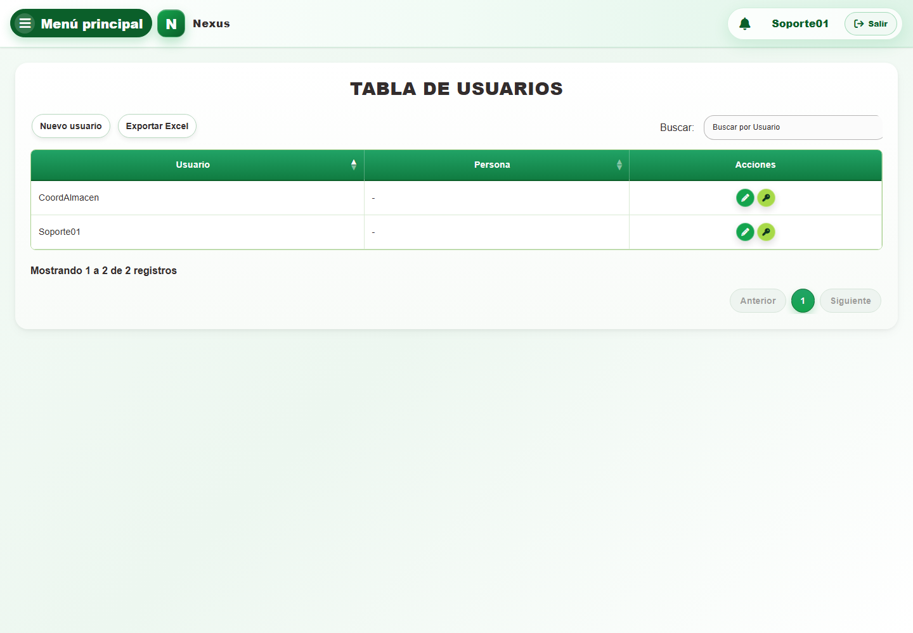
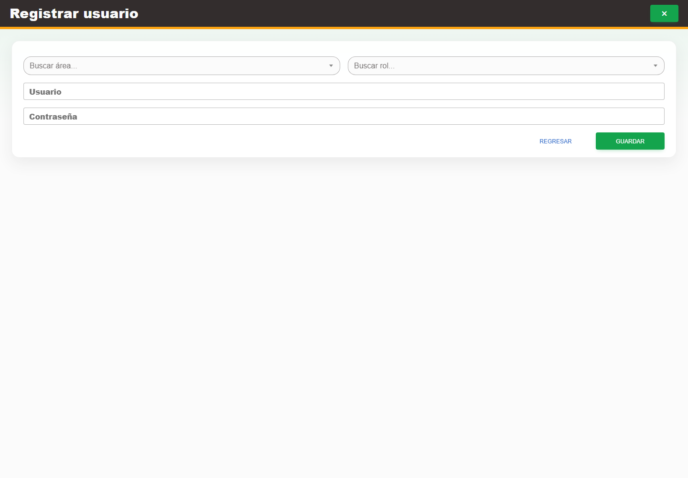
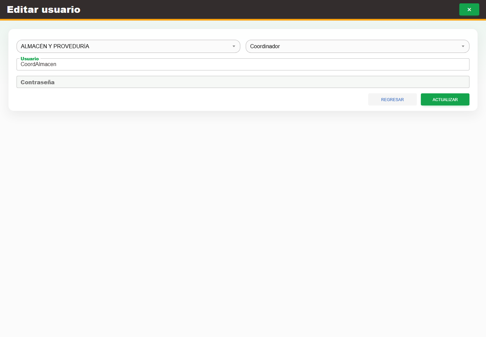
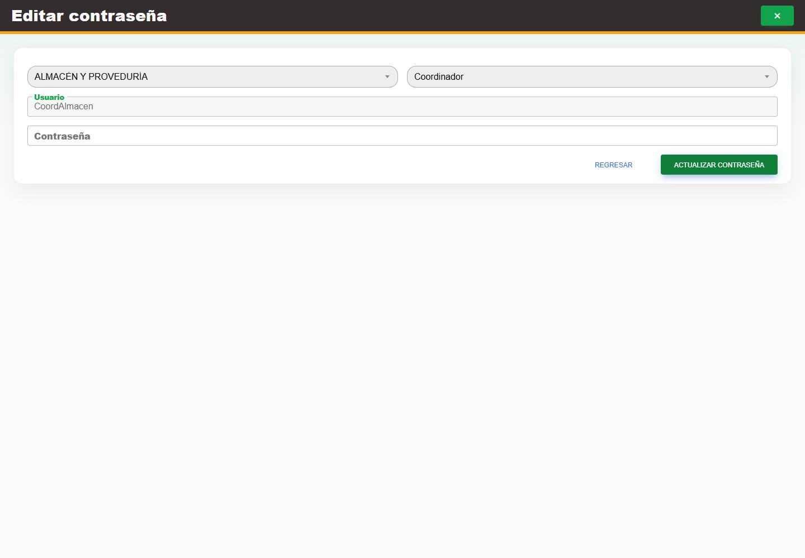

# Casos: Identidad y acceso

Cada procedimiento identifica sus casos de uso, controles, errores posibles y captura de referencia.

## Personas

**Propósito.** Consultar y mantener las personas que participan en la operación.

### CAP-IDA-PER-01-LIST — Listado

**Casos:** `CU-IDA-01`, `CU-REP-14`.

**Errores posibles:** [Catálogos e inventario](../error-messages.md#errores-catalogos).

**Controles que debe usar:** Buscador **Buscar por Nombre**; filtros **Área** y **Rol**; botones **Buscar / filtrar**, **Limpiar filtros**, **Exportar Excel** y **Nueva persona**, y acción **Editar registro** por fila.

1. Antes de usar los controles, compruebe que la pantalla inicial coincida con la captura:

   

2. Escriba un término en **Buscar por Nombre** o elija opciones en los filtros **Área** y **Rol**.
3. Seleccione **Buscar / filtrar** para actualizar la tabla; use **Limpiar filtros** para restablecerla.
4. En la tabla, seleccione **Nueva persona**, **Exportar Excel** o **Editar registro** en una fila.

### CAP-IDA-PER-02-CREATE — Formulario alta

**Casos:** `CU-IDA-02`, `CU-IDA-08`, `CU-IDA-09`.

**Errores posibles:** [Validación de formularios](../error-messages.md#errores-validacion), [Catálogos e inventario](../error-messages.md#errores-catalogos).

**Controles que debe usar:** Botón **Nueva persona**; campo **Nombre completo**; selectores **Buscar área...** y **Buscar rol...**; botón **Agregar** para cada acceso y botón **Guardar**.

1. Seleccione el botón **Nueva persona** para abrir el formulario. Antes de continuar, compruebe que la pantalla mostrada coincida con la captura:

   

2. Complete el campo **Nombre completo**.
3. Elija opciones en **Buscar área...** y **Buscar rol...**, y seleccione **Agregar** para incorporar cada acceso requerido.
4. Revise los accesos y seleccione el botón **Guardar**.

### CAP-IDA-PER-03-EDIT — Formulario edicion

**Casos:** `CU-IDA-03`.

**Errores posibles:** [Validación de formularios](../error-messages.md#errores-validacion), [Catálogos e inventario](../error-messages.md#errores-catalogos).

**Controles que debe usar:** Acción **Editar registro**; campo **Nombre completo**; selectores **Buscar área...** y **Buscar rol...**; botón **Agregar** y controles de los accesos existentes; botón **Actualizar**.

1. En la fila de la persona, seleccione **Editar registro**. Antes de continuar, compruebe que la pantalla mostrada coincida con la captura:

   

2. Modifique **Nombre completo** si corresponde.
3. Use los selectores **Buscar área...** y **Buscar rol...**, el botón **Agregar** y los controles de accesos existentes para dejar sólo los accesos autorizados.
4. Seleccione el botón **Actualizar** para guardar los cambios.

## Usuarios

**Propósito.** Administrar cuentas y cambios de contraseña.

### CAP-IDA-USR-01-LIST — Listado

**Casos:** `CU-IDA-04`, `CU-REP-15`.

**Errores posibles:** [Acceso y autorización](../error-messages.md#errores-acceso), [Catálogos e inventario](../error-messages.md#errores-catalogos).

**Controles que debe usar:** Buscador **Buscar por Usuario**; botones **Exportar Excel** y **Nuevo usuario**; acciones **Editar usuario** y **Cambiar contraseña** de cada fila.

1. Antes de usar los controles, compruebe que la pantalla inicial coincida con la captura:

   

2. Escriba un término en el buscador **Buscar por Usuario** para localizar una cuenta.
3. En la tabla, seleccione **Nuevo usuario**, **Exportar Excel**, **Editar usuario** o **Cambiar contraseña**.

### CAP-IDA-USR-02-CREATE — Formulario alta

**Casos:** `CU-IDA-05`.

**Errores posibles:** [Validación de formularios](../error-messages.md#errores-validacion), [Acceso y autorización](../error-messages.md#errores-acceso), [Catálogos e inventario](../error-messages.md#errores-catalogos).

**Controles que debe usar:** Botón **Nuevo usuario**; selectores **Buscar área...** y **Buscar rol...**; campos **Usuario** y **Contraseña**; botón **Guardar**.

1. Seleccione el botón **Nuevo usuario** para abrir el formulario. Antes de continuar, compruebe que la pantalla mostrada coincida con la captura:

   

2. Elija opciones en **Buscar área...** y **Buscar rol...**, y complete los campos **Usuario** y **Contraseña**.
3. Seleccione el botón **Guardar** para crear la cuenta.

### CAP-IDA-USR-03-EDIT — Formulario edicion

**Casos:** `CU-IDA-06`.

**Errores posibles:** [Validación de formularios](../error-messages.md#errores-validacion), [Acceso y autorización](../error-messages.md#errores-acceso), [Catálogos e inventario](../error-messages.md#errores-catalogos).

**Controles que debe usar:** Acción **Editar usuario**; selectores **Buscar área...** y **Buscar rol...**; campo **Usuario** y botón **Actualizar**.

1. En la fila de la cuenta, seleccione la acción **Editar usuario**. Antes de continuar, compruebe que la pantalla mostrada coincida con la captura:

   

2. Revise los selectores **Buscar área...** y **Buscar rol...**, y modifique el campo **Usuario** si corresponde.
3. Seleccione el botón **Actualizar** para guardar los cambios.

### CAP-IDA-USR-04-PASSWORD — Cambio contrasena

**Casos:** `CU-IDA-07`.

**Errores posibles:** [Validación de formularios](../error-messages.md#errores-validacion), [Acceso y autorización](../error-messages.md#errores-acceso), [Catálogos e inventario](../error-messages.md#errores-catalogos).

**Controles que debe usar:** Acción **Cambiar contraseña**; campo **Contraseña**, botón **Actualizar contraseña** y botón **Regresar**.

1. En la fila de la cuenta, seleccione la acción **Cambiar contraseña**. Antes de continuar, compruebe que la pantalla mostrada coincida con la captura:

   

2. Escriba la nueva clave conforme a la política en el campo **Contraseña**.
3. Seleccione **Actualizar contraseña** para confirmar o **Regresar** para salir sin cambios.
