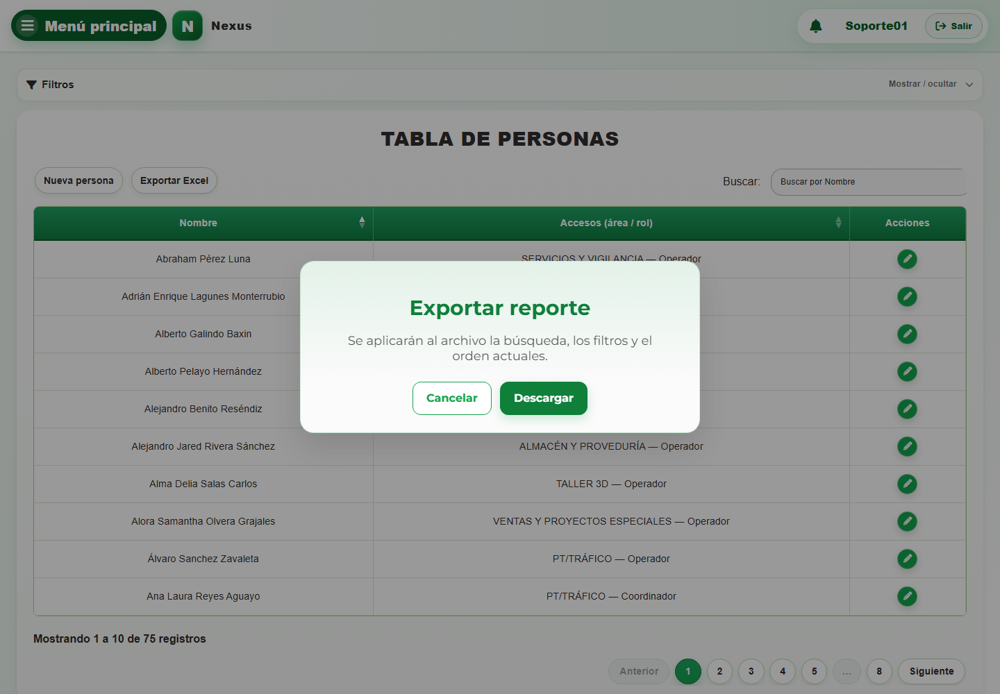

# CAP-IDA-PER-01-LIST — Listado

**Casos de uso:** `CU-IDA-01` — Consultar personas; `CU-IDA-04` — Generar reporte de personas.

**Errores posibles:** [Catálogos e inventario](../../error-messages.md#errores-catalogos).

**Controles que debe usar:** Buscador **Buscar por Nombre**; filtros **Área** y **Rol**; botones **Buscar / filtrar**, **Limpiar filtros**, **Exportar Excel** y **Nueva persona**, y acción **Editar registro** por fila.

1. Abra **Filtros** y compruebe que los controles desplegados coincidan con la captura:

   

2. Escriba un término en **Buscar por Nombre** o elija opciones en los filtros **Área** y **Rol**.
3. Seleccione **Buscar / filtrar** para actualizar la tabla; use **Limpiar filtros** para restablecerla.
4. En la tabla, seleccione **Nueva persona**, **Exportar Excel** o **Editar registro** en una fila.
5. Si selecciona **Exportar Excel**, Nexus abre el modal **Exportar reporte**. Confirme que se aplicarán la búsqueda, los filtros y el orden actuales; seleccione **Descargar** para continuar o cierre el modal para cancelar.

   
   
