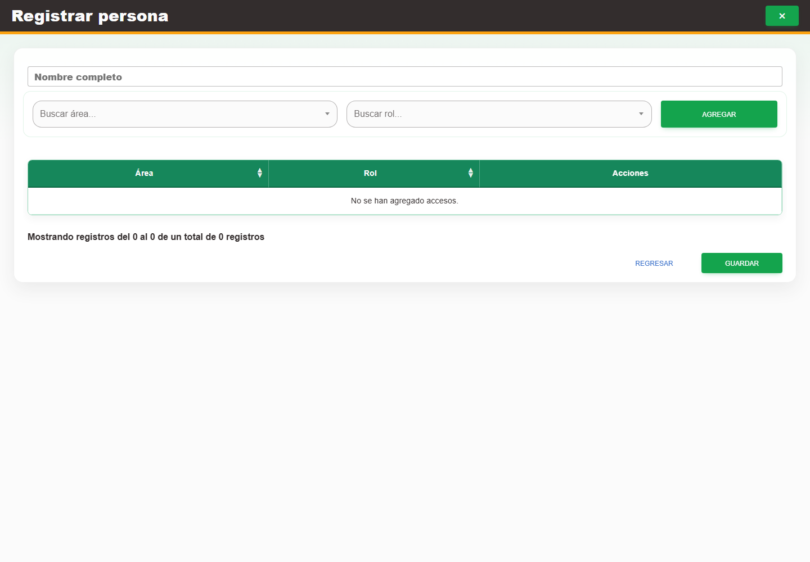

# 2. CAP-IDA-PER-02-CREATE — Formulario alta

**Casos de uso:** `CU-IDA-02` — Crear persona.

**Errores posibles:** [Validación de formularios](../../error-messages.md#errores-validacion), [Catálogos e inventario](../../error-messages.md#errores-catalogos).

**Controles que debe usar:** Botón **Nueva persona**; campo **Nombre completo**; selectores **Buscar área...** y **Buscar rol...**; botón **Agregar** para cada acceso y botón **Guardar**.

1. Seleccione el botón **Nueva persona** para abrir el formulario. Antes de continuar, compruebe que la pantalla mostrada coincida con la captura:

   

2. Complete el campo **Nombre completo**.
3. Elija opciones en **Buscar área...** y **Buscar rol...**, y seleccione **Agregar**. Compruebe que el acceso aparezca como un nuevo renglón de la tabla y repita este paso para cada área requerida.
4. Revise los renglones de la tabla y seleccione el botón **Guardar**. Los accesos se guardan junto con la persona; agregarlos a la tabla todavía no los persiste.

Cada área puede aparecer **una sola vez** en los accesos de la persona y sólo puede tener un rol. Si intenta agregar un área que ya está en la tabla, Nexus no crea otro renglón y le solicita eliminar primero la relación existente si necesita cambiar su rol.
