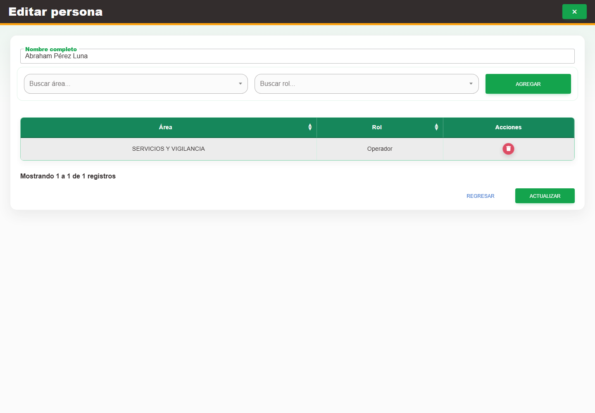

# 3. CAP-IDA-PER-03-EDIT — Formulario edicion

**Casos de uso:** `CU-IDA-03` — Editar persona.

**Errores posibles:** [Validación de formularios](../../error-messages.md#errores-validacion), [Catálogos e inventario](../../error-messages.md#errores-catalogos).

**Controles que debe usar:** Acción **Editar registro**; campo **Nombre completo**; selectores **Buscar área...** y **Buscar rol...**; botón **Agregar** y controles de los accesos existentes; botón **Actualizar**.

1. En la fila de la persona, seleccione **Editar registro**. Antes de continuar, compruebe que la pantalla mostrada coincida con la captura:

   

2. Modifique **Nombre completo** si corresponde.
3. Para incorporar un acceso, elija opciones en **Buscar área...** y **Buscar rol...**, seleccione **Agregar** y compruebe que aparezca en la tabla. Para retirar uno, use **Eliminar acceso** en su renglón.
4. Repita las operaciones necesarias, revise la tabla y seleccione **Actualizar** para guardar todos los cambios. Agregar o eliminar un renglón todavía no modifica las asignaciones persistidas hasta confirmar.

Cada área puede aparecer **una sola vez** y sólo puede tener un rol para la persona. Para cambiar el rol de un área ya registrada, elimine primero su renglón y vuelva a agregar la misma área con el rol correcto; Nexus rechaza agregar directamente un segundo acceso para esa área.
