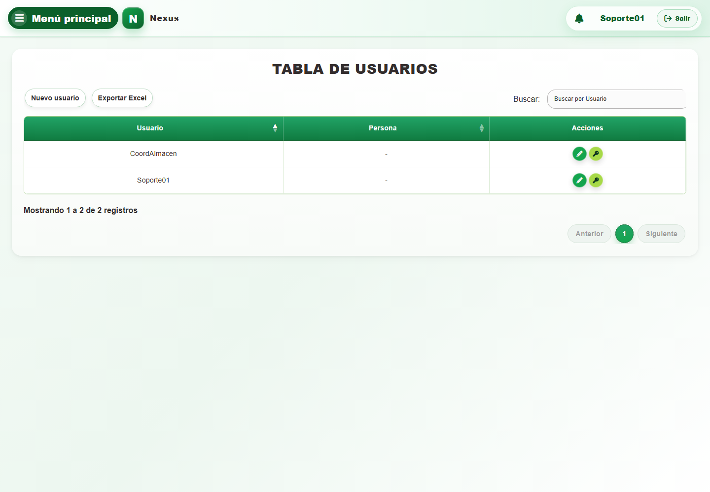
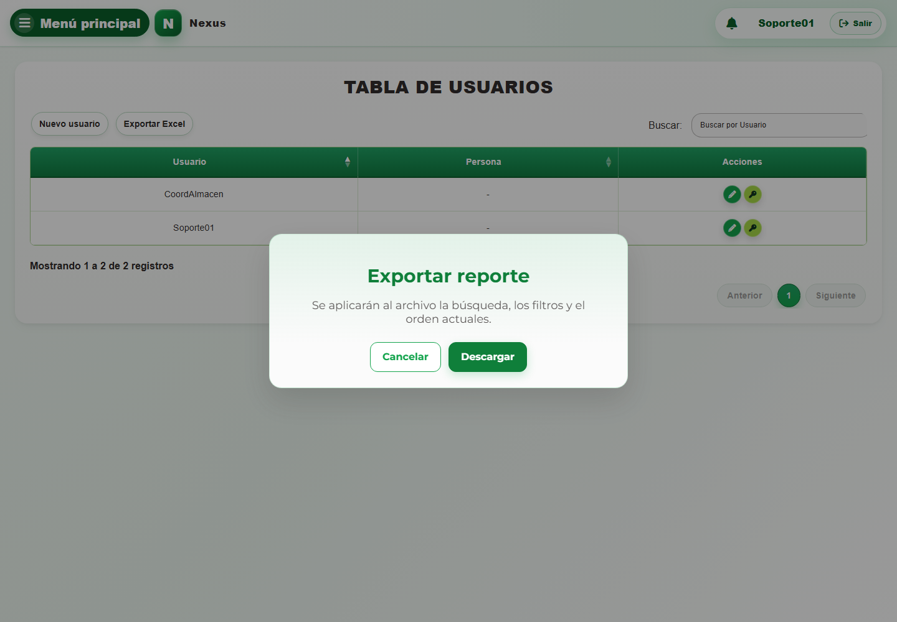

# 4. CAP-IDA-USR-01-LIST — Listado

**Casos de uso:** `CU-IDA-05` — Consultar usuarios; `CU-IDA-09` — Generar reporte de usuarios.

**Errores posibles:** [Acceso y autorización](../../error-messages.md#errores-acceso), [Catálogos e inventario](../../error-messages.md#errores-catalogos).

**Controles que debe usar:** Buscador **Buscar por Usuario**; botones **Exportar Excel** y **Nuevo usuario**; acciones **Editar registro** y **Cambiar contraseña** de cada fila.

1. Antes de usar los controles, compruebe que la pantalla inicial coincida con la captura:

   

2. Escriba un término en el buscador **Buscar por Usuario** para localizar una cuenta.
3. En la tabla, seleccione **Nuevo usuario**, **Exportar Excel**, **Editar registro** o **Cambiar contraseña**.
4. Si selecciona **Exportar Excel**, Nexus abre el modal **Exportar reporte**. Confirme que se aplicarán la búsqueda, los filtros y el orden actuales; seleccione **Descargar** para continuar o cierre el modal para cancelar.

   
   
