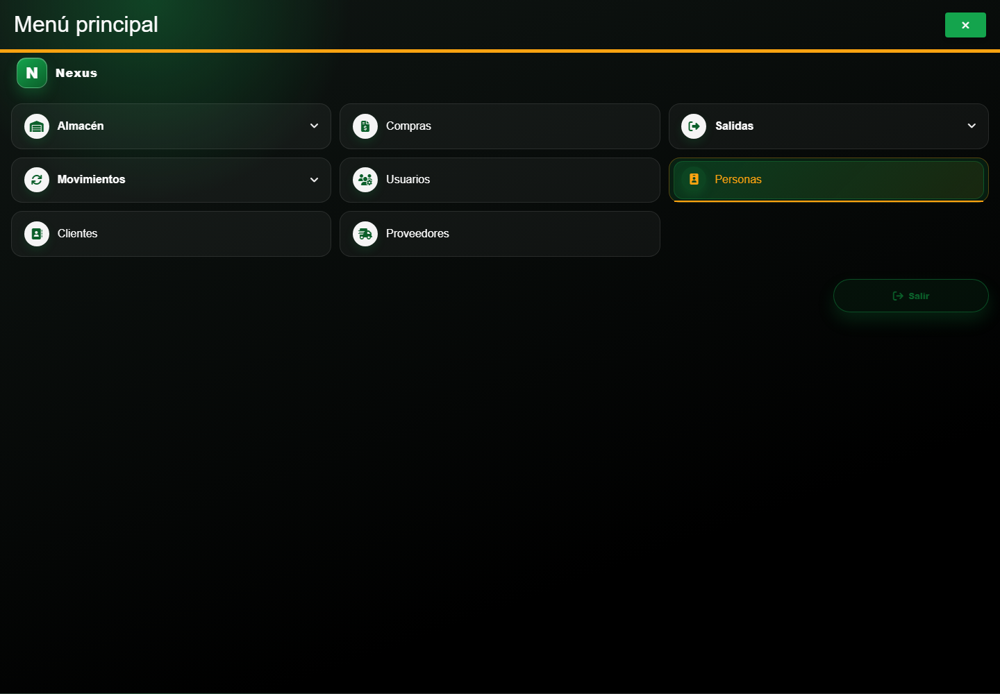
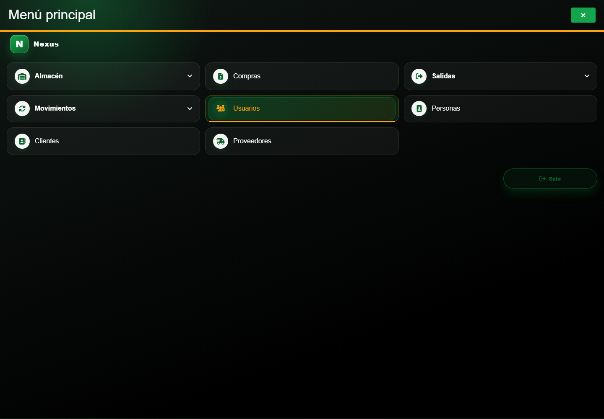

# Casos: Identidad y acceso

Cada procedimiento identifica sus casos de uso, controles, errores posibles y captura de referencia.

## Capítulos

### Personas

**Propósito.** Consultar y mantener las personas que participan en la operación.

**Ruta en el menú:** **Menú principal → Personas**.

1. [1. CAP-IDA-PER-01-LIST — Listado](01-cap-ida-per-01-list.md)
2. [2. CAP-IDA-PER-02-CREATE — Formulario alta](02-cap-ida-per-02-create.md)
3. [3. CAP-IDA-PER-03-EDIT — Formulario edicion](03-cap-ida-per-03-edit.md)

### Usuarios

**Propósito.** Administrar cuentas y cambios de contraseña.

**Ruta en el menú:** **Menú principal → Usuarios**.

4. [4. CAP-IDA-USR-01-LIST — Listado](04-cap-ida-usr-01-list.md)
5. [5. CAP-IDA-USR-02-CREATE — Formulario alta](05-cap-ida-usr-02-create.md)
6. [6. CAP-IDA-USR-03-EDIT — Formulario edicion](06-cap-ida-usr-03-edit.md)
7. [7. CAP-IDA-USR-04-PASSWORD — Cambio contrasena](07-cap-ida-usr-04-password.md)
