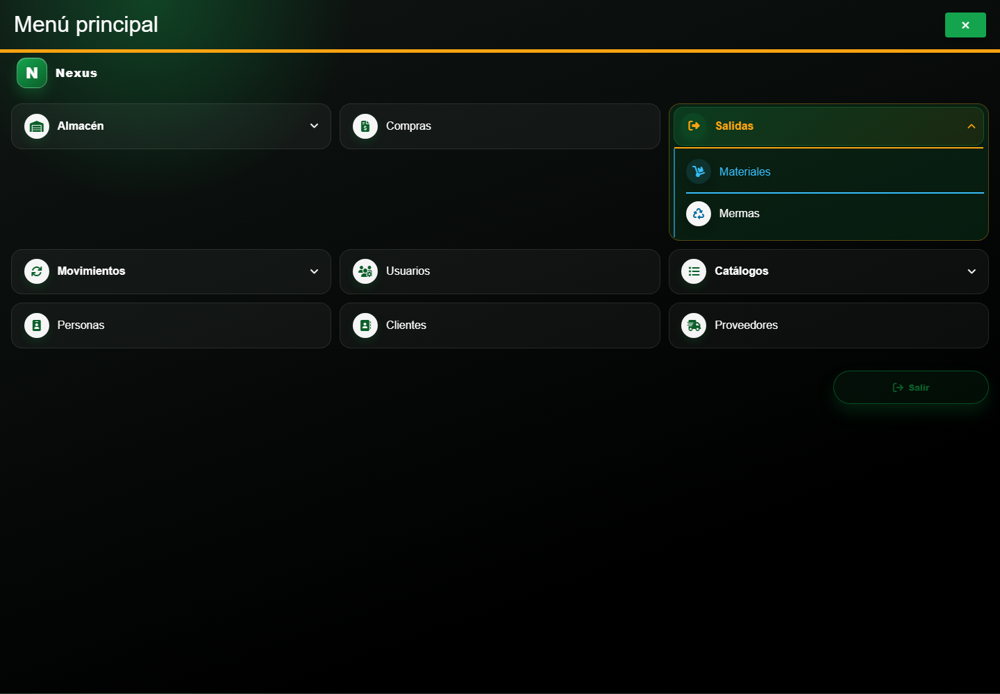
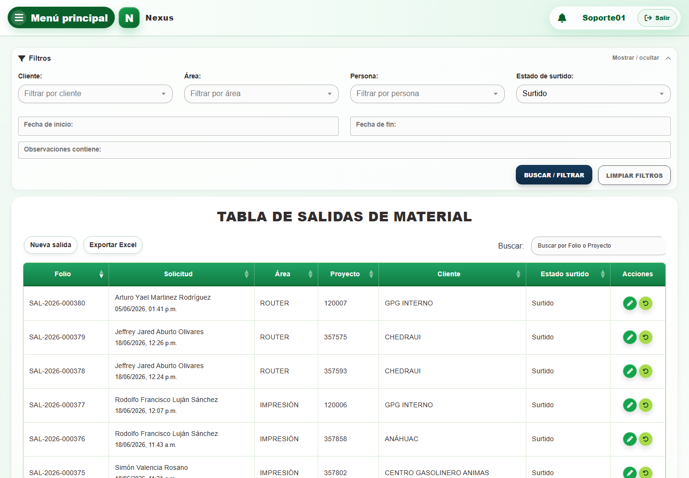
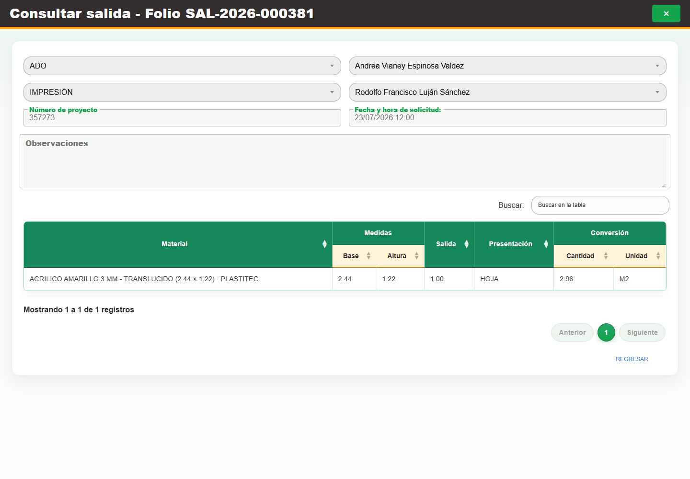
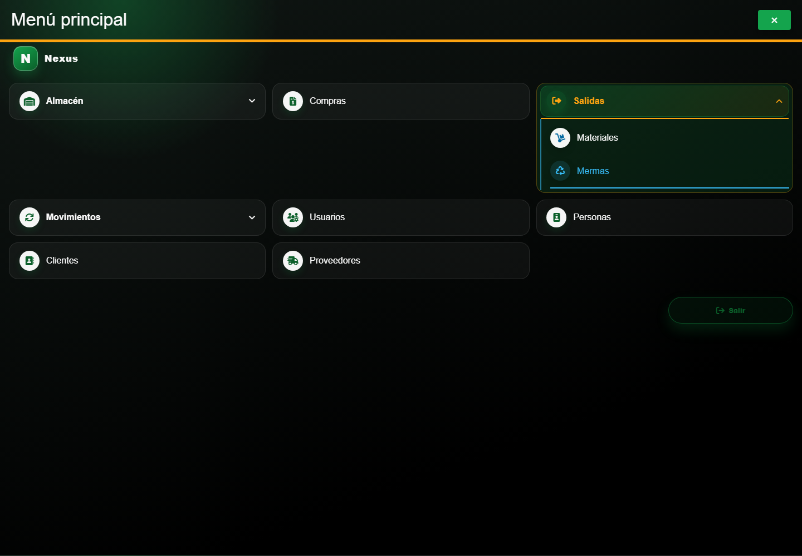
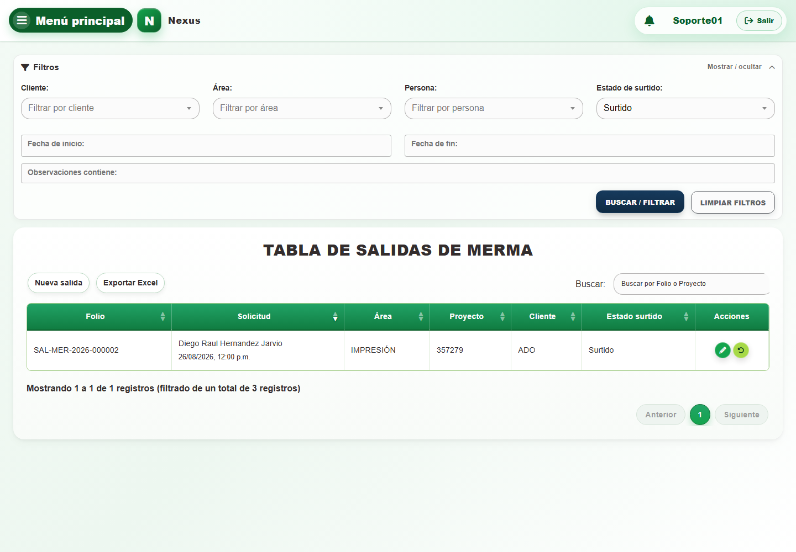
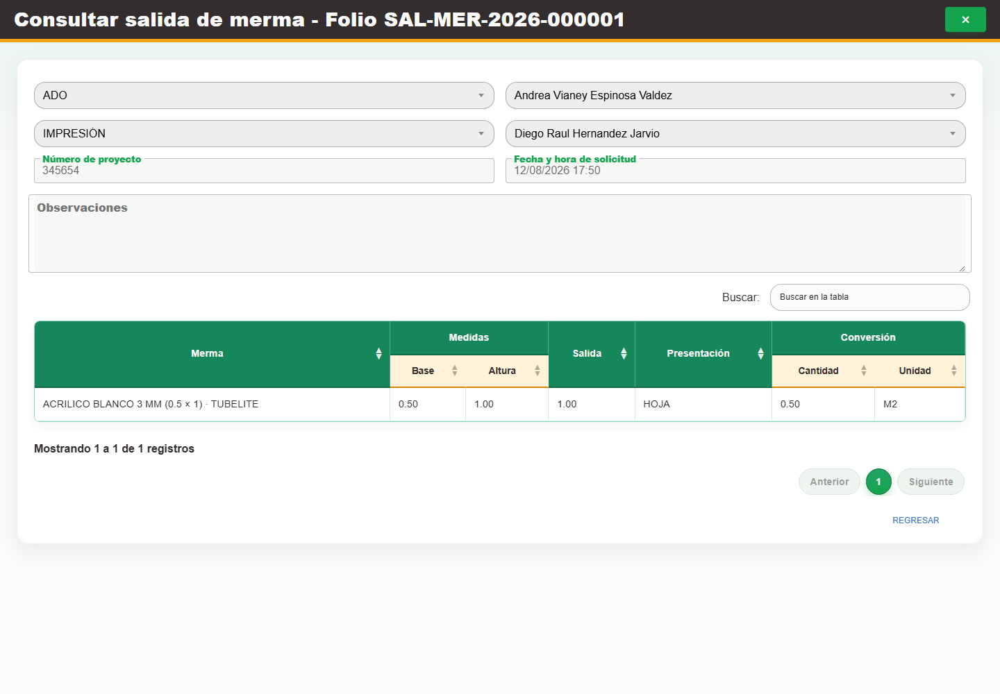

# Casos: Salidas de material y merma

Cada procedimiento identifica sus casos de uso, controles, errores posibles y captura de referencia.

**Cómo cambia el estado.** El estado no es un campo editable. Al registrar una salida y sus
detalles, Nexus los deja **Pendientes**. Al confirmar un surtido, el sistema calcula
automáticamente **Surtido parcial** o **Surtido** según la cantidad acumulada. La devolución sólo
está disponible sobre un detalle surtido: una devolución parcial conserva el detalle como
**Surtido** y devolver toda la cantidad lo deja **Cancelado**. Si todos los detalles quedan
cancelados, Nexus también cancela la salida. Estos cambios actualizan documento, detalle,
existencia y movimiento como una sola operación; abrir el formulario o cambiar de modo no altera
por sí solo ningún estado. **Devolver** es la acción que registra el retorno y reintegra
existencias; **cancelar** no es otro botón ni otro procedimiento para las salidas, sino el resultado
automático de una devolución total. A nivel de detalle se cancela sólo el renglón devuelto por
completo; a nivel de encabezado, la salida se cancela sólo si todos sus renglones ya están
cancelados.

## Salidas de material

**Propósito.** Registrar y dar seguimiento al surtido y devolución de materiales.

**Ruta en el menú:** **Menú principal → Salidas → Materiales**.

**Campos por modo del formulario.** En **alta** se editan cliente, asesor, área, solicitante, número
de proyecto, fecha de solicitud, observaciones y los materiales solicitados. En **edición completa**
se habilitan esos mismos datos y la incorporación de detalles sólo mientras la salida esté
pendiente; después, la edición se limita al **encabezado** y los detalles quedan de consulta. En
**surtido** el encabezado es de sólo lectura y únicamente se editan **Surtir** y **Cantidad de
proyecto** en los renglones pendientes. En **devolución** el documento es de sólo lectura y la acción
habilita únicamente **Cantidad a devolver** y **Observaciones**. Una salida cancelada se abre en
**consulta**, sin campos editables.

### CAP-SAL-MAT-01-LIST — Listado

**Casos de uso:** `CU-CAT-20` — Consultar estados de cumplimiento; `CU-SAL-01` — Consultar salidas de material.

**Errores posibles:** [Salidas de material](../error-messages.md#errores-salidas-material).

**Controles que debe usar:** Buscador **Buscar por Folio o Proyecto**; filtros **Fecha de inicio:**, **Fecha de fin:**, **Cliente:**, **Área:**, **Persona:**, **Estado de surtido:** y **Observaciones contiene:**; botones **Buscar / filtrar**, **Limpiar filtros**, **Exportar Excel** y **Nueva salida**; acciones **Editar registro**, **Surtir detalle** y **Devolver material surtido** por fila.

1. Abra **Filtros** y compruebe que los controles desplegados coincidan con la captura:

   

2. Escriba un término en **Buscar por Folio o Proyecto** o complete **Fecha de inicio:**, **Fecha de fin:**, **Cliente:**, **Área:**, **Persona:**, **Estado de surtido:** y **Observaciones contiene:**.
3. Seleccione **Buscar / filtrar** para actualizar la tabla; use **Limpiar filtros** para restablecerla.
4. Para localizar una devolución, cambie **Estado de surtido:** de **Pendiente** a **Surtido** y
   seleccione **Buscar / filtrar**. Compruebe el filtro aplicado y el resultado:

   
   

5. En la tabla, seleccione **Nueva salida**, **Exportar Excel**, **Editar registro**, **Surtir detalle** o **Devolver material surtido**, según la operación requerida.

### CAP-SAL-MAT-02-CREATE — Formulario registro

**Casos de uso:** `CU-SAL-02` — Crear salida de material.

**Errores posibles:** [Validación de formularios](../error-messages.md#errores-validacion), [Salidas de material](../error-messages.md#errores-salidas-material).

**Controles que debe usar:** Botón **Nueva salida**; selectores **Buscar cliente...**, **Buscar asesor...**, **Buscar área...** y **Buscar solicitante...**; campos **Número de proyecto**, **Fecha y hora de solicitud:** y **Observaciones**; selector **Buscar material...**, campo **Cantidad**, botón **Agregar** y botón **Guardar**.

1. Seleccione **Nueva salida** para abrir el formulario. Antes de continuar, compruebe que la pantalla mostrada coincida con la captura:

   

2. Elija opciones en **Buscar cliente...**, **Buscar asesor...**, **Buscar área...** y **Buscar solicitante...**.
3. Complete **Número de proyecto**, **Fecha y hora de solicitud:** y **Observaciones**.
4. Elija una opción en **Buscar material...**, complete **Cantidad** y pulse **Agregar** por cada detalle.
5. Revise los datos y seleccione **Guardar**.

Cada combinación de material y proveedor debe aparecer una sola vez. Si vuelve a agregar la misma
combinación antes de guardar, el formulario reemplaza la cantidad del renglón existente; no crea
otro renglón ni suma ambas cantidades. Capture en **Cantidad** el total que desea solicitar.

### CAP-SAL-MAT-03-EDIT — Edicion encabezado

**Casos de uso:** `CU-SAL-03` — Editar encabezado de salida de material; `CU-SAL-04` — Editar detalles de material de una salida.

**Errores posibles:** [Validación de formularios](../error-messages.md#errores-validacion), [Salidas de material](../error-messages.md#errores-salidas-material).

**Controles que debe usar:** Acción **Editar registro**; selectores **Buscar cliente...**, **Buscar asesor...**, **Buscar área...** y **Buscar solicitante...**; campos **Número de proyecto**, **Fecha y hora de solicitud:** y **Observaciones**; cuando el estado lo permita, selector **Buscar material...**, campo **Cantidad** y botón **Agregar**; botones **Editar** y **Regresar**.

1. En la fila de la salida, seleccione **Editar registro**. Antes de continuar, compruebe que la pantalla mostrada coincida con la captura:

   

2. Modifique los selectores y campos indicados. Mientras la salida esté pendiente, también puede usar **Buscar material...**, **Cantidad** y **Agregar** para incorporar detalles; después del primer surtido, los detalles quedan deshabilitados.
3. Seleccione **Editar** para guardar o **Regresar** para salir sin confirmar.

### CAP-SAL-MAT-04-SUPPLY — Surtir detalles

**Casos de uso:** `CU-SAL-05` — Surtir material.

**Errores posibles:** [Validación de formularios](../error-messages.md#errores-validacion), [Salidas de material](../error-messages.md#errores-salidas-material).

**Controles que debe usar:** Acción **Surtir detalle**; casilla de la columna **Surtir** y campo de la columna **Cantidad de proyecto** de cada renglón pendiente; botón **Surtir**.

1. En la fila de la salida, seleccione **Surtir detalle** para abrir sus renglones pendientes. Antes de continuar, compruebe que la pantalla mostrada coincida con la captura:

   

2. En los renglones pendientes, marque la casilla **Surtir** y complete **Cantidad de proyecto**. El encabezado y los renglones ya surtidos permanecen deshabilitados como referencia.
3. Revise la existencia y seleccione **Surtir**.

### CAP-SAL-MAT-05-RETURN — Devolver detalle

**Casos de uso:** `CU-SAL-06` — Devolver material surtido.

**Errores posibles:** [Validación de formularios](../error-messages.md#errores-validacion), [Salidas de material](../error-messages.md#errores-salidas-material).

**Controles que debe usar:** Acción **Devolver material surtido** y botón **Devolver detalle de salida**; campo **Cantidad a devolver**, campo **Observaciones**, botón **Devolver** y botón **Regresar**.

1. En la fila correspondiente, seleccione **Devolver material surtido** y después **Devolver detalle de salida**. Antes de continuar, compruebe que la pantalla mostrada coincida con la captura:

   

2. Complete **Cantidad a devolver** y **Observaciones**. El encabezado y los demás datos del detalle permanecen deshabilitados como referencia.
3. Seleccione **Devolver** para confirmar o **Regresar** para salir sin aplicar la devolución.

### CAP-REP-SAL-MAT-06-EXPORT — Exportar reporte

**Casos de uso:** `CU-REP-04` — Generar reporte de salidas de material.

**Errores posibles:** [Salidas de material](../error-messages.md#errores-salidas-material).

**Controles que debe usar:** Botón **Exportar Excel**; opciones de alcance mensual, otro mes o filtros aplicados; campo **Mes del reporte** y botón **Descargar**.

1. Seleccione **Exportar Excel** para abrir el diálogo de alcance. Antes de continuar, compruebe que la pantalla mostrada coincida con la captura:

   

2. Elija el alcance mensual, otro mes o los filtros aplicados y complete **Mes del reporte** cuando corresponda.
3. Seleccione **Descargar** para generar el archivo.

### CAP-SAL-MAT-08-VIEW — Consultar salida cancelada

**Caso de uso:** `CU-SAL-01` — Consultar salidas de material.

1. Seleccione **Cancelado** en **Estado de surtido:**, aplique el filtro y abra **Editar registro**.
2. Compruebe que el encabezado, los detalles y las acciones permanezcan deshabilitados, como en la
   captura:

   

3. Use **Regresar** para cerrar el formulario sin cambios.

## Salidas de merma

**Propósito.** Registrar y dar seguimiento al surtido y devolución de mermas.

**Ruta en el menú:** **Menú principal → Salidas → Mermas**.

**Campos por modo del formulario.** En **alta** se editan cliente, asesor, área, solicitante, número
de proyecto, fecha de solicitud, observaciones y las mermas solicitadas. En **edición completa** se
habilitan esos mismos datos y la incorporación de detalles sólo mientras la salida esté pendiente;
después, la edición se limita al **encabezado** y los detalles quedan de consulta. En **surtido** el
encabezado es de sólo lectura y únicamente se editan **Surtir** y **Cantidad de proyecto** en los
renglones pendientes. En **devolución** el documento es de sólo lectura y la acción habilita
únicamente **Cantidad a devolver** y **Observaciones**. Una salida cancelada se abre en **consulta**,
sin campos editables.

### CAP-SAL-WAS-01-LIST — Listado

**Casos de uso:** `CU-SAL-07` — Consultar salidas de merma; `CU-REP-08` — Generar reporte de salidas de merma.

**Errores posibles:** [Salidas de merma](../error-messages.md#errores-salidas-merma).

**Controles que debe usar:** Buscador **Buscar por Folio o Proyecto**; filtros **Fecha de inicio:**, **Fecha de fin:**, **Cliente:**, **Área:**, **Persona:**, **Estado de surtido:** y **Observaciones contiene:**; botones **Buscar / filtrar**, **Limpiar filtros**, **Exportar Excel** y **Nueva salida**; acciones **Editar registro**, **Surtir detalle** y **Devolver material surtido** por fila.

1. Abra **Filtros** y compruebe que los controles desplegados coincidan con la captura:

   

2. Escriba un término en **Buscar por Folio o Proyecto** o complete **Fecha de inicio:**, **Fecha de fin:**, **Cliente:**, **Área:**, **Persona:**, **Estado de surtido:** y **Observaciones contiene:**.
3. Seleccione **Buscar / filtrar** para actualizar la tabla; use **Limpiar filtros** para restablecerla.
4. Para localizar una devolución, cambie **Estado de surtido:** de **Pendiente** a **Surtido** y
   seleccione **Buscar / filtrar**. Compruebe el filtro aplicado y el resultado:

   
   

5. En la tabla, seleccione **Nueva salida**, **Exportar Excel**, **Editar registro**, **Surtir detalle** o **Devolver material surtido**, según la operación requerida.

### CAP-SAL-WAS-02-CREATE — Formulario registro

**Casos de uso:** `CU-SAL-08` — Crear salida de merma.

**Errores posibles:** [Validación de formularios](../error-messages.md#errores-validacion), [Salidas de merma](../error-messages.md#errores-salidas-merma).

**Controles que debe usar:** Botón **Nueva salida**; selectores **Buscar cliente...**, **Buscar asesor...**, **Buscar área...** y **Buscar solicitante...**; campos **Número de proyecto**, **Fecha y hora de solicitud** y **Observaciones**; selector **Buscar merma...**, campo **Cantidad**, botón **Agregar** y botón **Guardar**.

1. Seleccione **Nueva salida** para abrir el formulario. Antes de continuar, compruebe que la pantalla mostrada coincida con la captura:

   

2. Elija opciones en **Buscar cliente...**, **Buscar asesor...**, **Buscar área...** y **Buscar solicitante...**.
3. Complete **Número de proyecto**, **Fecha y hora de solicitud** y **Observaciones**.
4. Elija una opción en **Buscar merma...**, complete **Cantidad** y pulse **Agregar** por cada detalle.
5. Revise los datos y seleccione **Guardar**.

Cada merma debe aparecer una sola vez. Si vuelve a agregarla antes de guardar, el formulario
reemplaza la cantidad del renglón existente; no crea otro renglón ni suma ambas cantidades. Capture
en **Cantidad** el total que desea solicitar. Nexus también rechaza una solicitud enviada con la
misma merma repetida.

### CAP-SAL-WAS-03-EDIT — Edicion encabezado

**Casos de uso:** `CU-SAL-09` — Editar encabezado de salida de merma; `CU-SAL-10` — Editar detalles de merma de una salida.

**Errores posibles:** [Validación de formularios](../error-messages.md#errores-validacion), [Salidas de merma](../error-messages.md#errores-salidas-merma).

**Controles que debe usar:** Acción **Editar registro**; selectores **Buscar cliente...**, **Buscar asesor...**, **Buscar área...** y **Buscar solicitante...**; campos **Número de proyecto**, **Fecha y hora de solicitud** y **Observaciones**; cuando el estado lo permita, selector **Buscar merma...**, campo **Cantidad** y botón **Agregar**; botones **Editar** y **Regresar**.

1. En la fila de la salida, seleccione **Editar registro**. Antes de continuar, compruebe que la pantalla mostrada coincida con la captura:

   

2. Modifique los selectores y campos indicados. Mientras la salida esté pendiente, también puede
   usar **Buscar merma...**, **Cantidad** y **Agregar** para incorporar detalles; después del primer
   surtido, los detalles quedan deshabilitados.
3. Seleccione **Editar** para guardar o **Regresar** para salir sin confirmar.

### CAP-SAL-WAS-04-SUPPLY — Surtir detalles

**Casos de uso:** `CU-SAL-11` — Surtir merma.

**Errores posibles:** [Validación de formularios](../error-messages.md#errores-validacion), [Salidas de merma](../error-messages.md#errores-salidas-merma).

**Controles que debe usar:** Acción **Surtir detalle**; casilla de la columna **Surtir** y campo de la columna **Cantidad de proyecto** de cada renglón pendiente; botón **Surtir**.

1. En la fila de la salida, seleccione **Surtir detalle** para abrir sus renglones pendientes. Antes de continuar, compruebe que la pantalla mostrada coincida con la captura:

   

2. En los renglones pendientes, marque la casilla **Surtir** y complete **Cantidad de proyecto**. El encabezado y los renglones ya surtidos permanecen deshabilitados como referencia.
3. Revise la existencia y seleccione **Surtir**.

### CAP-SAL-WAS-05-RETURN — Devolver detalle

**Casos de uso:** `CU-SAL-12` — Devolver merma surtida.

**Errores posibles:** [Validación de formularios](../error-messages.md#errores-validacion), [Salidas de merma](../error-messages.md#errores-salidas-merma).

**Controles que debe usar:** Acción **Devolver material surtido** de la fila y botón **Devolver detalle de salida**; campos **Cantidad a devolver** y **Observaciones**; botones **Devolver** y **Regresar**.

1. En la fila correspondiente, seleccione **Devolver material surtido** y después **Devolver detalle de salida**. Antes de continuar, compruebe que la pantalla mostrada coincida con la captura:

   

2. Complete **Cantidad a devolver** y **Observaciones**. El encabezado y los demás datos del detalle permanecen deshabilitados como referencia.
3. Seleccione **Devolver** para confirmar o **Regresar** para salir sin aplicar la devolución.

### CAP-REP-SAL-WAS-06-EXPORT — Exportar reporte

**Casos de uso:** `CU-REP-08` — Generar reporte de salidas de merma.

**Errores posibles:** [Salidas de merma](../error-messages.md#errores-salidas-merma).

**Controles que debe usar:** Botón **Exportar Excel**; opciones de alcance mensual, otro mes o filtros aplicados; campo **Mes del reporte** y botón **Descargar**.

1. Seleccione **Exportar Excel** para abrir el diálogo de alcance. Antes de continuar, compruebe que la pantalla mostrada coincida con la captura:

   

2. Elija el alcance mensual, otro mes o los filtros aplicados y complete **Mes del reporte** cuando corresponda.
3. Seleccione **Descargar** para generar el archivo.

### CAP-SAL-WAS-08-VIEW — Consultar salida cancelada

**Caso de uso:** `CU-SAL-07` — Consultar salidas de merma.

1. Seleccione **Cancelado** en **Estado de surtido:**, aplique el filtro y abra **Editar registro**.
2. Compruebe que el encabezado, los detalles y las acciones permanezcan deshabilitados, como en la
   captura:

   

3. Use **Regresar** para cerrar el formulario sin cambios.
