# Casos: Salidas de material y merma

Cada procedimiento identifica sus casos de uso, controles, errores posibles y captura de referencia.

## Salidas de material

**Propósito.** Registrar y dar seguimiento al surtido y devolución de materiales.

### CAP-SAL-MAT-01-LIST — Listado

**Casos:** `CU-CAT-20`, `CU-SAL-01`.

**Errores posibles:** [Salidas de material](../error-messages.md#errores-salidas-material).

**Controles que debe usar:** Buscador **Buscar por Folio o Proyecto**; filtros de fecha, **Cliente**, **Área**, **Persona**, **Estado de surtido** y **Observaciones contiene**; botones **Buscar / filtrar**, **Limpiar filtros**, **Exportar Excel** y **Nueva salida**, y acciones por fila.

1. Revise el listado y use sus filtros o acciones disponibles.
2. Compruebe que la pantalla coincida con la captura antes de continuar.

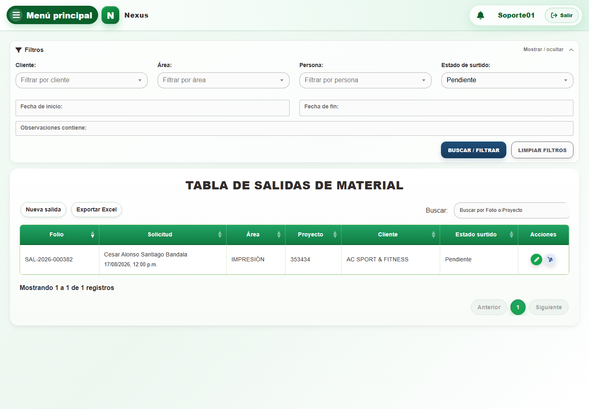

### CAP-SAL-MAT-02-CREATE — Formulario registro

**Casos:** `CU-SAL-02`.

**Errores posibles:** [Validación de formularios](../error-messages.md#errores-validacion), [Salidas de material](../error-messages.md#errores-salidas-material).

**Controles que debe usar:** Botón **Nueva salida**; selectores **Cliente**, **Asesor**, **Área** y **Solicitante**; campos **Número de proyecto**, fecha y **Observaciones**; selector de material, campo **Cantidad**, botón **Agregar** y botón **Guardar**.

1. Abra la acción de alta, capture los campos requeridos y confirme.
2. Compruebe que la pantalla coincida con la captura antes de continuar.

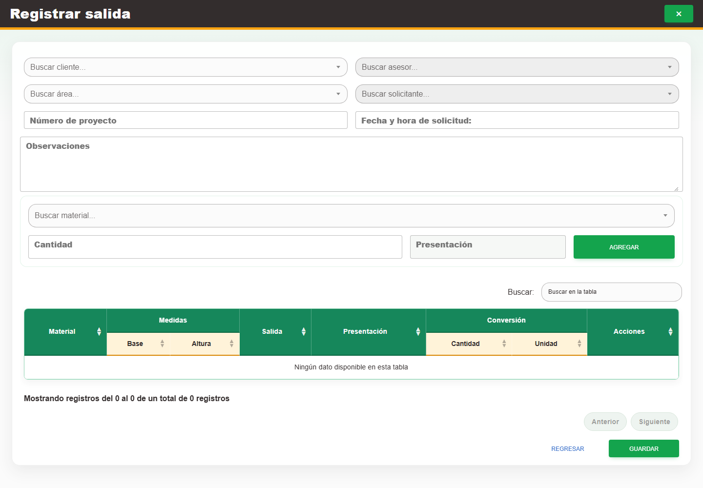

### CAP-SAL-MAT-03-EDIT — Edicion encabezado

**Casos:** `CU-SAL-03`, `CU-SAL-04`.

**Errores posibles:** [Validación de formularios](../error-messages.md#errores-validacion), [Salidas de material](../error-messages.md#errores-salidas-material).

**Controles que debe usar:** Acción **Editar registro**; controles del encabezado de la salida y, cuando el estado lo permita, sus materiales y cantidades; botones **Editar** y **Regresar**.

1. Seleccione un registro editable, revise los datos y confirme únicamente los cambios necesarios.
2. Compruebe que la pantalla coincida con la captura antes de continuar.

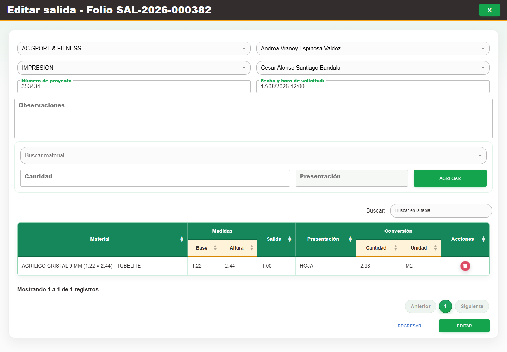

### CAP-SAL-MAT-04-SUPPLY — Surtir detalles

**Casos:** `CU-SAL-05`.

**Errores posibles:** [Validación de formularios](../error-messages.md#errores-validacion), [Salidas de material](../error-messages.md#errores-salidas-material).

**Controles que debe usar:** Acción **Surtir detalle**; campo **Cantidad** de cada renglón pendiente y botón **Surtir**.

1. Abra el detalle pendiente, capture la cantidad que se surtirá y confirme.
2. Compruebe que la pantalla coincida con la captura antes de continuar.

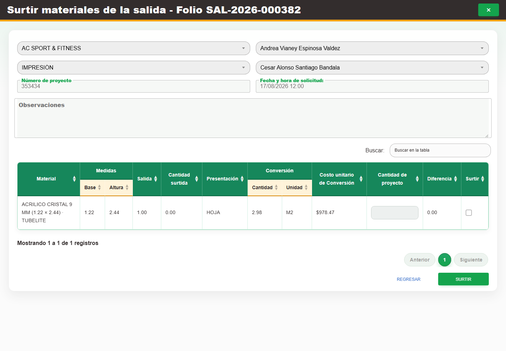

### CAP-SAL-MAT-05-RETURN — Devolver detalle

**Casos:** `CU-SAL-06`.

**Errores posibles:** [Validación de formularios](../error-messages.md#errores-validacion), [Salidas de material](../error-messages.md#errores-salidas-material).

**Controles que debe usar:** Acción **Devolver material surtido** y botón **Devolver detalle de salida**; campo **Cantidad a devolver**, campo **Observaciones**, botón **Devolver** y botón **Regresar**.

1. Abra el detalle surtido, capture una cantidad retornable y confirme.
2. Compruebe que la pantalla coincida con la captura antes de continuar.

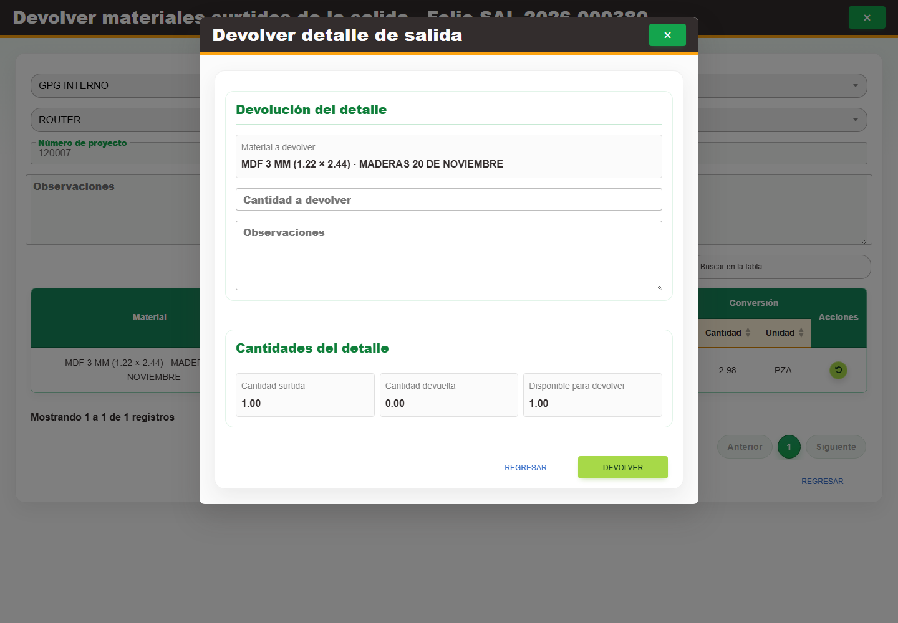

### CAP-REP-SAL-MAT-06-EXPORT — Exportar reporte

**Casos:** `CU-REP-04`.

**Errores posibles:** [Salidas de material](../error-messages.md#errores-salidas-material).

**Controles que debe usar:** Botón **Exportar Excel**; opciones de alcance mensual, otro mes o filtros aplicados; campo **Mes del reporte** y botón **Descargar**.

1. Abra la exportación, seleccione el alcance o periodo y genere el archivo.
2. Compruebe que la pantalla coincida con la captura antes de continuar.

## Salidas de merma

**Propósito.** Registrar y dar seguimiento al surtido y devolución de mermas.

### CAP-SAL-WAS-01-LIST — Listado

**Casos:** `CU-SAL-07`, `CU-REP-08`.

**Errores posibles:** [Salidas de merma](../error-messages.md#errores-salidas-merma).

**Controles que debe usar:** Buscador **Buscar por Folio o Proyecto**; filtros de fecha, **Cliente**, **Área**, **Persona**, **Estado de surtido** y **Observaciones contiene**; botones **Buscar / filtrar**, **Limpiar filtros**, **Exportar Excel** y **Nueva salida**, y acciones por fila.

1. Revise el listado y use sus filtros o acciones disponibles.
2. Compruebe que la pantalla coincida con la captura antes de continuar.

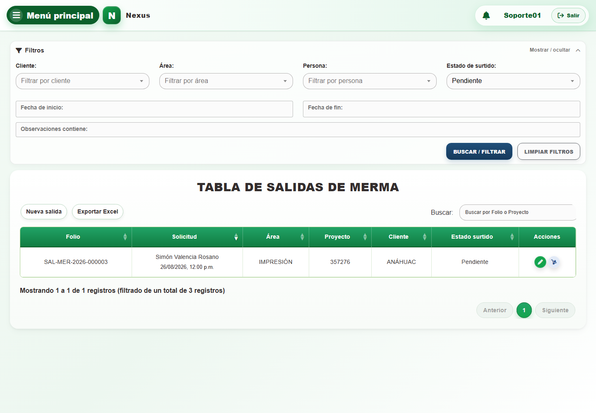

### CAP-SAL-WAS-02-CREATE — Formulario registro

**Casos:** `CU-SAL-08`.

**Errores posibles:** [Validación de formularios](../error-messages.md#errores-validacion), [Salidas de merma](../error-messages.md#errores-salidas-merma).

**Controles que debe usar:** Botón **Nueva salida**; selectores **Cliente**, **Asesor**, **Área** y **Solicitante**; campos **Número de proyecto**, fecha y **Observaciones**; selector de merma, campo **Cantidad**, botón **Agregar** y botón **Guardar**.

1. Abra la acción de alta, capture los campos requeridos y confirme.
2. Compruebe que la pantalla coincida con la captura antes de continuar.

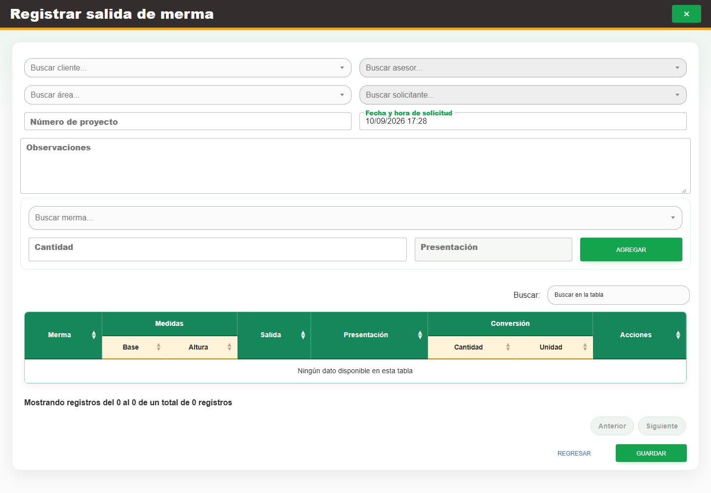

### CAP-SAL-WAS-03-EDIT — Edicion encabezado

**Casos:** `CU-SAL-09`, `CU-SAL-10`.

**Errores posibles:** [Validación de formularios](../error-messages.md#errores-validacion), [Salidas de merma](../error-messages.md#errores-salidas-merma).

**Controles que debe usar:** Acción **Editar registro**; controles del encabezado y, cuando el estado lo permita, las mermas y cantidades; botones **Editar** y **Regresar**.

1. Seleccione un registro editable, revise los datos y confirme únicamente los cambios necesarios.
2. Compruebe que la pantalla coincida con la captura antes de continuar.

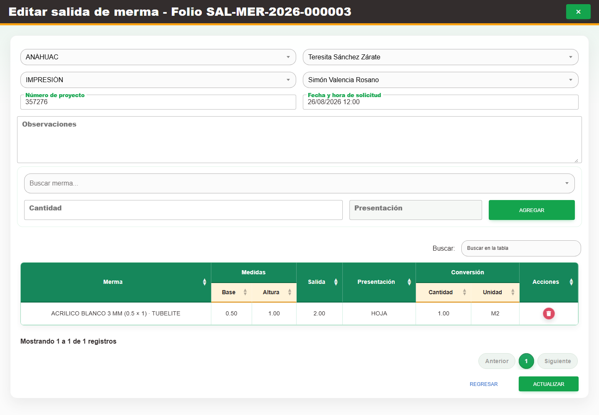

### CAP-SAL-WAS-04-SUPPLY — Surtir detalles

**Casos:** `CU-SAL-11`.

**Errores posibles:** [Validación de formularios](../error-messages.md#errores-validacion), [Salidas de merma](../error-messages.md#errores-salidas-merma).

**Controles que debe usar:** Acción **Surtir detalle**; campo **Cantidad** del renglón pendiente y botón **Surtir**.

1. Abra el detalle pendiente, capture la cantidad que se surtirá y confirme.
2. Compruebe que la pantalla coincida con la captura antes de continuar.

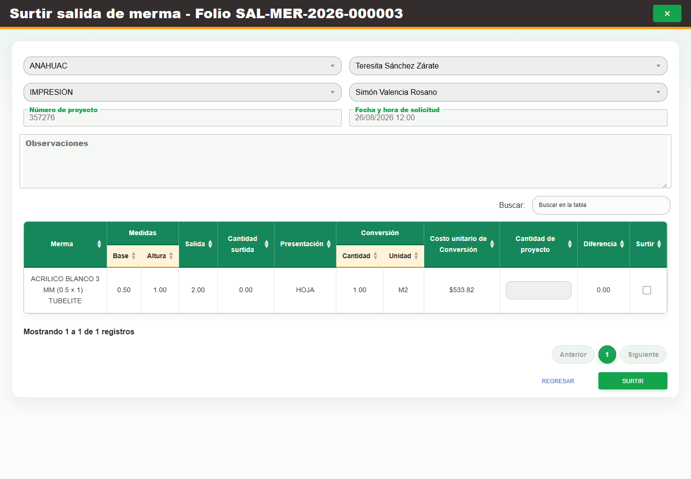

### CAP-SAL-WAS-05-RETURN — Devolver detalle

**Casos:** `CU-SAL-12`.

**Errores posibles:** [Validación de formularios](../error-messages.md#errores-validacion), [Salidas de merma](../error-messages.md#errores-salidas-merma).

**Controles que debe usar:** Acción de devolución de la fila y botón **Devolver detalle de salida**; campo **Cantidad a devolver**, campo **Observaciones**, botón **Devolver** y botón **Regresar**.

1. Abra el detalle surtido, capture una cantidad retornable y confirme.
2. Compruebe que la pantalla coincida con la captura antes de continuar.

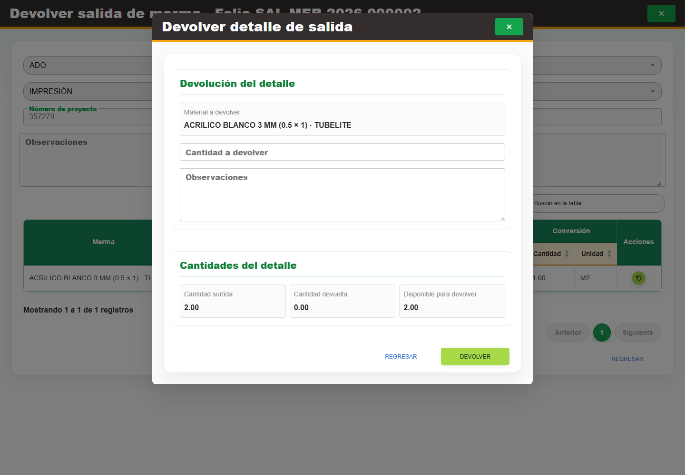

### CAP-REP-SAL-WAS-06-EXPORT — Exportar reporte

**Casos:** `CU-REP-08`.

**Errores posibles:** [Salidas de merma](../error-messages.md#errores-salidas-merma).

**Controles que debe usar:** Botón **Exportar Excel**; opciones de alcance mensual, otro mes o filtros aplicados; campo **Mes del reporte** y botón **Descargar**.

1. Abra la exportación, seleccione el alcance o periodo y genere el archivo.
2. Compruebe que la pantalla coincida con la captura antes de continuar.

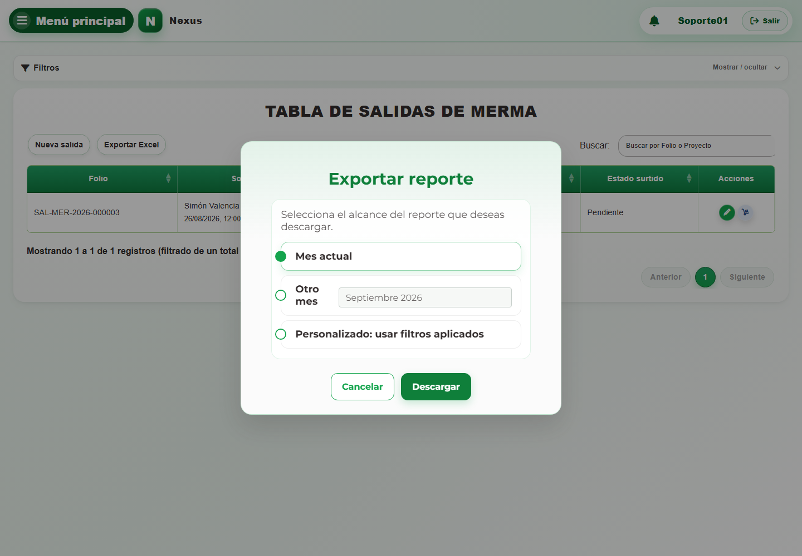
