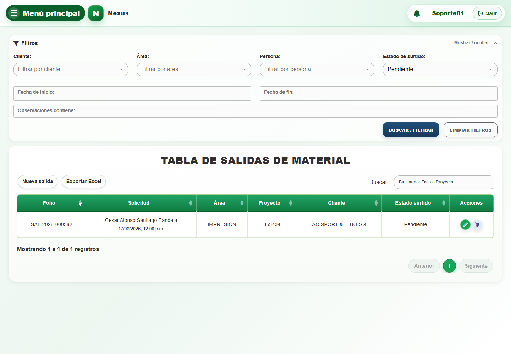
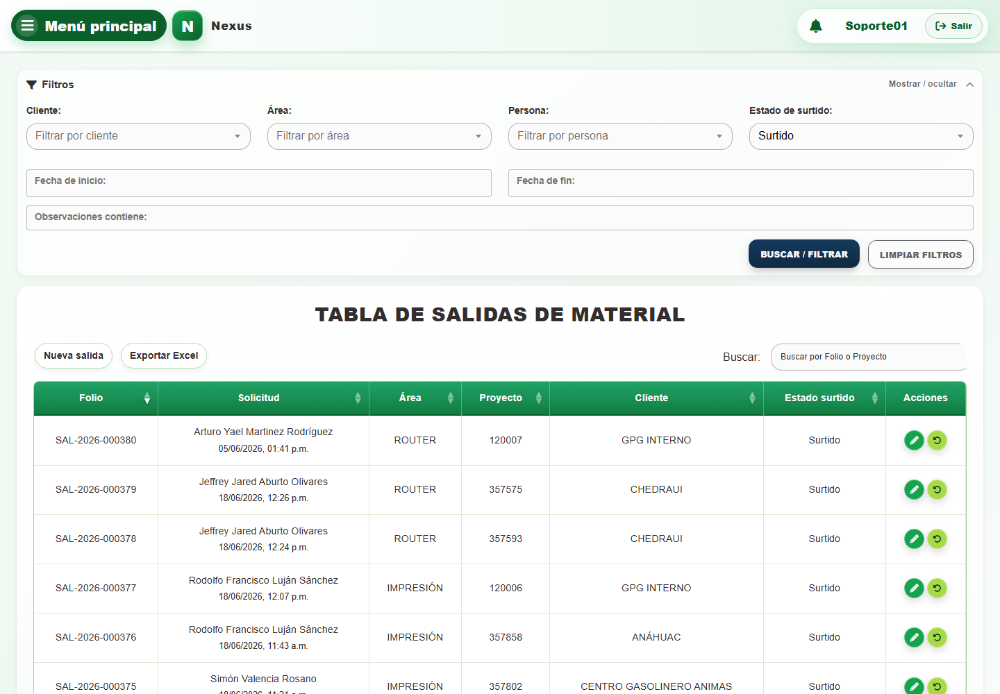

# 1. CAP-SAL-MAT-01-LIST — Listado

**Casos de uso:** `CU-SAL-01` — Consultar salidas de material.

**Errores posibles:** [Salidas de material](../../error-messages.md#errores-salidas-material).

**Antes de empezar:** Abra **Menú principal → Salidas → Materiales**. Tenga el folio o número de proyecto; use cliente y área cuando necesite acotar la búsqueda.

**Controles que debe usar:** Buscador **Buscar por Folio o Proyecto**; filtros **Fecha de inicio:**, **Fecha de fin:**, **Cliente:**, **Área:**, **Persona:**, **Estado de surtido:** y **Observaciones contiene:**; botones **Buscar / filtrar**, **Limpiar filtros**, **Exportar Excel** y **Nueva salida**; acciones **Editar registro**, **Surtir detalle** y **Devolver material surtido** por fila.

1. Abra **Filtros** y compruebe que los controles desplegados coincidan con la captura:

   

2. Escriba un término en **Buscar por Folio o Proyecto** o complete **Fecha de inicio:**, **Fecha de fin:**, **Cliente:**, **Área:**, **Persona:**, **Estado de surtido:** y **Observaciones contiene:**.
3. Seleccione **Buscar / filtrar** para actualizar la tabla; use **Limpiar filtros** para restablecerla.
4. Para localizar una devolución, cambie **Estado de surtido:** de **Pendiente** a **Surtido** y
   seleccione **Buscar / filtrar**. Compruebe el filtro aplicado y el resultado:

   
   

5. En la tabla, seleccione **Nueva salida**, **Exportar Excel**, **Editar registro**, **Surtir detalle** o **Devolver material surtido**, según la operación requerida.

**Compruebe el resultado:** Confirme el folio, cliente y estado de surtido de la salida encontrada antes de elegir una acción.
