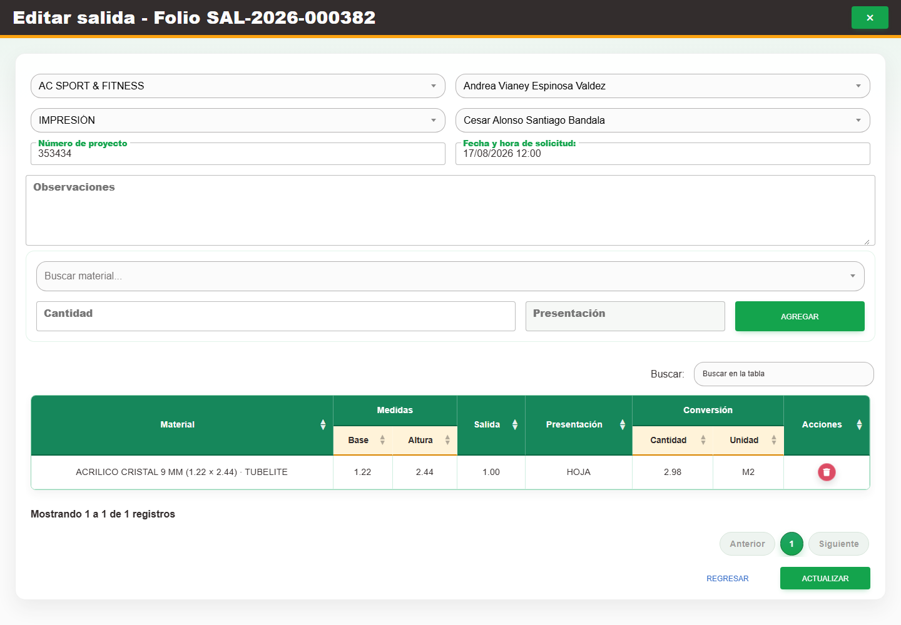

# 3. CAP-SAL-MAT-03-EDIT — Edicion encabezado

**Casos de uso:** `CU-SAL-03` — Editar encabezado de salida de material; `CU-SAL-04` — Editar detalles de material de una salida.

**Errores posibles:** [Validación de formularios](../../error-messages.md#errores-validacion), [Salidas de material](../../error-messages.md#errores-salidas-material).

**Controles que debe usar:** Acción **Editar registro**; selectores **Buscar cliente...**, **Buscar asesor...**, **Buscar área...** y **Buscar solicitante...**; campos **Número de proyecto**, **Fecha y hora de solicitud:** y **Observaciones**; cuando el estado lo permita, selector **Buscar material...**, campo **Cantidad** y botón **Agregar**; botones **Actualizar** y **Regresar**.

1. En la fila de la salida, seleccione **Editar registro**. Antes de continuar, compruebe que la pantalla mostrada coincida con la captura:

   

2. Modifique los selectores y campos indicados. Mientras la salida esté pendiente, para incorporar un detalle elija una opción en **Buscar material...**, complete **Cantidad**, seleccione **Agregar** y compruebe que el renglón aparezca en la tabla; repita la operación cuando necesite más detalles. Después del primer surtido, los detalles quedan deshabilitados.
3. Revise la tabla y seleccione **Actualizar** para guardar o **Regresar** para salir sin confirmar.
