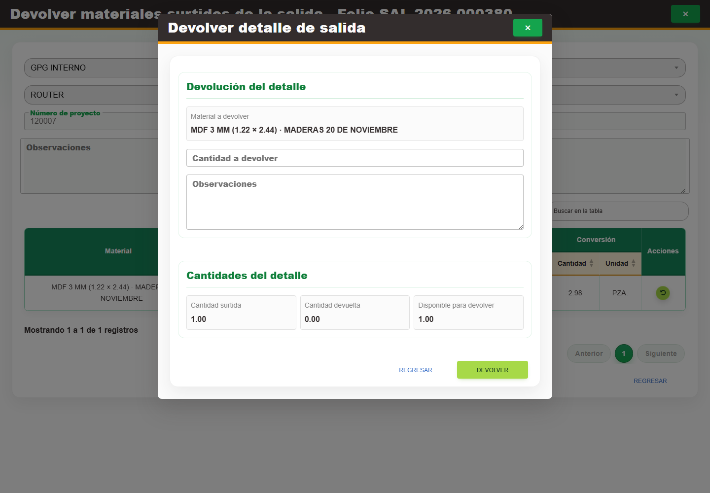

# 5. CAP-SAL-MAT-05-RETURN — Devolver detalle

**Casos de uso:** `CU-SAL-06` — Devolver material surtido.

**Errores posibles:** [Validación de formularios](../../error-messages.md#errores-validacion), [Salidas de material](../../error-messages.md#errores-salidas-material).

**Antes de empezar:** Localice una salida **Surtida** y confirme el artículo y la cantidad que regresaron físicamente. Sólo puede devolver hasta lo surtido que aún no se haya devuelto.

**Controles que debe usar:** Acción **Devolver material surtido** y botón **Devolver detalle de salida**; campo **Cantidad a devolver**, campo **Observaciones**, botón **Devolver** y botón **Regresar**.

1. En la fila correspondiente, seleccione **Devolver material surtido** y después **Devolver detalle de salida**. Antes de continuar, compruebe que la pantalla mostrada coincida con la captura:

   

2. Complete **Cantidad a devolver** y **Observaciones**. El encabezado y los demás datos del detalle permanecen deshabilitados como referencia.
3. Seleccione **Devolver** para confirmar o **Regresar** para salir sin aplicar la devolución.

**Compruebe el resultado:** La existencia aumenta por la cantidad devuelta. Devolver todo lo surtido cancela el renglón; si todos quedan cancelados, también se cancela la salida.
