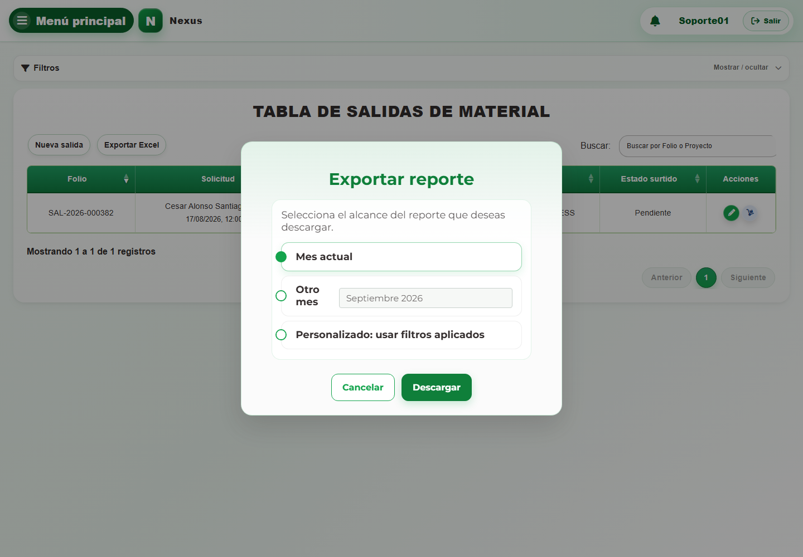

# 6. CAP-REP-SAL-MAT-06-EXPORT — Exportar reporte

**Casos de uso:** `CU-SAL-07` — Generar reporte de salidas de material.

**Errores posibles:** [Salidas de material](../../error-messages.md#errores-salidas-material).

**Antes de empezar:** Abra **Salidas → Materiales** y determine el periodo. Si va a usar **Personalizado: usar filtros aplicados**, filtre primero el listado.

**Controles que debe usar:** Botón **Exportar Excel**; opciones de alcance mensual, otro mes o filtros aplicados; campo **Mes del reporte** y botón **Descargar**.

1. Seleccione **Exportar Excel** para abrir el modal **Exportar reporte**. Antes de continuar, compruebe que la pantalla mostrada coincida con la captura:

   

2. Elija el alcance mensual, otro mes o los filtros aplicados y complete **Mes del reporte** cuando corresponda.
3. Seleccione **Descargar** para generar el archivo.

**Compruebe el resultado:** Abra el Excel y confirme folio, cliente, periodo y cantidades solicitadas y surtidas. Descargarlo no cambia la salida.
