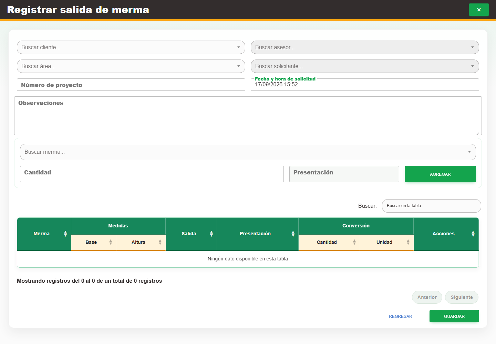

# 9. CAP-SAL-WAS-02-CREATE — Formulario registro

**Casos de uso:** `CU-SAL-09` — Crear salida de merma.

**Errores posibles:** [Validación de formularios](../../error-messages.md#errores-validacion), [Salidas de merma](../../error-messages.md#errores-salidas-merma).

**Controles que debe usar:** Botón **Nueva salida**; selectores **Buscar cliente...**, **Buscar asesor...**, **Buscar área...** y **Buscar solicitante...**; campos **Número de proyecto**, **Fecha y hora de solicitud** y **Observaciones**; selector **Buscar merma...**, campo **Cantidad**, botón **Agregar** y botón **Guardar**.

1. Seleccione **Nueva salida** para abrir el formulario. Antes de continuar, compruebe que la pantalla mostrada coincida con la captura:

   

2. Elija opciones en **Buscar cliente...**, **Buscar asesor...**, **Buscar área...** y **Buscar solicitante...**.
3. Complete **Número de proyecto**, **Fecha y hora de solicitud** y **Observaciones**.
4. Elija una opción en **Buscar merma...**, complete **Cantidad** y pulse **Agregar**. Compruebe que el detalle aparezca en la tabla y repita este paso para cada merma requerida.
5. Revise el encabezado y los renglones de la tabla y seleccione **Guardar**.

Cada merma debe aparecer una sola vez. Si vuelve a agregarla antes de guardar, el formulario
reemplaza la cantidad del renglón existente; no crea otro renglón ni suma ambas cantidades. Capture
en **Cantidad** el total que desea solicitar. Nexus también rechaza una solicitud enviada con la
misma merma repetida.
