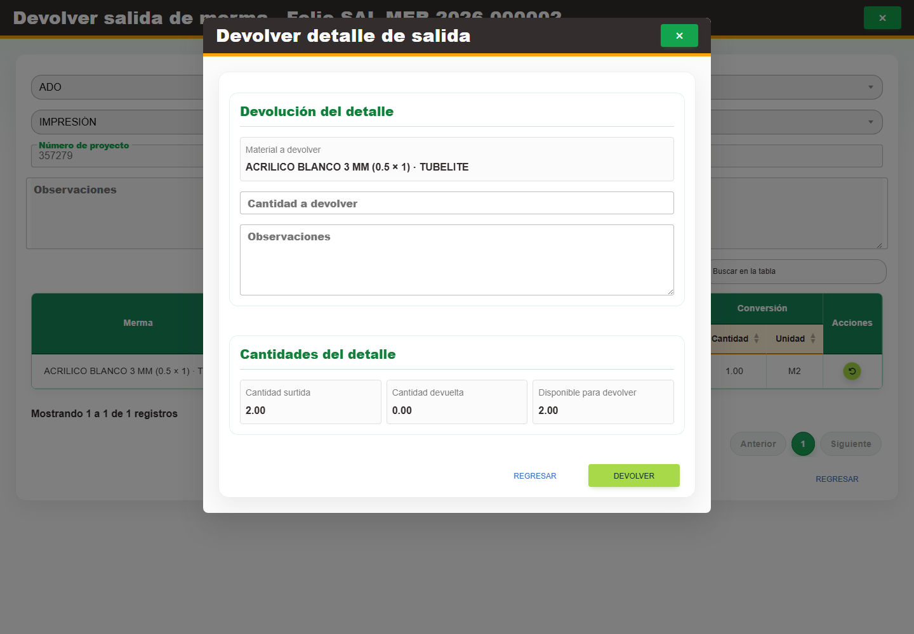

# 12. CAP-SAL-WAS-05-RETURN — Devolver detalle

**Casos de uso:** `CU-SAL-13` — Devolver merma surtida.

**Errores posibles:** [Validación de formularios](../../error-messages.md#errores-validacion), [Salidas de merma](../../error-messages.md#errores-salidas-merma).

**Controles que debe usar:** Acción **Devolver material surtido** de la fila y botón **Devolver detalle de salida**; campos **Cantidad a devolver** y **Observaciones**; botones **Devolver** y **Regresar**.

1. En la fila correspondiente, seleccione **Devolver material surtido** y después **Devolver detalle de salida**. Antes de continuar, compruebe que la pantalla mostrada coincida con la captura:

   

2. Complete **Cantidad a devolver** y **Observaciones**. El encabezado y los demás datos del detalle permanecen deshabilitados como referencia.
3. Seleccione **Devolver** para confirmar o **Regresar** para salir sin aplicar la devolución.
