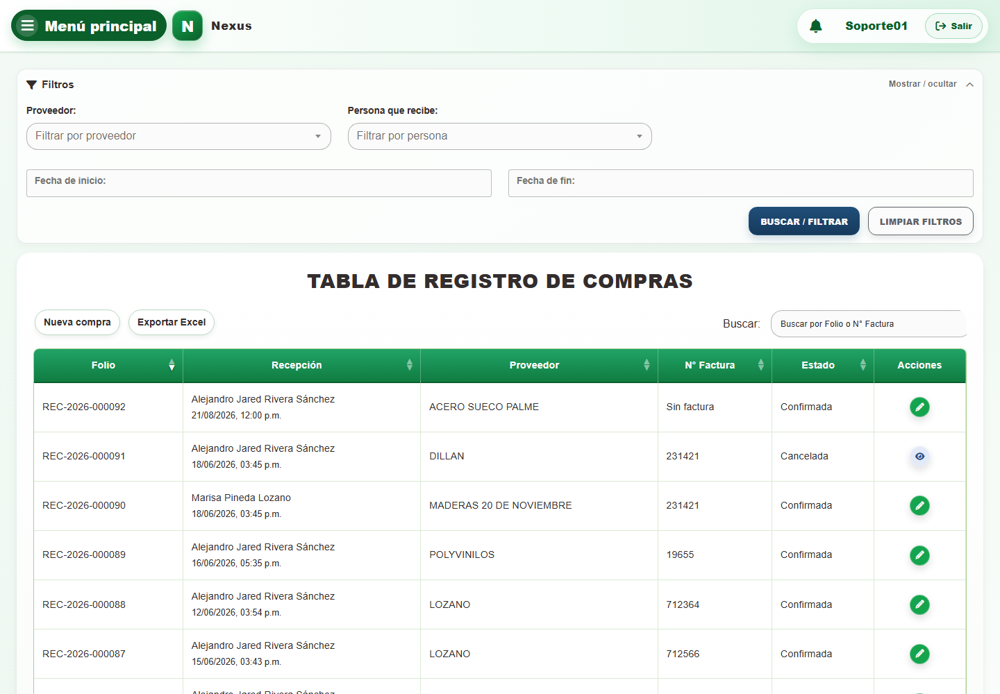
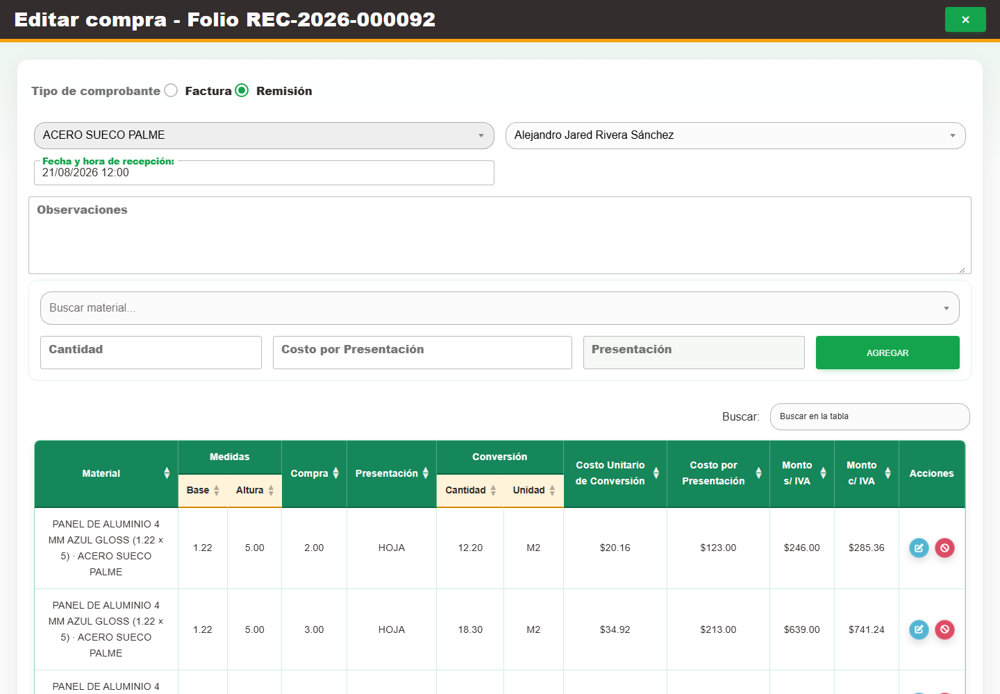
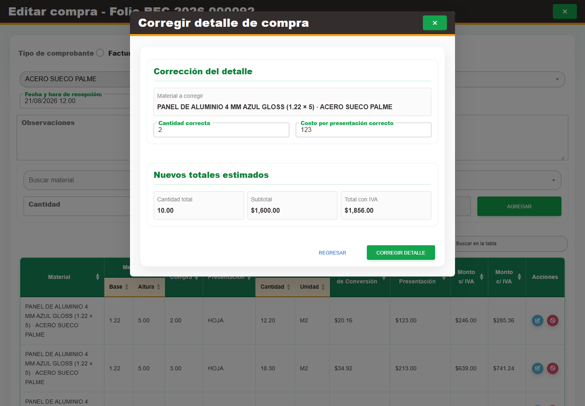
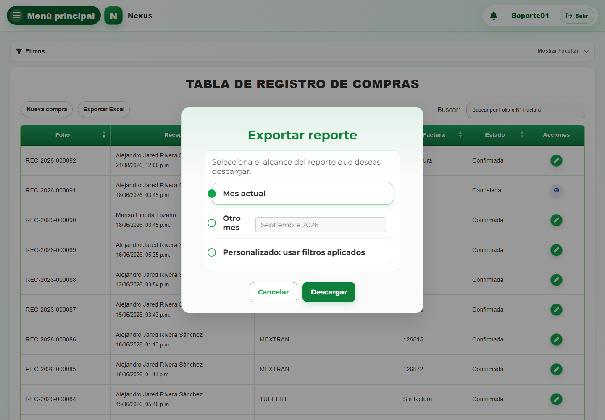

# Casos: Compras de material

Cada procedimiento identifica sus casos de uso, controles, errores posibles y captura de referencia.

## Compras

**Propósito.** Consultar, registrar, editar y corregir compras, además de delimitar reportes.

### CAP-ENT-01-LIST — Listado

**Casos:** `CU-ENT-01`.

**Errores posibles:** [Compras](../error-messages.md#errores-compras).

**Controles que debe usar:** Buscador **Buscar por Folio o N° Factura**; filtros **Fecha de inicio:**, **Fecha de fin:**, **Proveedor:** y **Persona que recibe:**; botones **Buscar / filtrar**, **Limpiar filtros**, **Exportar Excel** y **Nueva compra**; acción **Editar registro** por fila.

1. Escriba un término en **Buscar por Folio o N° Factura** o complete **Fecha de inicio:**, **Fecha de fin:**, **Proveedor:** y **Persona que recibe:**.
2. Seleccione **Buscar / filtrar** para actualizar la tabla; use **Limpiar filtros** para restablecerla.
3. En la tabla, seleccione **Nueva compra**, **Exportar Excel** o **Editar registro**, según la operación requerida.
4. Compruebe que la pantalla coincida con la captura antes de continuar.

### CAP-ENT-02-CREATE — Formulario registro

**Casos:** `CU-ENT-02`.

**Errores posibles:** [Validación de formularios](../error-messages.md#errores-validacion), [Compras](../error-messages.md#errores-compras).

**Controles que debe usar:** Botón **Nueva compra**; opciones **Factura** o **Remisión**; campo **Número de Factura**; selectores **Buscar proveedor...** y **Buscar persona que recibe...**; campos **Fecha y hora de recepción:** y **Observaciones**; selector **Buscar material...**, campos **Cantidad** y **Costo por Presentación**, botón **Agregar** y botón **Confirmar**.

1. Seleccione **Nueva compra** y elija la opción **Factura** o **Remisión**.
2. Complete **Número de Factura** cuando corresponda; elija opciones en **Buscar proveedor...** y **Buscar persona que recibe...**; capture **Fecha y hora de recepción:** y **Observaciones**.
3. En el detalle, elija una opción en **Buscar material...**, complete **Cantidad** y **Costo por Presentación**, y pulse **Agregar** por cada renglón.
4. Revise el encabezado y los detalles, y seleccione **Confirmar**.
5. Compruebe que la pantalla coincida con la captura antes de continuar.

### CAP-ENT-03-EDIT — Edicion compra

**Casos:** `CU-ENT-03`, `CU-ENT-05`.

**Errores posibles:** [Validación de formularios](../error-messages.md#errores-validacion), [Compras](../error-messages.md#errores-compras).

**Controles que debe usar:** Acción **Editar registro**; opciones **Factura** y **Remisión**; campo **Número de Factura**; selectores **Buscar proveedor...** y **Buscar persona que recibe...**; campos **Fecha y hora de recepción:** y **Observaciones**; selector **Buscar material...**; campos **Cantidad** y **Costo por Presentación**; botones **Agregar**, **Actualizar** y **Regresar**.

1. En la fila de la compra, seleccione **Editar registro** para abrir el formulario.
2. Modifique las opciones, campos o selectores indicados y use **Agregar** para incorporar los detalles permitidos.
3. Seleccione **Actualizar** para guardar o **Regresar** para salir sin confirmar.
4. Compruebe que la pantalla coincida con la captura antes de continuar.

### CAP-ENT-04-CORRECT — Correccion detalle

**Casos:** `CU-ENT-04`.

**Errores posibles:** [Validación de formularios](../error-messages.md#errores-validacion), [Compras](../error-messages.md#errores-compras).

**Controles que debe usar:** Acción **Editar registro** de la compra y acción **Corregir detalle de compra** del renglón; campos **Cantidad correcta** y **Costo por presentación correcto**; botones **Corregir detalle** y **Regresar**.

1. Abra la compra mediante **Editar registro** y, en el renglón requerido, seleccione **Corregir detalle de compra**.
2. Complete **Cantidad correcta** y **Costo por presentación correcto**.
3. Seleccione **Corregir detalle** para confirmar o **Regresar** para salir sin aplicar la corrección.
4. Compruebe que la pantalla coincida con la captura antes de continuar.

### CAP-REP-ENT-05-EXPORT — Exportar reporte

**Casos:** `CU-REP-11`.

**Errores posibles:** [Compras](../error-messages.md#errores-compras).

**Controles que debe usar:** Botón **Exportar Excel**; opciones **Mes actual**, **Otro mes** o **Personalizado: usar filtros aplicados**; campo **Mes del reporte** y botón **Descargar**.

1. Seleccione **Exportar Excel** para abrir el diálogo de alcance.
2. Elija **Mes actual**, **Otro mes** o **Personalizado: usar filtros aplicados** y complete **Mes del reporte** cuando corresponda.
3. Seleccione **Descargar** para generar el archivo.
4. Compruebe que la pantalla coincida con la captura antes de continuar.

