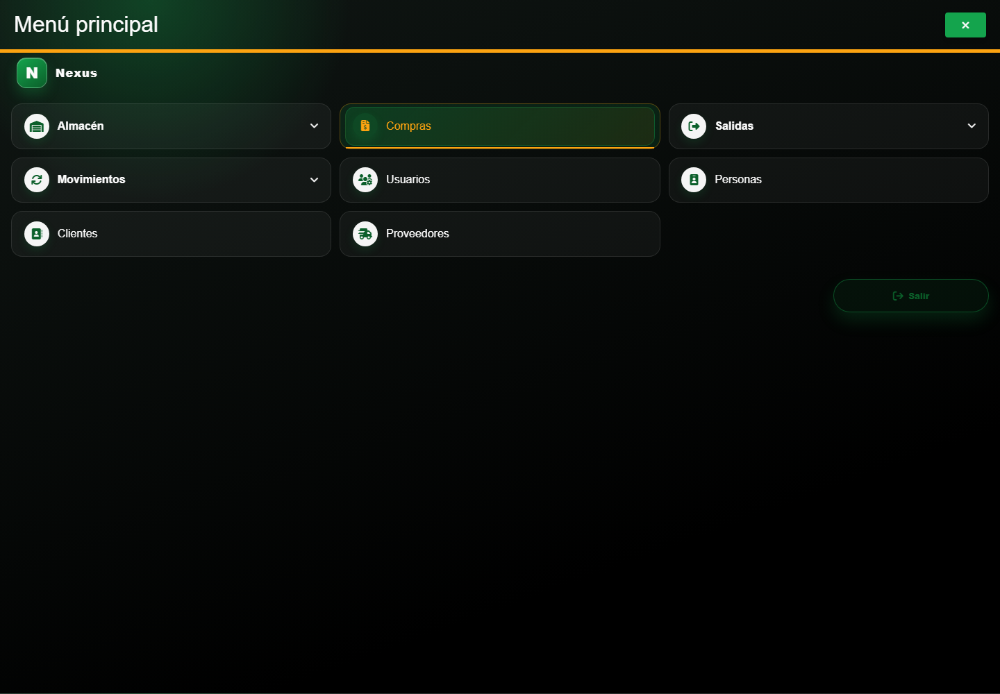
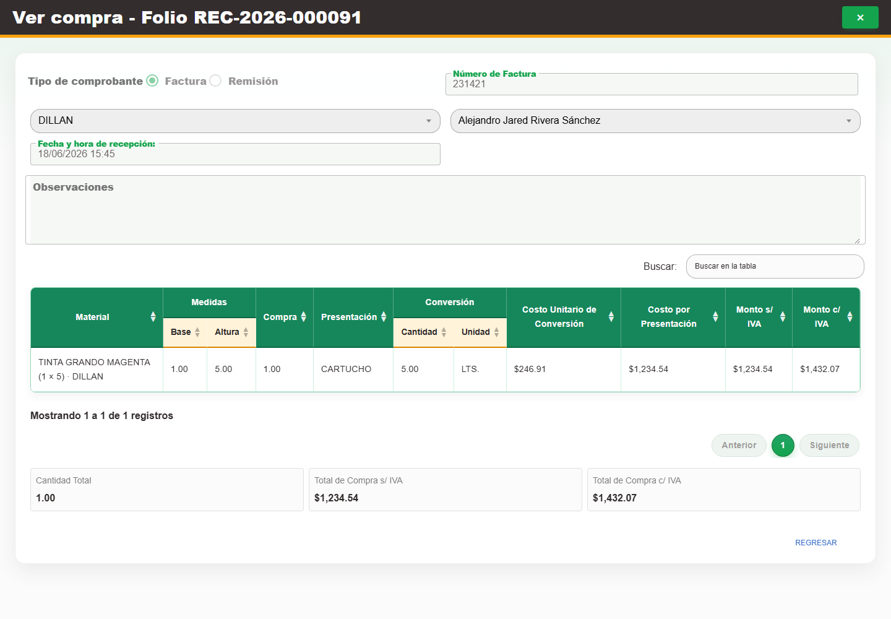

# Casos: Compras de material

Cada procedimiento identifica sus casos de uso, controles, errores posibles y captura de referencia.

## Compras

**Propósito.** Consultar, registrar, editar y corregir compras, además de delimitar reportes.

**Ruta en el menú:** **Menú principal → Compras**.

**Campos por modo del formulario.** En **alta** se editan tipo y número de comprobante, proveedor,
persona que recibe, fecha de recepción, observaciones y los nuevos renglones de material. En
**edición** se conservan editables el comprobante, persona que recibe, fecha, observaciones y la
incorporación de nuevos renglones; el proveedor y los detalles ya confirmados no se editan desde el
formulario principal. Cada detalle existente se cambia mediante **Corrección**, donde sólo se editan
**Cantidad correcta** y **Costo por presentación correcto**, o se retira mediante **Cancelación**.
En modo **consulta**, incluida una compra cancelada, todos los campos permanecen deshabilitados.

**Cómo cambia el estado.** El estado de la compra y de cada detalle no se captura directamente.
Una compra nueva queda confirmada con sus detalles activos. **Corrección** conserva el detalle
activo y registra los valores anterior y corregido. **Cancelación** cambia únicamente el renglón
seleccionado a cancelado, revierte su inventario y conserva su historia; cuando ya no queda ningún
detalle activo, Nexus deriva la compra como cancelada y desde entonces la presenta en modo
consulta. Abrir o editar el encabezado no cambia esos estados.

### CAP-ENT-01-LIST — Listado

**Casos de uso:** `CU-ENT-01` — Consultar compras de material.

**Errores posibles:** [Compras](../error-messages.md#errores-compras).

**Controles que debe usar:** Buscador **Buscar por Folio o N° Factura**; filtros **Fecha de inicio:**, **Fecha de fin:**, **Proveedor:** y **Persona que recibe:**; botones **Buscar / filtrar**, **Limpiar filtros**, **Exportar Excel** y **Nueva compra**; acción **Editar registro** por fila.

1. Abra **Filtros** y compruebe que los controles desplegados coincidan con la captura:

   

2. Escriba un término en **Buscar por Folio o N° Factura** o complete **Fecha de inicio:**, **Fecha de fin:**, **Proveedor:** y **Persona que recibe:**.
3. Seleccione **Buscar / filtrar** para actualizar la tabla; use **Limpiar filtros** para restablecerla.
4. En la tabla, seleccione **Nueva compra**, **Exportar Excel** o **Editar registro**, según la operación requerida.

### CAP-ENT-02-CREATE — Formulario registro

**Casos de uso:** `CU-ENT-02` — Crear compra de material.

**Errores posibles:** [Validación de formularios](../error-messages.md#errores-validacion), [Compras](../error-messages.md#errores-compras).

**Controles que debe usar:** Botón **Nueva compra**; opciones **Factura** o **Remisión**; campo **Número de Factura**; selectores **Buscar proveedor...** y **Buscar persona que recibe...**; campos **Fecha y hora de recepción:** y **Observaciones**; selector **Buscar material...**, campos **Cantidad** y **Costo por Presentación**, botón **Agregar** y botón **Confirmar**.

1. Seleccione **Nueva compra** para abrir el formulario. Antes de continuar, compruebe que la pantalla mostrada coincida con la captura:

   

2. Elija la opción **Factura** o **Remisión**. Complete **Número de Factura** cuando corresponda; elija opciones en **Buscar proveedor...** y **Buscar persona que recibe...**; capture **Fecha y hora de recepción:** y **Observaciones**.
3. En el detalle, elija una opción en **Buscar material...**, complete **Cantidad** y **Costo por Presentación**, y pulse **Agregar** por cada renglón.
4. Revise el encabezado y los detalles, y seleccione **Confirmar**.

Una compra sí puede contener el mismo material en más de un renglón, por ejemplo cuando las
cantidades tienen costos por presentación distintos. Cada renglón se conserva por separado y su
cantidad incrementa la existencia al confirmar. En cambio, una factura no se registra dos veces
para el mismo proveedor: si Nexus indica el folio donde ya existe, abra esa compra y agregue ahí los
materiales faltantes.

### CAP-ENT-03-EDIT — Edicion compra

**Casos de uso:** `CU-ENT-03` — Editar compra de material; `CU-ENT-05` — Cancelar material de una compra.

**Errores posibles:** [Validación de formularios](../error-messages.md#errores-validacion), [Compras](../error-messages.md#errores-compras).

**Controles que debe usar:** Acción **Editar registro**; opciones **Factura** y **Remisión**; campo **Número de Factura**; selectores **Buscar proveedor...** y **Buscar persona que recibe...**; campos **Fecha y hora de recepción:** y **Observaciones**; selector **Buscar material...**; campos **Cantidad** y **Costo por Presentación**; botones **Agregar**, **Actualizar** y **Regresar**.

1. En la fila de la compra, seleccione **Editar registro** para abrir el formulario. Antes de continuar, compruebe que la pantalla mostrada coincida con la captura:

   

2. Modifique el comprobante, la persona que recibe, la fecha o las observaciones, y use **Agregar** para incorporar detalles nuevos. El proveedor y los renglones ya confirmados permanecen deshabilitados; para cambiar la cantidad o el costo de uno de esos renglones, use **Corregir detalle de compra**.
3. Seleccione **Actualizar** para guardar o **Regresar** para salir sin confirmar.

### CAP-ENT-04-CORRECT — Correccion detalle

**Casos de uso:** `CU-ENT-04` — Corregir material de una compra.

**Errores posibles:** [Validación de formularios](../error-messages.md#errores-validacion), [Compras](../error-messages.md#errores-compras).

**Controles que debe usar:** Acción **Editar registro** de la compra y acción **Corregir detalle de compra** del renglón; campos **Cantidad correcta** y **Costo por presentación correcto**; botones **Corregir detalle** y **Regresar**.

1. Abra la compra mediante **Editar registro** y, en el renglón requerido, seleccione **Corregir detalle de compra**. Antes de continuar, compruebe que la pantalla mostrada coincida con la captura:

   

2. Complete **Cantidad correcta** y **Costo por presentación correcto**.
3. Seleccione **Corregir detalle** para confirmar o **Regresar** para salir sin aplicar la corrección.

### CAP-REP-ENT-05-EXPORT — Exportar reporte

**Casos de uso:** `CU-REP-11` — Generar reporte de compras de material.

**Errores posibles:** [Compras](../error-messages.md#errores-compras).

**Controles que debe usar:** Botón **Exportar Excel**; opciones **Mes actual**, **Otro mes** o **Personalizado: usar filtros aplicados**; campo **Mes del reporte** y botón **Descargar**.

1. Seleccione **Exportar Excel** para abrir el diálogo de alcance. Antes de continuar, compruebe que la pantalla mostrada coincida con la captura:

   

2. Elija **Mes actual**, **Otro mes** o **Personalizado: usar filtros aplicados** y complete **Mes del reporte** cuando corresponda.
3. Seleccione **Descargar** para generar el archivo.

### CAP-ENT-06-VIEW — Consultar compra cancelada

**Caso de uso:** `CU-ENT-01` — Consultar compras de material.

1. Localice una compra con estado **Cancelada** y seleccione **Editar registro**.
2. Compruebe que el formulario, sus detalles y sus acciones permanezcan en modo consulta, como en
   la captura:

   

3. Use **Regresar** para cerrar el formulario; una compra cancelada no admite nuevos cambios.
