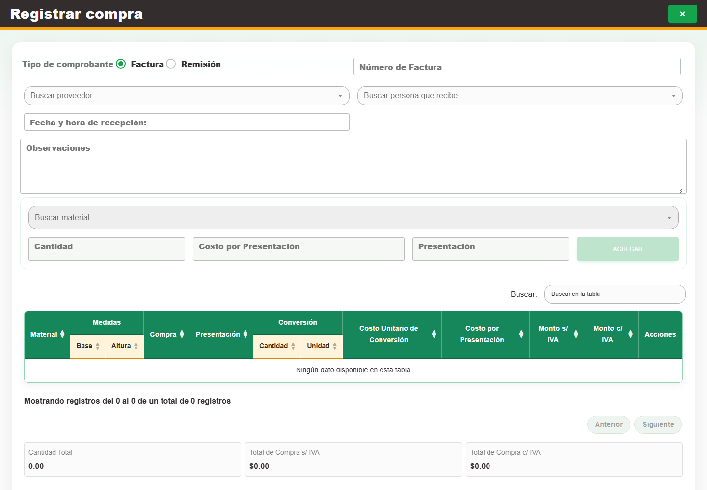

# 2. CAP-ENT-02-CREATE — Formulario registro

**Casos de uso:** `CU-ENT-02` — Crear compra de material.

**Errores posibles:** [Validación de formularios](../../error-messages.md#errores-validacion), [Compras](../../error-messages.md#errores-compras).

**Controles que debe usar:** Botón **Nueva compra**; opciones **Factura** o **Remisión**; campo **Número de Factura**; selectores **Buscar proveedor...** y **Buscar persona que recibe...**; campos **Fecha y hora de recepción:** y **Observaciones**; selector **Buscar material...**, campos **Cantidad** y **Costo por Presentación**, botón **Agregar** y botón **Guardar**.

1. Seleccione **Nueva compra** para abrir el formulario. Antes de continuar, compruebe que la pantalla mostrada coincida con la captura:

   

2. Elija la opción **Factura** o **Remisión**. Complete **Número de Factura** cuando corresponda; elija opciones en **Buscar proveedor...** y **Buscar persona que recibe...**; capture **Fecha y hora de recepción:** y **Observaciones**.
3. En el detalle, elija una opción en **Buscar material...**, complete **Cantidad** y **Costo por Presentación**, y pulse **Agregar** por cada renglón.
4. Revise el encabezado y los detalles, y seleccione **Guardar**.

   🟨 **ADVERTENCIA:** confirmar la compra incrementa la existencia de cada renglón. Si Nexus no
   muestra un resultado concluyente, consulte el listado y el folio antes de volver a confirmar.

Una compra sí puede contener el mismo material en más de un renglón, por ejemplo cuando las
cantidades tienen costos por presentación distintos. Cada renglón se conserva por separado y su
cantidad incrementa la existencia al confirmar. En cambio, una factura no se registra dos veces
para el mismo proveedor: si Nexus indica el folio donde ya existe, abra esa compra y agregue ahí los
materiales faltantes.
