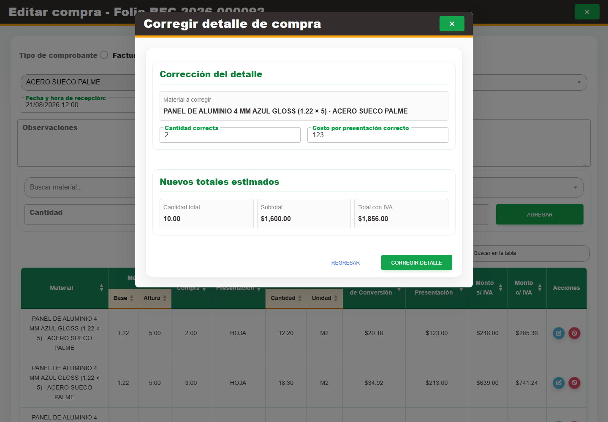

# 4. CAP-ENT-04-CORRECT — Correccion detalle

**Casos de uso:** `CU-ENT-04` — Corregir material de una compra.

**Errores posibles:** [Validación de formularios](../../error-messages.md#errores-validacion), [Compras](../../error-messages.md#errores-compras).

**Antes de empezar:** Localice la compra y el detalle activo que necesita corregir. Tenga la cantidad y el costo correctos. La cantidad corregida debe ser positiva y no superar la registrada.

**Controles que debe usar:** Acción **Editar registro** de la compra y acción **Corregir detalle de compra** del renglón; campos **Cantidad correcta** y **Costo por presentación correcto**; botones **Corregir detalle** y **Regresar**.

1. Abra la compra mediante **Editar registro** y, en el renglón requerido, seleccione **Corregir detalle de compra**. Antes de continuar, compruebe que la pantalla mostrada coincida con la captura:

   

2. Complete **Cantidad correcta** y **Costo por presentación correcto**.
3. Seleccione **Corregir detalle**, revise la confirmación y acepte con **Corregir detalle**. Use **Regresar** si todavía necesita revisar los datos.

Al confirmar, compruebe los valores corregidos y la existencia resultante en Nexus. Si aparece un
error o el estado queda incierto, actualice la compra antes de repetir la corrección.

**Compruebe el resultado:** Compruebe el mensaje de confirmación, el valor del detalle y los totales. Cambiar la cantidad ajusta existencia; cambiar sólo el costo no mueve unidades.
