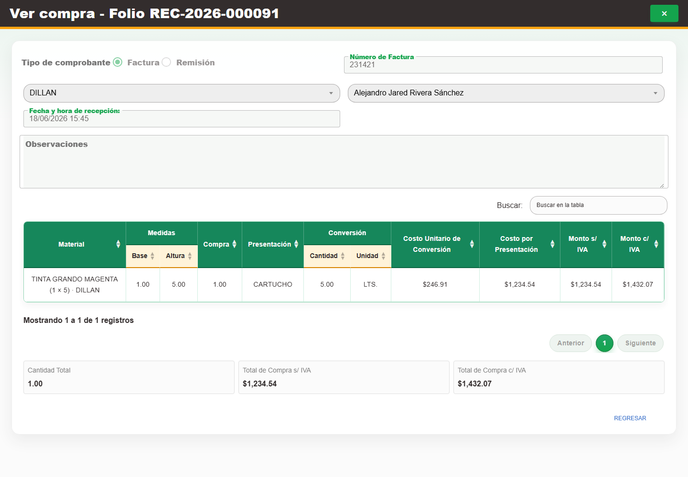

# 6. CAP-ENT-06-VIEW — Consultar compra cancelada

**Caso de uso:** `CU-ENT-01` — Consultar compras de material.

1. Localice una compra con estado **Cancelada** y seleccione **Editar registro**.
2. Compruebe que el formulario, sus detalles y sus acciones permanezcan en modo consulta, como en
   la captura:

   

3. Use **Regresar** para cerrar el formulario; una compra cancelada no admite nuevos cambios.
