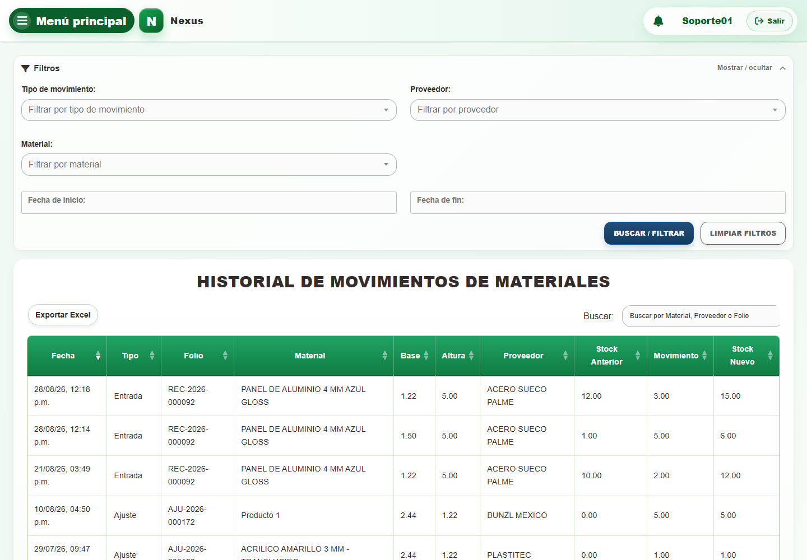
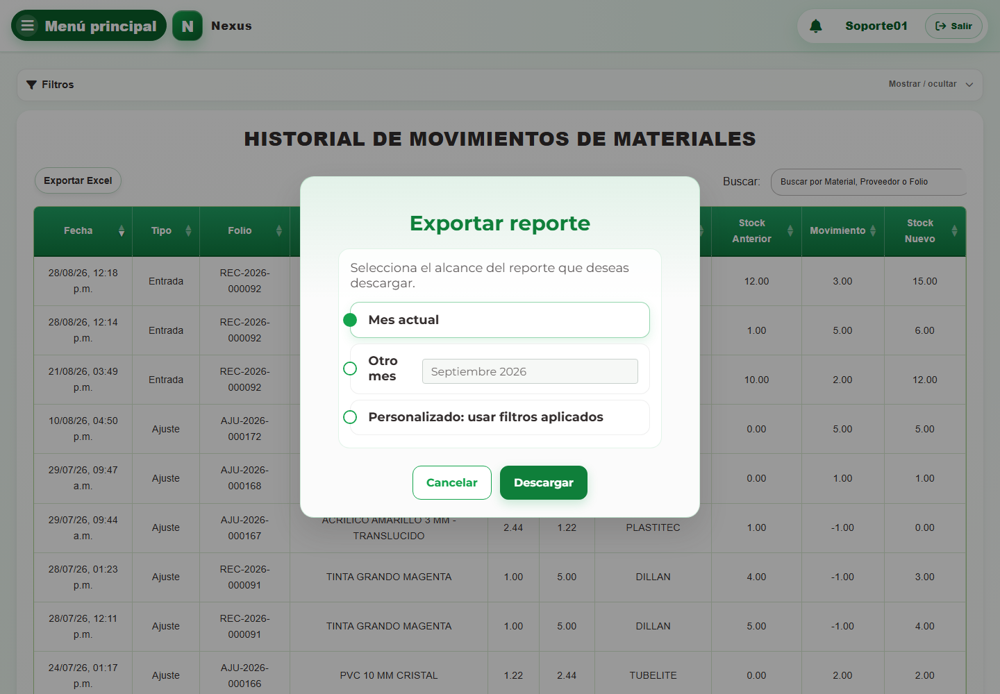
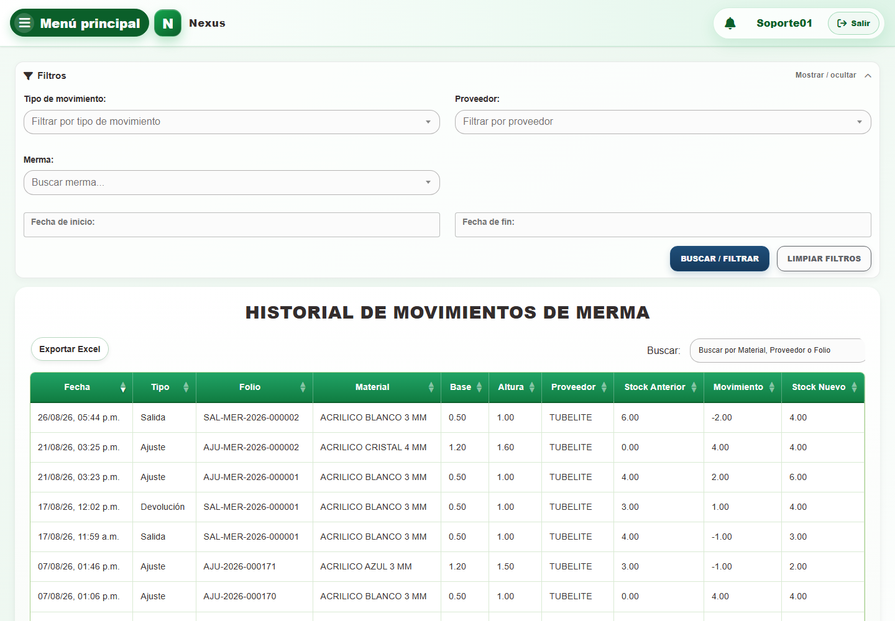
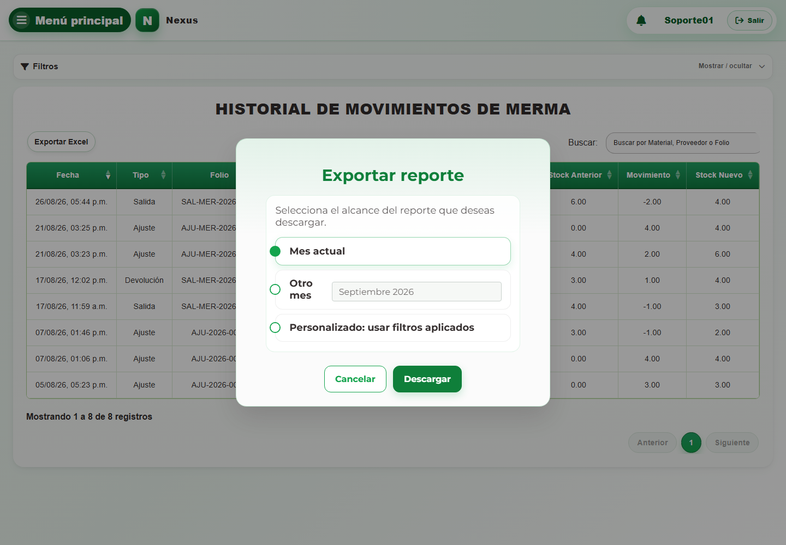

# Casos: Consultas y reportes

Cada procedimiento identifica sus casos de uso, controles, errores posibles y captura de referencia.

## Movimientos de material

**Propósito.** Consultar el historial, aplicar filtros y delimitar su reporte.

### CAP-REP-MOV-MAT-01-LIST — Historial y filtros

**Casos:** `CU-REP-02`.

**Errores posibles:** [Reportes](../error-messages.md#errores-reportes).

**Controles que debe usar:** Buscador **Buscar por Material, Proveedor o Folio**; filtros **Fecha de inicio:**, **Fecha de fin:**, **Tipo de movimiento:**, **Proveedor:** y **Material:**; botones **Buscar / filtrar**, **Limpiar filtros** y **Exportar Excel**.

1. Antes de usar los controles, compruebe que la pantalla inicial coincida con la captura:

   

2. Escriba un término en **Buscar por Material, Proveedor o Folio** o complete **Fecha de inicio:**, **Fecha de fin:**, **Tipo de movimiento:**, **Proveedor:** y **Material:**.
3. Seleccione **Buscar / filtrar** para actualizar el historial; use **Limpiar filtros** para restablecerlo.
4. Seleccione **Exportar Excel** si necesita descargar la consulta.

### CAP-REP-MOV-MAT-02-EXPORT — Exportar reporte

**Casos:** `CU-REP-05`.

**Errores posibles:** [Reportes](../error-messages.md#errores-reportes).

**Controles que debe usar:** Botón **Exportar Excel**; opciones **Mes actual**, **Otro mes** o **Personalizado: usar filtros aplicados**; campo **Mes del reporte** y botón **Descargar**.

1. Seleccione **Exportar Excel** para abrir el diálogo de alcance. Antes de continuar, compruebe que la pantalla mostrada coincida con la captura:

   

2. Elija **Mes actual**, **Otro mes** o **Personalizado: usar filtros aplicados** y complete **Mes del reporte** cuando corresponda.
3. Seleccione **Descargar** para generar el archivo.

## Movimientos de merma

**Propósito.** Consultar el historial, aplicar filtros y delimitar su reporte.

### CAP-REP-MOV-WAS-01-LIST — Historial y filtros

**Casos:** `CU-REP-07`.

**Errores posibles:** [Reportes](../error-messages.md#errores-reportes).

**Controles que debe usar:** Buscador **Buscar por Material, Proveedor o Folio**; filtros **Fecha de inicio:**, **Fecha de fin:**, **Tipo de movimiento:**, **Proveedor:** y **Merma:**; botones **Buscar / filtrar**, **Limpiar filtros** y **Exportar Excel**.

1. Antes de usar los controles, compruebe que la pantalla inicial coincida con la captura:

   

2. Escriba un término en **Buscar por Material, Proveedor o Folio** o complete **Fecha de inicio:**, **Fecha de fin:**, **Tipo de movimiento:**, **Proveedor:** y **Merma:**.
3. Seleccione **Buscar / filtrar** para actualizar el historial; use **Limpiar filtros** para restablecerlo.
4. Seleccione **Exportar Excel** si necesita descargar la consulta.

### CAP-REP-MOV-WAS-02-EXPORT — Exportar reporte

**Casos:** `CU-REP-10`.

**Errores posibles:** [Reportes](../error-messages.md#errores-reportes).

**Controles que debe usar:** Botón **Exportar Excel**; opciones **Mes actual**, **Otro mes** o **Personalizado: usar filtros aplicados**; campo **Mes del reporte** y botón **Descargar**.

1. Seleccione **Exportar Excel** para abrir el diálogo de alcance. Antes de continuar, compruebe que la pantalla mostrada coincida con la captura:

   

2. Elija **Mes actual**, **Otro mes** o **Personalizado: usar filtros aplicados** y complete **Mes del reporte** cuando corresponda.
3. Seleccione **Descargar** para generar el archivo.
